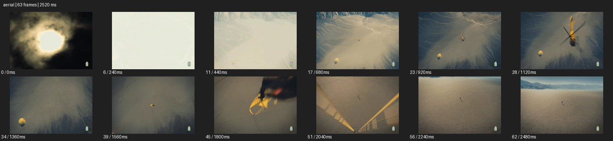

# Aerial


- 출처: Eyecandy · [Aerial](https://eyecannndy.com/technique/aerial)
- 카탈로그 등록 표기: **Aerial 항공 촬영**
- 카테고리: E · More Camera Moves · 카메라 무브 확장
- 원본 미디어: [애니메이션 WebP](https://asset.eyecannndy.com/media/clip/2024/02/27/261709018151.webp)
- 확인 방식: 원본 애니메이션을 디코딩해 시간순 프레임을 추출한 뒤 컨택트 시트를 직접 시각 확인했다. 전체 63프레임 / 2520ms, 기본 12시점. 재생·음향 청취·전 프레임 시각 검수·생성 테스트를 했다고 주장하지 않는다.
- 기본 확인 프레임: 0, 6, 11, 17, 23, 28, 34, 39, 45, 51, 56, 62. 해당 타임스탬프(ms): 0, 240, 440, 680, 920, 1120, 1360, 1560, 1800, 2040, 2240, 2480.
- 원본 길이는 관찰 정보다. 아래 새 장면의 길이를 원본에 자동 맞추지 않는다.

## 움직임 증거



## 원본에서 확인한 시작 → 변화 → 끝

처음 태양과 구름이 보이다 밝은 화면을 거쳐 산악 분지의 높은 시점으로 바뀐다. 노란 헬기가 접근해 프레임 위를 지나고, 아래로 보이는 사다리와 매달린 인물이 넓은 지형 앞에 남는다.

- 카메라·시점: 높은 시점 변화와 기체 통과를 따른다.
- 주체: 헬기와 매달린 인물이 지형 위를 이동한다.
- 조명·합성·편집: 초반 밝기 변화와 큰 시점 전환이 있으며 합성·컷 경계는 미확인.

## 작동 원리와 확인 한계

높은 위치에서 지형 규모와 작은 인물의 관계를 드러내며 기체의 접근·통과와 시점 변화를 결합한다. 실제 드론·헬기 장비와 합성 여부는 샘플만으로 확정할 수 없다.

샘플 사이의 빠른 변화는 일부 빠질 수 있다. GIF의 반복 경계가 작품의 의도된 완전 루프라는 보장은 없다. 원본 음악·대사·촬영 장비·제작 소프트웨어는 확인하지 않았다. 아래 프롬프트는 관찰한 원리를 다른 장면에 각색한 창작안이며 원본 장면이나 검증된 생성 결과가 아니다.

## 뮤직비디오 각색 · 완전한 장면 프롬프트

```text
새벽 소금 평원 한가운데 붉은 코트를 입은 성인 보컬이 서 있는 뮤직비디오. 처음 높은 사선 항공 와이드에서 희미한 발자국과 인물의 고립을 읽힌다. 보컬이 고개를 들면 카메라가 완만한 곡선을 그리며 낮아지고 접근해, 지평선이 점차 올라오도록 시선을 보컬에게 유지한다. 인물은 제자리에서 한 팔만 펼치고 소금 바람이 옷자락을 민다. 마지막에는 얼굴이 읽히는 넓은 미디엄 높이로 감속하고 붉은 실루엣 뒤의 빈 풍경을 남긴다. 비행 중 임의 컷이나 급격한 줌은 넣지 않는다.
```

## 브랜드필름 각색 · 완전한 장면 프롬프트

```text
해안 절벽의 곡선과 전기차의 정숙한 이동을 연결하는 브랜드필름. 높은 항공 시점에서 바다와 도로가 같은 곡률로 이어지는 구도를 잡고, 은색 전기차가 굽이를 들어올 때 카메라가 바깥쪽으로 크게 원호 이동한다. 차는 일정한 속도로 달리고 카메라는 차보다 천천히 전진해 측면과 해안의 관계를 드러낸다. 굽이가 끝나면 고도를 조금 낮추고 차의 측후면을 안정되게 따라가며 종료한다. 차체 비율과 도로 경계는 유지하고 마지막 구간에는 유리와 금속의 반사가 읽히게 한다.
```

적용 시 사용자가 지정한 길이·참조·컷·음향·제품 보존 조건을 우선한다. 효과의 시작 계기와 도착 구도를 유지하며 필요한 부분을 해당 장면에 맞춰 다시 연출한다.
