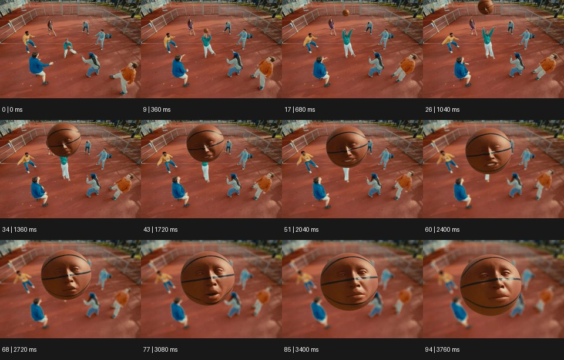

# Anthropomorphism 의인화


출처: Eyecandy · 원본 등록 카드명: **Anthropomorphism 의인화** · slug: anthropomorphism

분류: J · People, POV & Mood / 인물·시점·무드

[원본 기법 페이지](https://eyecannndy.com/technique/anthropomorphism) · [원본 미디어](https://asset.eyecannndy.com/media/clip/2024/06/07/261717742676.webp)

## 확인 근거

원본 95프레임, 메타데이터 길이 3800ms. 고유 12개 시점 프레임을 추출하여 이미지로 직접 관찰했다. 재생 감상·음향 청취·생성 재현 테스트를 했다는 뜻이 아니다.

표본 프레임(0부터): 0, 9, 17, 26, 34, 43, 51, 60, 68, 77, 85, 94



## 실제 시간순 관찰

0–1040ms: 야외 코트에서 여러 인물이 공을 향해 움직이고 농구공이 위로 올라와 커진다. 1360–2400ms: 공 표면에 사람 얼굴 같은 눈·코·입이 나타나고 공은 공중에 머문다. 2720–3760ms: 얼굴 있는 공이 크게 보이는 동안 눈과 입이 움직이며 코트 인물들은 뒤에 작게 남는다.

## 주체·카메라·합성·편집 구분

사람들은 몸을 움직이고 공은 상승·접근한다. 공의 얼굴은 별도 변형·합성 층으로 보인다. 화면 확대 중 실제 카메라 이동과 공 이동 비중은 분리하기 어렵다.

## 장면에 재사용할 원리

사물의 기본 재질·형태를 유지하면서 시선·표정·행동 의도를 부여한다.

## 확인 한계

입 움직임이 있지만 원본 대사나 노래는 듣지 않았다. 공이 실제로 말하는 소리를 확인했다고 쓰지 않는다. 표본 사이의 모든 프레임과 반복 경계의 연속성을 검사하지 않았다. 음향은 확인하지 않았다.

## 뮤직비디오 각색 · 완성형 프롬프트

아래는 장면 목적에 맞게 새로 설계한 창작 적용안이며 원본 길이를 상속하지 않는다.

```text
7초 의인화 뮤직비디오, 빈 연습실 바닥에 둥근 탬버린 한 개를 놓고 성인 보컬이 옆에 쪼그려 앉는다. 카메라는 바닥 높이 정면이다. 보컬이 손가락으로 바닥을 두 번 두드리면 탬버린 테두리가 고개를 끄덕이듯 앞뒤로 작게 기울고 두 개의 징글이 눈처럼 방향을 바꾼다. 사물에 팔·다리를 추가하지 않고 테두리와 징글의 움직임만으로 주저하다 동의하는 성격을 만든다. 4초에 보컬이 손을 내밀면 탬버린이 한 번 굴러 손바닥에 기대어 멈춘다. 마지막 2초는 사람과 사물의 조용한 교감에 안착한다. 자막·대사 없이 금속 울림만 둔다.
```

## 브랜드필름 각색 · 완성형 프롬프트

```text
8초 프리미엄 데스크 조명 브랜드필름, 어두운 책상에서 성인 사용자가 책을 펼친다. 카메라는 옆쪽 삼사분면 고정 구도로 조명과 손을 함께 담는다. 책이 열리면 조명 헤드가 작은 고개 움직임처럼 책을 향해 부드럽게 숙이고 빛의 원이 페이지 중앙에 도착한다. 사용자가 다른 페이지를 넘기면 헤드가 한 번만 다시 조정되어 관심을 따라가는 느낌을 준다. 눈·입·팔을 추가하지 않고 실제 관절 범위와 제품 재질을 보존한다. 마지막 3초에는 헤드가 완전히 멈추고 충분히 밝아진 책과 조명 실루엣을 읽힌다. 새 로고·문자 없이 페이지 소리만 둔다.
```

생성 테스트: 미실시. 단일 모델의 정확한 재현을 보장하지 않으며 필요한 촬영·합성·편집 층을 구분해 구현한다.
