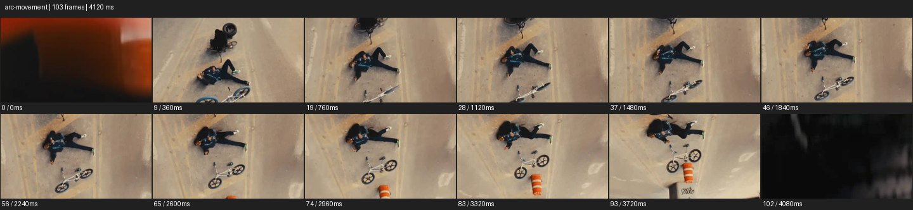

# Arc


- 출처: Eyecandy · [Arc](https://eyecannndy.com/technique/arc-movement)
- 카탈로그 등록 표기: **Arc 아크 무브**
- 카테고리: E · More Camera Moves · 카메라 무브 확장
- 원본 미디어: [애니메이션 WebP](https://asset.eyecannndy.com/media/clip/2024/01/12/261705098919.webp)
- 확인 방식: 원본 애니메이션을 디코딩해 시간순 프레임을 추출한 뒤 컨택트 시트를 직접 시각 확인했다. 전체 103프레임 / 4120ms, 기본 12시점. 재생·음향 청취·전 프레임 시각 검수·생성 테스트를 했다고 주장하지 않는다.
- 기본 확인 프레임: 0, 9, 19, 28, 37, 46, 56, 65, 74, 83, 93, 102. 해당 타임스탬프(ms): 0, 360, 760, 1120, 1480, 1840, 2240, 2600, 2960, 3320, 3720, 4080.
- 원본 길이는 관찰 정보다. 아래 새 장면의 길이를 원본에 자동 맞추지 않는다.

## 움직임 증거



## 원본에서 확인한 시작 → 변화 → 끝

초반 흐린 가림 뒤 콘크리트 바닥에 누운 인물과 자전거가 나타난다. 위에서 본 구도가 기울며 인물·자전거·주황 표지의 배치가 프레임 안에서 돌아간다. 마지막에는 어두운 가림이 들어온다.

- 카메라·시점: 바닥을 향한 시점이 피사체 주위로 돌아간다.
- 주체: 누운 인물의 몸짓은 작다.
- 조명·합성·편집: 초반과 끝 가림이 존재하며 연속 촬영 여부는 미확인.

## 작동 원리와 확인 한계

피사체 주변으로 시점을 이동해 배경 관계를 변화시키는 원리. 이 샘플은 높은 시점의 회전도 포함해 순수 수평 오빗과 롤을 완전히 분리하기 어렵다.

샘플 사이의 빠른 변화는 일부 빠질 수 있다. GIF의 반복 경계가 작품의 의도된 완전 루프라는 보장은 없다. 원본 음악·대사·촬영 장비·제작 소프트웨어는 확인하지 않았다. 아래 프롬프트는 관찰한 원리를 다른 장면에 각색한 창작안이며 원본 장면이나 검증된 생성 결과가 아니다.

## 뮤직비디오 각색 · 완전한 장면 프롬프트

```text
원형 빈 수영장 바닥에서 성인 보컬이 앉아 편지를 접는 뮤직비디오. 카메라는 얼굴 높이의 측면 미디엄으로 시작하고 편지가 접히는 순간 인물을 중심으로 천천히 반원을 그린다. 보컬은 몸을 돌리지 않은 채 종이를 내려놓고 시선만 카메라를 따른다. 이동으로 뒤쪽 계단과 먼 출입구가 차례로 드러나며 혼자 남은 공간을 설명한다. 후반에는 정면 삼분의 사 구도에 도착해 정지하고, 접힌 편지가 전경에 들어오도록 초점을 유지한다. 화면 롤이나 장면 전환은 추가하지 않는다.
```

## 브랜드필름 각색 · 완전한 장면 프롬프트

```text
짙은 석재 받침 위의 조형적인 향수병을 보여주는 브랜드필름. 카메라를 병 어깨 높이의 측면 가까이에 두고 얇은 측광이 유리 두께를 드러내게 한다. 병은 움직이지 않고 카메라만 완만하게 반원 이동해 유리 가장자리의 반사가 앞면으로 흐르게 한다. 뒤에 놓인 반투명 패널이 서로 다른 속도로 겹쳐 공간 깊이를 만든다. 이동 말미에는 정면에서 약간 비껴 선 위치로 감속하고 라벨을 온전히 읽을 수 있는 구도로 멈춘다. 유리 윤곽과 액체 높이는 일정하게 유지한다.
```

적용 시 사용자가 지정한 길이·참조·컷·음향·제품 보존 조건을 우선한다. 효과의 시작 계기와 도착 구도를 유지하며 필요한 부분을 해당 장면에 맞춰 다시 연출한다.
