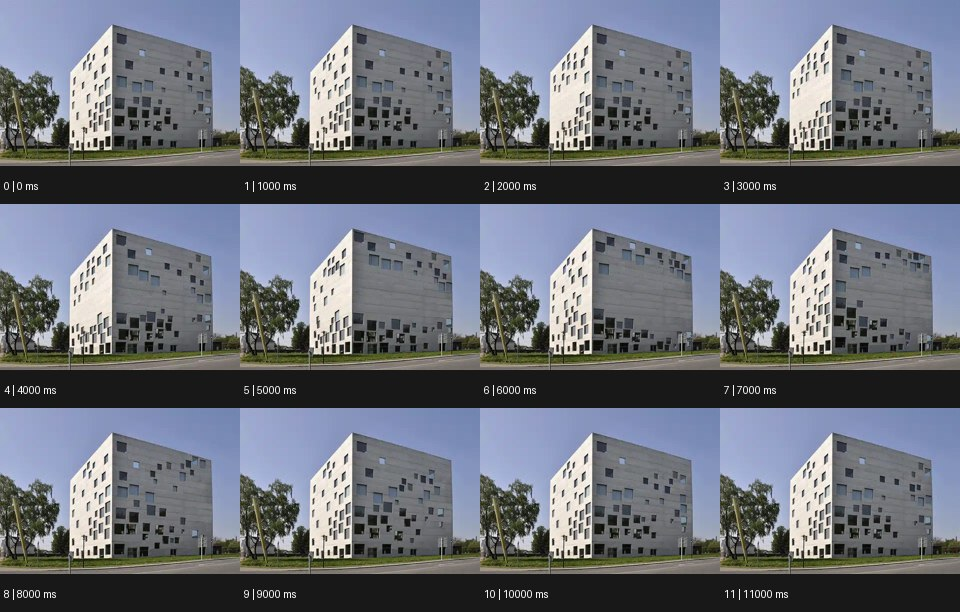

# Architexture 아키텍스처


출처: Eyecandy · 원본 등록 카드명: **Architexture 아키텍스처** · slug: architexture

분류: J · People, POV & Mood / 인물·시점·무드

[원본 기법 페이지](https://eyecannndy.com/technique/architexture) · [원본 미디어](https://asset.eyecannndy.com/media/clip/2023/12/19/261702984433.webp)

## 확인 근거

원본 12프레임, 메타데이터 길이 12000ms. 고유 12개 시점 프레임을 추출하여 이미지로 직접 관찰했다. 재생 감상·음향 청취·생성 재현 테스트를 했다는 뜻이 아니다.

표본 프레임(0부터): 0, 1, 2, 3, 4, 5, 6, 7, 8, 9, 10, 11



## 실제 시간순 관찰

0–3000ms: 같은 밝은 건물의 외곽은 유지되지만 전면·측면의 작은 창 사각형 배열이 달라진다. 4000–7000ms: 창들이 위아래 다른 위치에 묶이거나 모서리 근처로 이동한다. 8000–11000ms: 건물 외곽·도로·나무는 고정된 채 창의 조합이 다시 바뀐다.

## 주체·카메라·합성·편집 구분

카메라는 고정된 건물 외관 구도를 유지한다. 주체 변화는 건물 전체의 호흡보다 표면 창 배열의 이동·교체에 집중된다. 합성·스톱모션 같은 처리 방식은 미확인이다.

## 장면에 재사용할 원리

건축의 큰 구조를 고정 기준으로 두고 반복 디테일의 위치·열림·패턴만 변화시켜 공간에 리듬을 준다.

## 확인 한계

카탈로그 설명의 '건물이 숨 쉰다'를 이 샘플의 사실로 쓰지 않는다. 12개 프레임이 각각 1초 길이인 파일이다. 표본 사이의 모든 프레임과 반복 경계의 연속성을 검사하지 않았다. 음향은 확인하지 않았다.

## 뮤직비디오 각색 · 완성형 프롬프트

아래는 장면 목적에 맞게 새로 설계한 창작 적용안이며 원본 길이를 상속하지 않는다.

```text
7초 건축 표면 연출 뮤직비디오, 성인 보컬을 회색 아파트 외벽 앞의 빈 광장에 세운다. 고정 와이드 카메라로 건물 외곽과 보컬 전신을 함께 담는다. 보컬이 고개를 드는 2초 지점에 건물의 사각 창들만 한 칸씩 옆으로 이동해 규칙적인 대각선 패턴을 만든다. 벽체·모서리·바닥은 휘어지지 않고 창 내부에 새 인물을 만들지 않는다. 보컬이 손을 내리면 창들의 이동이 아래쪽부터 멈춘다. 마지막 2초는 모든 창이 중앙 보컬 쪽으로 시선을 모으는 배열에 안착한다. 실제 카메라 이동·건물 붕괴·문자 없이 바람 소리만 둔다.
```

## 브랜드필름 각색 · 완성형 프롬프트

```text
8초 건축 조명 브랜드필름, 해가 진 현대적인 갤러리 건물의 외관을 정면 고정 카메라로 담는다. 건물 외곽과 창 위치는 고정하고 첫 2초는 창 세 개만 따뜻하게 켜져 있다. 이어 사각 창의 밝기가 왼쪽 아래에서 오른쪽 위로 한 칸씩 이동해 빛으로 된 패턴을 만든다. 패턴은 실제 창 경계를 벗어나지 않고 벽이 늘어나거나 접히지 않는다. 5초에 모든 빛이 일정한 낮은 밝기로 정리되며 현관 주변만 한 단계 밝아진다. 마지막 3초는 입구와 정돈된 외관을 함께 읽혀 조명이 공간을 조직한다는 인상을 남긴다. 수치·문구·새 로고는 없다.
```

생성 테스트: 미실시. 단일 모델의 정확한 재현을 보장하지 않으며 필요한 촬영·합성·편집 층을 구분해 구현한다.
