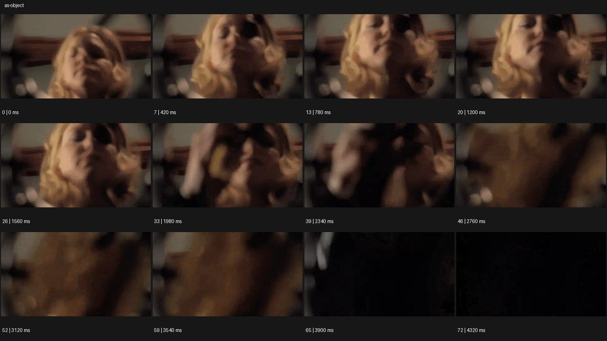

# Object POV


- 원본 등록명: **Object POV**
- 분류: B · 앵글 & 구도 / Angle & Framing
- 공식 기법 페이지: [Object POV](https://eyecannndy.com/technique/as-object)
- 지정 원본 미디어: [애니메이션 WebP](https://asset.eyecannndy.com/media/clip/2024/01/04/261704372378.webp)
- 확인 방식: 73프레임 중 12시점의 시간순 이미지 배열을 직접 시각 확인. 메타데이터 길이 4.38초. 전체 프레임 재생·청음 확인 또는 생성 재현 테스트로 보고하지 않는다.



## 실제 관찰

낮은 근접 시점 위로 금발 인물이 렌즈 방향을 내려다본다. 0.42–1.56초 얼굴이 다가오고 고개가 움직인다. 1.98초 이후 손 또는 가까운 물체가 렌즈 앞을 점점 가리며 3.9–4.32초 거의 검정으로 닫힌다.

## 작동 원리와 역할

카메라 위치가 인물이 다루는 사물의 시점처럼 기능한다. 인물 접근과 렌즈 앞 가림이 크기·밝기를 바꾸며 시청자에게 직접 말한다고 단정할 근거는 없다.

## 해석의 한계

사물이 무엇인지는 표본만으로 명확히 식별되지 않는다. 거울이나 물웅덩이라고 자동 해석하지 않는다. 샘플 사이의 모든 움직임과 반복 경계의 무봉합 여부는 별도 검증하지 않았다. 아래 프롬프트는 새로운 장면 각색이며 생성 테스트는 하지 않았다.

## 뮤직비디오 적용 · 완성형 프롬프트

아래 설정과 길이는 독립 창작 예시다. 실제 요청의 길이·참조·음향 조건을 우선한다.

```text
6초 뮤직비디오. 낡은 레코드 플레이어의 덮개 안쪽에서 위를 보는 사물 시점으로 시작한다. 성인 보컬이 어두운 방에서 레코드를 두 손으로 들고 렌즈 아래 턴테이블에 조심스럽게 내려놓는다. 얼굴은 위쪽에 가까워졌다가 뒤로 물러나며 눈은 관객이 아닌 바늘 위치를 확인한다. 카메라는 플레이어 안에 고정되어 손이 렌즈 가까이를 지나갈 때만 잠깐 가려진다. 마지막 보컬이 투명한 덮개를 내리면 반사가 얼굴 위에 겹치고 천천히 어두워진다. 얼굴과 손의 정상적 형태를 유지하며 다음 장소로 전환하지 않는다.
```

## 브랜드필름 적용 · 완성형 프롬프트

제품의 재질과 기능이 읽히는 순간에 효과를 배치하고 안정된 제품 상태로 끝낸다. 실제 브랜드 톤과 구조에 맞춰 각색한다.

```text
6초 고급 주얼리 필름. 짙은 청색 벨벳 보석함 안쪽에서 뚜껑 방향을 바라보는 고정 시점이다. 성인 착용자가 뚜껑을 열면 따뜻한 방빛과 얼굴이 드러나고, 시선은 렌즈 바로 아래 반지를 향한다. 두 손가락이 천천히 내려와 반지를 집어 올리며 금속 가장자리의 빛이 화면 가까이를 지나간다. 카메라는 보석함과 함께 움직이지 않고 내부에 머문다. 착용자가 반지를 손가락에 끼우는 동작이 화면 위쪽에서 읽힌 뒤 뚜껑을 절반만 닫아 벨벳 가장자리로 얼굴을 감싼다. 끝에서는 반지의 원형과 세팅을 선명하게 남긴다.
```

음향은 원본에서 확인하지 않았다. 실제 음원과 무음·NO BGM 등 사용자 조건을 유지한다. 특정 모델의 자동 재현을 보장하는 프리셋이 아니다.
