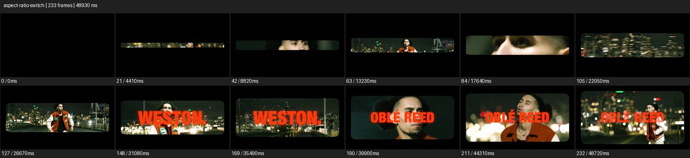

# Ratio Switch


- 출처: Eyecandy · [Ratio Switch](https://eyecannndy.com/technique/aspect-ratio-switch)
- 카탈로그 등록 표기: **Ratio Switch 비율 전환**
- 카테고리: H · More Editing & Transition · 편집 & 전환 확장
- 원본 미디어: [애니메이션 WebP](https://asset.eyecannndy.com/media/clip/2024/05/13/261715643438.webp)
- 확인 방식: 원본 애니메이션을 디코딩해 시간순 프레임을 추출한 뒤 컨택트 시트를 직접 시각 확인했다. 전체 233프레임 / 48930ms, 기본 12시점. 재생·음향 청취·전 프레임 시각 검수·생성 테스트를 했다고 주장하지 않는다.
- 기본 확인 프레임: 0, 21, 42, 63, 84, 105, 127, 148, 169, 190, 211, 232. 해당 타임스탬프(ms): 0, 4410, 8820, 13230, 17640, 22050, 26670, 31080, 35490, 39900, 44310, 48720.
- 원본 길이는 관찰 정보다. 아래 새 장면의 길이를 원본에 자동 맞추지 않는다.

## 움직임 증거



## 원본에서 확인한 시작 → 변화 → 끝

처음 검은 화면 중앙에 매우 얇은 가로 이미지 띠가 나타난다. 도시 야경과 인물 컷이 바뀌는 동안 위아래 영역이 점차 넓어져 둥근 모서리의 가로 화면이 된다. 후반 붉은 제목 글자가 겹친다.

- 카메라·시점: 여러 인물·도시 구도 컷이 내부에서 바뀐다.
- 주체: 보컬의 몸짓과 얼굴 움직임이 보인다.
- 조명·합성·편집: 상하 검은 매트가 열리며 제목 글자가 뒤에 겹친다.

## 작동 원리와 확인 한계

화면 자체를 늘이는 대신 상하 매트의 높이를 바꿔 보이는 정보와 개방감을 조절한다. 원본 전체 48.93초를 새 프롬프트의 기본 길이로 사용하지 않는다.

샘플 사이의 빠른 변화는 일부 빠질 수 있다. GIF의 반복 경계가 작품의 의도된 완전 루프라는 보장은 없다. 원본 음악·대사·촬영 장비·제작 소프트웨어는 확인하지 않았다. 아래 프롬프트는 관찰한 원리를 다른 장면에 각색한 창작안이며 원본 장면이나 검증된 생성 결과가 아니다.

## 뮤직비디오 각색 · 완전한 장면 프롬프트

```text
성인 보컬이 밤의 다리에서 노래하는 뮤직비디오. 시작은 화면 중앙의 얇은 가로 띠 안에 보컬의 눈만 보이게 하고 나머지는 검은 매트로 가린다. 보컬이 고개를 들고 팔을 펼치면 상하 매트가 천천히 열려 얼굴, 상체, 도시 야경을 차례로 드러낸다. 카메라는 고정하고 인물의 실제 비율은 전혀 늘이지 않는다. 화면이 넓은 전신 구도까지 열리면 매트 움직임을 멈추고 보컬과 다리의 공간을 유지한다. 임의의 제목이나 로고는 넣지 않는다.
```

## 브랜드필름 각색 · 완전한 장면 프롬프트

```text
자동차 실내의 넓은 시야를 보여주는 브랜드필름. 시작은 좁은 가로 화면 안에 대시보드의 재질과 한 줄의 창빛을 담는다. 카메라가 조금 뒤로 이동하는 동안 상하 검은 매트를 부드럽게 열어 운전석, 파노라마 루프, 앞 유리를 차례로 공개한다. 화면이 완전히 열리면 카메라 이동도 멈춰 실내 전체가 안정된 구도에 들어오게 한다. 시트와 핸들, 디스플레이의 비율은 그대로 유지한다. 마지막에는 밝은 외부 풍경과 실내 소재가 함께 읽히며 화면을 늘려 왜곡하지 않는다.
```

적용 시 사용자가 지정한 길이·참조·컷·음향·제품 보존 조건을 우선한다. 효과의 시작 계기와 도착 구도를 유지하며 필요한 부분을 해당 장면에 맞춰 다시 연출한다.
