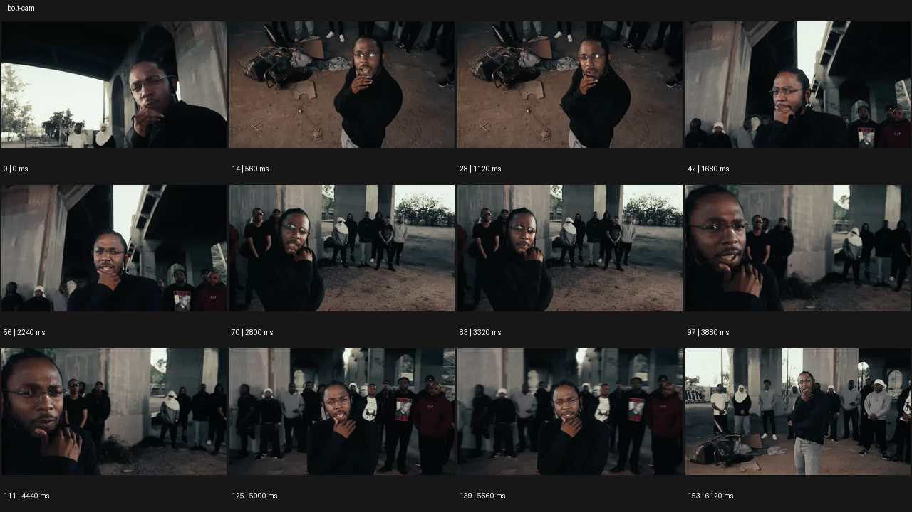
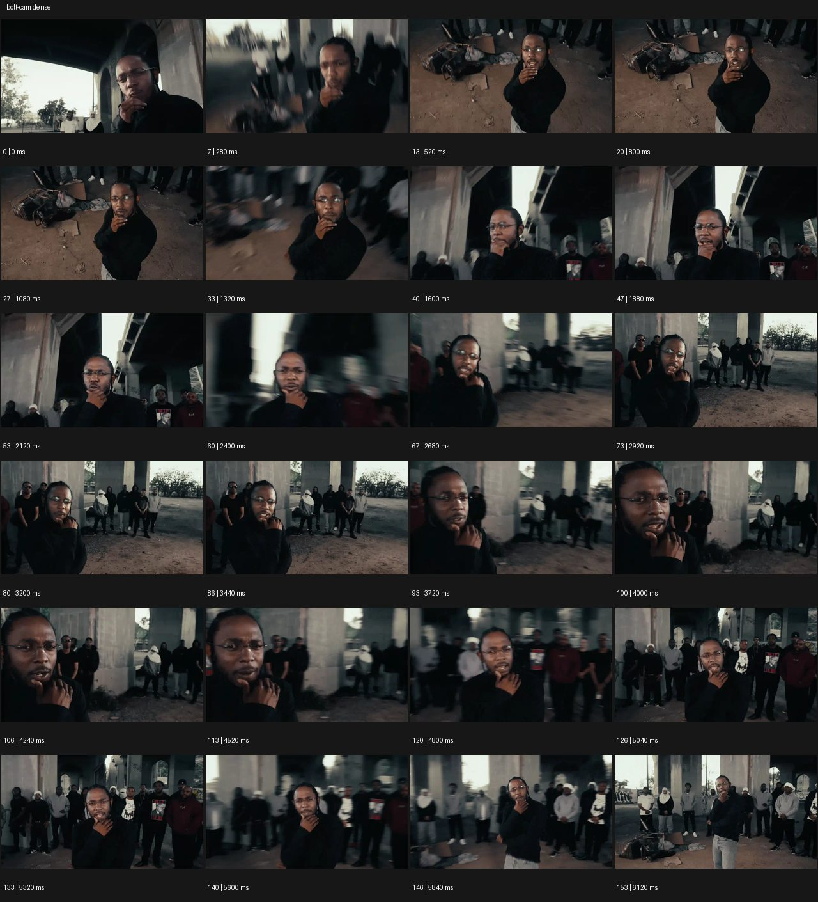

# Bolt Cam


- 원본 등록명: **Bolt Cam**
- 분류: A · 카메라 무브 / Camera Moves
- 공식 기법 페이지: [Bolt Cam](https://eyecannndy.com/technique/bolt-cam)
- 지정 원본 미디어: [애니메이션 WebP](https://asset.eyecannndy.com/media/clip/2023/12/24/261703408961.webp)
- 확인 방식: 154프레임 중 12시점의 시간순 이미지 배열을 직접 시각 확인. 메타데이터 길이 6.16초. 추가 24시점 배열도 직접 확인. 전체 프레임 재생·청음 확인 또는 생성 재현 테스트로 보고하지 않는다.





## 실제 관찰

0–0.52초 턱에 손을 댄 인물의 낮은 근접 구도에서 높은 내려다보기로 급히 이동한다. 1.32초와 2.40초 전후에는 배경이 흐려지고 높이·측면이 바뀐다. 3.72초 얼굴로 가까워졌다가 4.80–6.12초 다시 넓어져 뒤의 군중까지 드러난다.

## 작동 원리와 역할

주체는 손·입·시선의 작은 퍼포먼스를 지속한다. 카메라 시점이 고저·좌우·거리 사이를 짧게 이동하고 각 위치에서 잠깐 머문다. 방향성 블러는 이동 구간에 집중된다.

## 해석의 한계

표본으로 실제 로봇 장비나 숨은 편집 여부는 확정할 수 없다. 속도 수치와 완전한 무편집 촬영을 원본 사실로 주장하지 않는다. 샘플 사이의 모든 움직임과 반복 경계의 무봉합 여부는 별도 검증하지 않았다. 아래 프롬프트는 새로운 장면 각색이며 생성 테스트는 하지 않았다.

## 뮤직비디오 적용 · 완성형 프롬프트

아래 설정과 길이는 독립 창작 예시다. 실제 요청의 길이·참조·음향 조건을 우선한다.

```text
8초 뮤직비디오, 비어 있는 콘크리트 수영장에서 은색 재킷을 입은 성인 보컬이 마이크 케이블을 감아 쥔다. 시작은 손과 가슴의 낮은 근접 구도로 케이블의 긴장을 읽힌다. 손을 펼치는 순간 카메라가 왼쪽 위로 빠르게 이동해 내려다보는 전신에 멈추고, 다음 어깨 동작에 오른쪽 눈높이로 급히 내려온다. 이동 때만 강한 방향성 블러를 남기며 얼굴과 의상은 유지한다. 마지막에는 뒤로 빠져 빈 수영장의 규모와 혼자 선 보컬을 함께 담고 1초 정지한다. 합성 분신이나 장면 전환 없이 카메라 위치 변화로 감정의 압박을 만든다.
```

## 브랜드필름 적용 · 완성형 프롬프트

제품의 재질과 기능이 읽히는 순간에 효과를 배치하고 안정된 제품 상태로 끝낸다. 실제 브랜드 톤과 구조에 맞춰 각색한다.

```text
7초 고급 스포츠 시계 필름. 검은 암석 받침 위 티타늄 시계의 크라운을 낮은 매크로 구도로 보여준다. 초침이 상단을 지나는 시각적 계기에 카메라 암이 위로 급상승해 다이얼을 수직으로 내려다보고 짧게 정지한다. 이어 오른쪽 낮은 사선으로 빠르게 이동하며 브레이슬릿의 연결 구조를 드러낸다. 이동 구간에만 자연스러운 블러를 허용하고 제품은 받침에 고정한다. 마지막 2초는 정면 사선의 선명한 제품 구도로 안착하며 넓은 소프트박스 반사가 금속을 한 번 스친다. 다이얼 숫자와 브랜드 각인은 왜곡 없이 읽히게 한다.
```

음향은 원본에서 확인하지 않았다. 실제 음원과 무음·NO BGM 등 사용자 조건을 유지한다. 특정 모델의 자동 재현을 보장하는 프리셋이 아니다.
