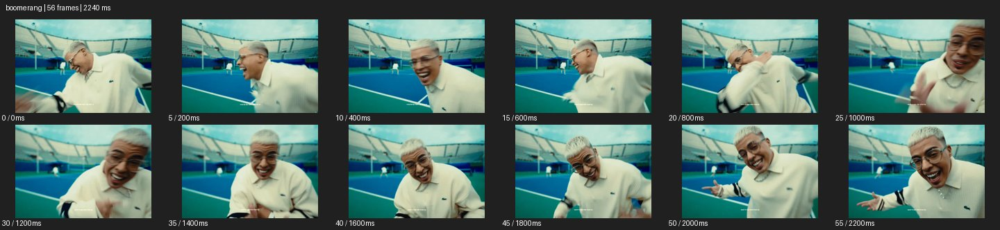
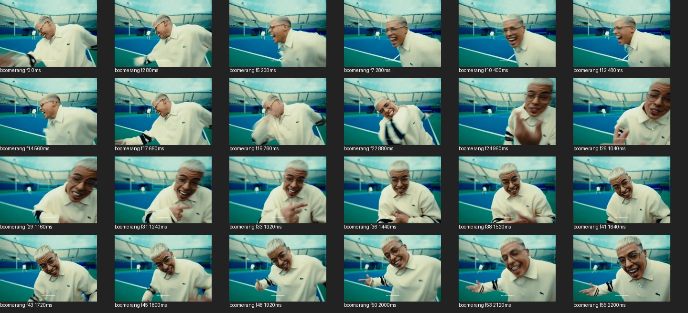

# Boomerang


- 출처: Eyecandy · [Boomerang](https://eyecannndy.com/technique/boomerang)
- 카탈로그 등록 표기: **Boomerang 부메랑 루프**
- 카테고리: G · Speed & Time · 속도 & 시간
- 원본 미디어: [애니메이션 WebP](https://asset.eyecannndy.com/media/clip/2025/02/10/261739192401.webp)
- 확인 방식: 원본 애니메이션을 디코딩해 시간순 프레임을 추출한 뒤 컨택트 시트를 직접 시각 확인했다. 전체 56프레임 / 2240ms, 기본 12시점, 추가 24시점 고밀도 확인. 재생·음향 청취·전 프레임 시각 검수·생성 테스트를 했다고 주장하지 않는다.
- 기본 확인 프레임: 0, 5, 10, 15, 20, 25, 30, 35, 40, 45, 50, 55. 해당 타임스탬프(ms): 0, 200, 400, 600, 800, 1000, 1200, 1400, 1600, 1800, 2000, 2200.
- 원본 길이는 관찰 정보다. 아래 새 장면의 길이를 원본에 자동 맞추지 않는다.

## 움직임 증거





## 원본에서 확인한 시작 → 변화 → 끝

테니스 코트의 흰 옷 인물이 가까이 웃으며 몸을 좌우로 기울인다. 초반 앞으로 온 얼굴이 다시 물러나는 유사 동작 뒤 손짓이 이어진다. 전 구간이 완벽한 정방향·역방향 대칭인지는 샘플로 확인되지 않는다.

- 카메라·시점: 인물 가까운 구도가 작게 움직인다.
- 주체: 몸을 앞뒤로 기울이고 웃고 손짓한다.
- 조명·합성·편집: 초반 유사 경로의 되돌림, 전체 대칭 루프는 미확인.

## 작동 원리와 확인 한계

짧은 행동을 전진·되감기해 다시 출발점으로 돌리는 리듬. 이 원본 전체의 루프 구조와 후반 제스처는 별도로 검증되지 않았다.

샘플 사이의 빠른 변화는 일부 빠질 수 있다. GIF의 반복 경계가 작품의 의도된 완전 루프라는 보장은 없다. 원본 음악·대사·촬영 장비·제작 소프트웨어는 확인하지 않았다. 아래 프롬프트는 관찰한 원리를 다른 장면에 각색한 창작안이며 원본 장면이나 검증된 생성 결과가 아니다.

## 뮤직비디오 각색 · 완전한 장면 프롬프트

```text
장난스러운 성인 보컬이 작은 레코드숍에서 모자를 들어 인사하는 뮤직비디오. 카메라는 정면 미디엄으로 고정한다. 보컬이 모자를 머리에서 들어 올려 웃는 짧은 동작을 보여준 뒤 같은 프레임 순서를 역재생해 모자가 머리 위로 돌아오게 한다. 이 왕복을 두 번 반복하고 마지막에는 정상 재생으로 모자를 내려 손에 쥔다. 끝의 미소를 안정되게 유지한다. 되감기 구간은 손과 모자, 옷 주름이 함께 정확히 돌아가며 새 동작이나 분신이 끼어들지 않는다.
```

## 브랜드필름 각색 · 완전한 장면 프롬프트

```text
작은 가죽 카드지갑의 탄력 있는 플랩을 보여주는 브랜드필름. 밝은 테이블 위 지갑을 손으로 열어 내부를 읽힌 뒤 같은 동작을 역재생해 닫힌 출발 상태로 돌아온다. 카메라는 위쪽 사선 근접 구도로 고정하고 손과 플랩, 그림자가 함께 왕복하도록 한다. 한 번 더 짧게 열고 닫은 뒤 마지막에는 지갑을 완전히 열어 카드 슬롯이 읽히는 상태로 멈춘다. 가죽 색과 스티치 간격, 손가락 수를 유지하고 실제 소재 탄성 이상의 자동 변형은 넣지 않는다.
```

적용 시 사용자가 지정한 길이·참조·컷·음향·제품 보존 조건을 우선한다. 효과의 시작 계기와 도착 구도를 유지하며 필요한 부분을 해당 장면에 맞춰 다시 연출한다.
