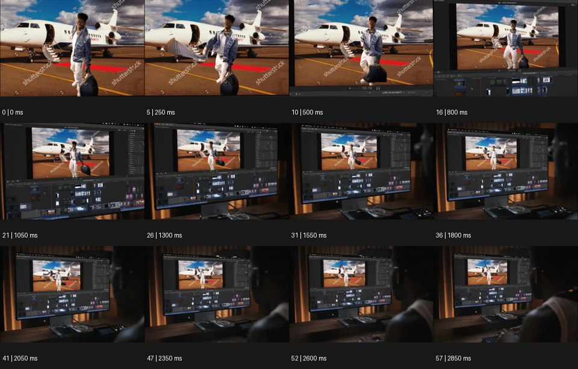

# BTS 비하인드 더 신


출처: Eyecandy · 원본 등록 카드명: **BTS 비하인드 더 신** · slug: breakdown

분류: J · People, POV & Mood / 인물·시점·무드

[원본 기법 페이지](https://eyecannndy.com/technique/breakdown) · [원본 미디어](https://asset.eyecannndy.com/media/clip/2024/02/20/261708472897.webp)

## 확인 근거

원본 58프레임, 메타데이터 길이 2900ms. 고유 12개 시점 프레임을 추출하여 이미지로 직접 관찰했다. 재생 감상·음향 청취·생성 재현 테스트를 했다는 뜻이 아니다.

표본 프레임(0부터): 0, 5, 10, 16, 21, 26, 31, 36, 41, 47, 52, 57



## 실제 시간순 관찰

0–500ms: 비행기 앞 인물이 걷는 합성 장면과 스톡 워터마크 같은 표기가 보인다. 800–1800ms: 그 영상이 편집 소프트웨어 창 안에 있다는 주변 인터페이스가 드러난다. 2050–2850ms: 모니터와 책상, 앞에 앉은 사람의 뒷모습까지 넓게 보인다.

## 주체·카메라·합성·편집 구분

영상 안 인물의 행동은 계속된다. 카메라 또는 합성된 후퇴가 완성 화면의 경계를 드러내며 제작 환경으로 시야를 넓힌다. 편집 인터페이스는 화면 안의 실제 요소다.

## 장면에 재사용할 원리

완성 이미지로 시작해 그 이미지를 만들거나 보는 물리적·작업적 맥락을 공개한다.

## 확인 한계

원본 워터마크나 편집 프로그램 브랜드를 새 영상에 복제하지 않는다. 실제 제작 비하인드 기록인지 연출인지 미확인이다. 표본 사이의 모든 프레임과 반복 경계의 연속성을 검사하지 않았다. 음향은 확인하지 않았다.

## 뮤직비디오 각색 · 완성형 프롬프트

아래는 장면 목적에 맞게 새로 설계한 창작 적용안이며 원본 길이를 상속하지 않는다.

```text
8초 제작 과정 공개형 뮤직비디오, 첫 2초는 성인 보컬이 비현실적인 붉은 사막 무대에서 노래하는 완성 영상처럼 보이게 한다. 2초부터 카메라가 천천히 뒤로 이동하며 사막 영상이 작은 스튜디오의 프로젝션 벽임을 드러낸다. 보컬은 같은 위치에서 퍼포먼스를 이어가고 화면 바깥의 케이블과 조명 스탠드가 차례로 들어온다. 5초에는 옆의 연출자가 손으로 조용히 박자를 세는 모습까지 포함한다. 마지막 2초는 보컬과 만드는 사람들을 한 구도에 담아 환상이 공동 작업임을 보여준다. 인물 정체성과 무대 방향을 유지하고 새 로고·자막은 없다.
```

## 브랜드필름 각색 · 완성형 프롬프트

```text
8초 공예 브랜드필름, 첫 2초는 완성된 세라믹 화병의 매끄러운 옆면을 고급 제품 광고처럼 가까이 보여준다. 카메라가 뒤로 천천히 이동하면서 화병이 사진 촬영용 받침 위에 있고 옆에 작은 반사판과 장인의 손이 있다는 사실을 드러낸다. 장인은 화병을 아주 조금 돌려 빛에 유약 결을 맞추고 손을 뺀다. 5초에 작업대의 유약 표본과 사용 흔적이 보이면 카메라 이동을 멈춘다. 마지막 3초는 완성 제품과 제작의 흔적을 함께 읽히되 화병이 중심을 잃지 않게 한다. 가짜 공정 UI·새 워터마크·문구 없이 도자기와 손의 작은 접촉음만 둔다.
```

생성 테스트: 미실시. 단일 모델의 정확한 재현을 보장하지 않으며 필요한 촬영·합성·편집 층을 구분해 구현한다.
