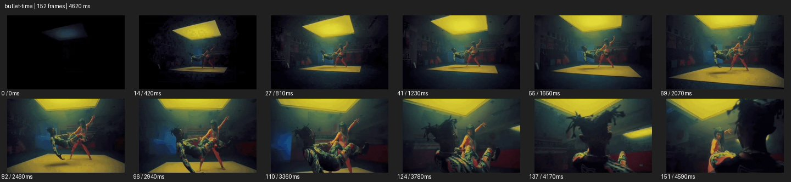

# Bullet Time


- 출처: Eyecandy · [Bullet Time](https://eyecannndy.com/technique/bullet-time)
- 카탈로그 등록 표기: **Bullet Time 불릿타임**
- 카테고리: G · Speed & Time · 속도 & 시간
- 원본 미디어: [애니메이션 WebP](https://asset.eyecannndy.com/media/clip/2023/12/23/261703314154.webp)
- 확인 방식: 원본 애니메이션을 디코딩해 시간순 프레임을 추출한 뒤 컨택트 시트를 직접 시각 확인했다. 전체 152프레임 / 4620ms, 기본 12시점. 재생·음향 청취·전 프레임 시각 검수·생성 테스트를 했다고 주장하지 않는다.
- 기본 확인 프레임: 0, 14, 27, 41, 55, 69, 82, 96, 110, 124, 137, 151. 해당 타임스탬프(ms): 0, 420, 810, 1230, 1650, 2070, 2460, 2940, 3360, 3780, 4170, 4590.
- 원본 길이는 관찰 정보다. 아래 새 장면의 길이를 원본에 자동 맞추지 않는다.

## 움직임 증거



## 원본에서 확인한 시작 → 변화 → 끝

어두운 실내 위의 노란 사각 빛 아래 여러 인물이 공중 또는 기울어진 포즈로 보인다. 카메라가 접근하며 옆으로 크게 이동하고 전경 인물이 커지지만 몸의 포즈는 대부분 유지된다.

- 카메라·시점: 거의 고정된 포즈 사이로 접근·원호 이동한다.
- 주체: 인물들은 공중·기울어진 자세를 대부분 유지한다.
- 조명·합성·편집: 주체 시간과 카메라 시간을 분리한 인상이며 촬영방식 미확인.

## 작동 원리와 확인 한계

주체의 시간을 거의 멈춘 상태로 공간 시점을 이동해 순간의 입체 관계를 읽힌다. 완전 정지인지 극저속인지, 다중 카메라 촬영인지는 미확인.

샘플 사이의 빠른 변화는 일부 빠질 수 있다. GIF의 반복 경계가 작품의 의도된 완전 루프라는 보장은 없다. 원본 음악·대사·촬영 장비·제작 소프트웨어는 확인하지 않았다. 아래 프롬프트는 관찰한 원리를 다른 장면에 각색한 창작안이며 원본 장면이나 검증된 생성 결과가 아니다.

## 뮤직비디오 각색 · 완전한 장면 프롬프트

```text
성인 댄서 둘이 마주 보며 점프하는 뮤직비디오. 처음 정면 와이드에서 도약을 보여주고 두 사람의 발이 공중에 뜬 순간 몸과 옷자락의 시간을 거의 멈춘다. 카메라만 왼쪽으로 짧은 원호 이동하며 겹쳐 있던 팔과 다리를 다른 각도에서 분리해 보여준다. 원호 끝에서 시간을 다시 정상으로 풀어 두 사람이 같은 바닥에 착지하도록 한다. 마지막에는 전신과 바닥 그림자가 보이는 수평 구도에서 멈춘다. 얼굴과 관절은 고정된 순간의 형태를 유지하고 복제 인물을 만들지 않는다.
```

## 브랜드필름 각색 · 완전한 장면 프롬프트

```text
가벼운 스포츠 가방의 움직임을 보여주는 브랜드필름. 성인 모델이 가방을 어깨에 올리는 동작을 측면 미디엄으로 담는다. 스트랩이 공중에서 곡선을 그리는 순간 모델과 가방의 시간을 잠깐 정지시키고 카메라만 작은 반원으로 이동해 가방의 측면과 등판을 순서대로 보여준다. 정면 가까운 각도에 도착하면 동작을 재개해 스트랩이 어깨에 자연스럽게 내려앉는다. 마지막에는 가방을 착용한 전신을 읽힌다. 스트랩의 연결점과 제품 비율, 손의 접촉은 유지한다.
```

적용 시 사용자가 지정한 길이·참조·컷·음향·제품 보존 조건을 우선한다. 효과의 시작 계기와 도착 구도를 유지하며 필요한 부분을 해당 장면에 맞춰 다시 연출한다.
