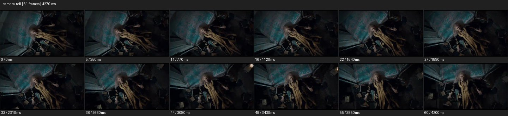

# Camera Roll


- 출처: Eyecandy · [Camera Roll](https://eyecannndy.com/technique/camera-roll)
- 카탈로그 등록 표기: **Camera Roll 카메라 롤**
- 카테고리: E · More Camera Moves · 카메라 무브 확장
- 원본 미디어: [애니메이션 WebP](https://asset.eyecannndy.com/media/clip/2023/12/23/261703364350.webp)
- 확인 방식: 원본 애니메이션을 디코딩해 시간순 프레임을 추출한 뒤 컨택트 시트를 직접 시각 확인했다. 전체 61프레임 / 4270ms, 기본 12시점. 재생·음향 청취·전 프레임 시각 검수·생성 테스트를 했다고 주장하지 않는다.
- 기본 확인 프레임: 0, 5, 11, 16, 22, 27, 33, 38, 44, 49, 55, 60. 해당 타임스탬프(ms): 0, 350, 770, 1120, 1540, 1890, 2310, 2660, 3080, 3430, 3850, 4200.
- 원본 길이는 관찰 정보다. 아래 새 장면의 길이를 원본에 자동 맞추지 않는다.

## 움직임 증거



## 원본에서 확인한 시작 → 변화 → 끝

어두운 실내의 긴 머리 인물이 비스듬한 구도에 보인다. 배경의 직선과 인물이 함께 조금씩 회전해 끝에서 상대적으로 바로 선 구도에 가까워진다. 샘플에서 180도 완전 회전은 확인되지 않는다.

- 카메라·시점: 배경과 인물이 함께 광축 주위로 기울기를 바꾼다.
- 주체: 얼굴과 상체가 작게 움직인다.
- 조명·합성·편집: 후반 회전인지 촬영 롤인지 구분되지 않음.

## 작동 원리와 확인 한계

인물의 몸 회전이 아니라 화면 광축 주위 회전으로 수평 감각을 바꾼다. 원본의 정확한 회전량과 촬영·후반 회전 방식은 확인되지 않는다.

샘플 사이의 빠른 변화는 일부 빠질 수 있다. GIF의 반복 경계가 작품의 의도된 완전 루프라는 보장은 없다. 원본 음악·대사·촬영 장비·제작 소프트웨어는 확인하지 않았다. 아래 프롬프트는 관찰한 원리를 다른 장면에 각색한 창작안이며 원본 장면이나 검증된 생성 결과가 아니다.

## 뮤직비디오 각색 · 완전한 장면 프롬프트

```text
흔들리는 감정을 보여주는 뮤직비디오. 폐극장 객석 사이에 선 성인 보컬의 얼굴 미디엄을 수평으로 시작한다. 보컬이 두 눈을 감으면 카메라가 천천히 접근하면서 광축을 따라 시계 방향으로 롤해 좌석 줄이 대각선으로 기울게 한다. 머리와 얼굴 형태는 정상으로 유지하고 인물이 몸을 비트는 동작으로 대체하지 않는다. 보컬이 다시 눈을 뜨는 후반에는 접근을 멈추고 롤만 부드럽게 되돌려 수평 얼굴 클로즈업으로 착지한다. 마지막 시선을 충분히 남기고 컷 없이 끝낸다.
```

## 브랜드필름 각색 · 완전한 장면 프롬프트

```text
검은 테일러드 코트의 구조를 강조하는 패션 브랜드필름. 밝은 사각 천창 아래 성인 모델을 전신으로 담고 카메라가 조금 낮은 위치에서 천천히 전진한다. 모델이 한 걸음 내딛는 동안 카메라 광축의 롤을 더해 천창과 벽의 직선이 함께 기울도록 한다. 모델은 곧은 자세를 유지하며 코트 자락만 자연스럽게 흔들린다. 마지막에는 롤을 풀고 허리 위 구도로 정지해 라펠과 여밈의 선을 읽힌다. 얼굴 정체성과 옷의 재단선을 보존하고 회전 중 인체 왜곡은 만들지 않는다.
```

적용 시 사용자가 지정한 길이·참조·컷·음향·제품 보존 조건을 우선한다. 효과의 시작 계기와 도착 구도를 유지하며 필요한 부분을 해당 장면에 맞춰 다시 연출한다.
