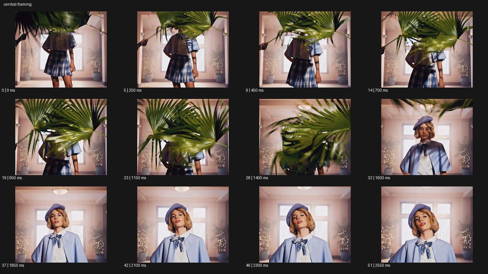

# Central Framing 센트럴 프레이밍


- 원본 등록명: **Central Framing 센트럴 프레이밍**
- 분류: B · 앵글 & 구도 / Angle & Framing
- 공식 기법 페이지: [Central Framing 센트럴 프레이밍](https://eyecannndy.com/technique/central-framing)
- 지정 원본 미디어: [애니메이션 WebP](https://asset.eyecannndy.com/media/clip/2024/02/04/261707021536.webp)
- 확인 방식: 52프레임 중 12시점의 시간순 이미지 배열을 직접 시각 확인. 메타데이터 길이 2.6초. 전체 프레임 재생·청음 확인 또는 생성 재현 테스트로 보고하지 않는다.



## 실제 관찰

분홍색 방 중앙에 서 있는 인물이 큰 야자 잎에 얼굴을 가린 채 시작한다. 0.25–1.4초 잎이 좌우로 흔들리며 앞을 가렸다가 1.6초 얼굴과 모자가 드러난다. 후반에는 중앙 인물의 상반신이 커지고 뒤 창문과 좌우 조명 요소의 대칭 관계가 남는다.

## 작동 원리와 역할

피사체를 중앙에 유지하는 프레이밍과 전경 잎의 가림이 결합된다. 잎을 치우는 행동, 인물의 미세 자세 변화, 더 가까워진 프레이밍을 구별한다.

## 해석의 한계

정중앙 구성은 모든 요소의 완전한 대칭을 뜻하지 않는다. 이동이 물리적 접근인지 줌인지 이 표본으로 단정하지 않는다. 샘플 사이의 모든 움직임과 반복 경계의 무봉합 여부는 별도 검증하지 않았다. 아래 프롬프트는 새로운 장면 각색이며 생성 테스트는 하지 않았다.

## 뮤직비디오 적용 · 완성형 프롬프트

아래 설정과 길이는 독립 창작 예시다. 실제 요청의 길이·참조·음향 조건을 우선한다.

```text
7초 뮤직비디오. 좁고 대칭적인 분홍색 복도 끝에 흰 수트를 입은 성인 보컬이 중앙에 선다. 전경 양쪽 커튼이 얼굴을 가린 상태로 시작하고 카메라는 복도의 중심축에서 눈높이를 유지한다. 보컬이 손을 들면 양쪽 커튼이 동시에 열려 얼굴과 전신이 드러난다. 카메라는 중심축을 따라 천천히 접근하되 보컬의 눈과 복도 소실점이 화면 중앙에서 벗어나지 않게 한다. 보컬은 한 걸음도 이동하지 않고 손을 내린다. 마지막에는 가슴 위 대칭 구도에 멈춰 정면 시선의 긴장을 남긴다. 좌우 복도를 서로 다른 공간으로 바꾸지 않는다.
```

## 브랜드필름 적용 · 완성형 프롬프트

제품의 재질과 기능이 읽히는 순간에 효과를 배치하고 안정된 제품 상태로 끝낸다. 실제 브랜드 톤과 구조에 맞춰 각색한다.

```text
7초 고급 향수 필름. 대칭적인 석재 틈 중앙에 투명한 향수병 하나를 세운다. 카메라는 병의 정면 라벨 중심을 화면 중앙에 두고 시작하며 양쪽의 얇은 리넨 천이 병을 절반씩 가린다. 잔잔한 바람이 천을 바깥으로 걷어내면 병의 전체 윤곽과 호박빛 액체가 드러난다. 카메라는 중심축을 따라 짧게 접근하며 라벨과 캡의 수직선을 유지한다. 빛은 왼쪽 모서리에서 오른쪽 모서리로 부드럽게 옮겨가 유리 두께를 읽힌다. 마지막 2초 카메라와 천이 안정되고 제품이 정확한 중앙의 선명한 정면으로 남는다.
```

음향은 원본에서 확인하지 않았다. 실제 음원과 무음·NO BGM 등 사용자 조건을 유지한다. 특정 모델의 자동 재현을 보장하는 프리셋이 아니다.
