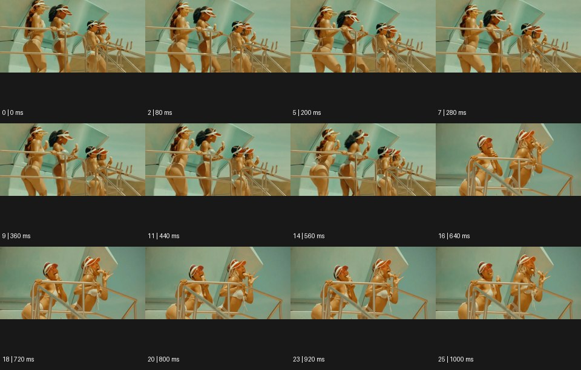

# Choreo 안무


출처: Eyecandy · 원본 등록 카드명: **Choreo 안무** · slug: choreo

분류: J · People, POV & Mood / 인물·시점·무드

[원본 기법 페이지](https://eyecannndy.com/technique/choreo) · [원본 미디어](https://asset.eyecannndy.com/media/clip/2024/05/15/261715813804.webp)

## 확인 근거

원본 26프레임, 메타데이터 길이 1040ms. 고유 12개 시점 프레임을 추출하여 이미지로 직접 관찰했다. 재생 감상·음향 청취·생성 재현 테스트를 했다는 뜻이 아니다.

표본 프레임(0부터): 0, 2, 5, 7, 9, 11, 14, 16, 18, 20, 23, 25



## 실제 시간순 관찰

0–560ms: 밝은 야외 계단의 여러 인물이 나란히 서서 팔을 들어 비슷한 제스처를 한다. 640ms: 두 인물이 더 크게 보이는 다른 구도로 바뀐다. 720–1000ms: 두 인물이 손과 팔의 방향을 맞추어 몸을 기울이는 동작을 이어간다.

## 주체·카메라·합성·편집 구분

여러 주체의 동작 관계가 중심이다. 카메라는 각 숏에서 비교적 안정되어 있고 중간에 편집이 있다. 동작의 정확한 음악 싱크는 미확인이다.

## 장면에 재사용할 원리

신체 방향·간격·순서를 조직해 관계와 리듬을 전달한다. 복제 VFX 대신 실제 다수의 연기를 설계할 수도 있다.

## 확인 한계

1.04초 원본에서 전체 안무의 시작과 결말을 확인한 것은 아니다. 표본 사이의 모든 프레임과 반복 경계의 연속성을 검사하지 않았다. 음향은 확인하지 않았다.

## 뮤직비디오 각색 · 완성형 프롬프트

아래는 장면 목적에 맞게 새로 설계한 창작 적용안이며 원본 길이를 상속하지 않는다.

```text
7초 안무 중심 뮤직비디오, 성인 댄서 네 명을 텅 빈 흰 계단에 한 칸씩 어긋나게 세운다. 카메라는 계단 옆의 고정 와이드숏으로 전신과 발 위치를 모두 담는다. 맨 아래 인물이 손바닥을 위로 열면 나머지가 아래에서 위 순서로 같은 동작을 이어 받아 팔의 파도를 만든다. 3초에 모두 몸을 반대 방향으로 돌리되 발은 자기 계단을 벗어나지 않는다. 마지막 2초에는 열린 손을 가슴 앞에 모으고 서로 다른 높이에서 같은 방향을 바라본다. 카메라 전환이나 복제 없이 신체의 순서만으로 개인이 집단에 합류하는 감정을 만든다. 대사·자막 없이 발과 옷감 소리만 둔다.
```

## 브랜드필름 각색 · 완성형 프롬프트

```text
8초 테일러링 브랜드필름, 성인 모델 세 명이 긴 회색 복도에 일정한 간격으로 선다. 카메라는 낮은 정면에서 천천히 뒤로 이동한다. 첫 모델이 재킷 단추를 잠그고, 그 동작이 끝나는 순간 두 번째 모델이 커프스를 정리하며, 이어 세 번째가 깃을 편다. 동작을 서로 겹치지 않는 순서로 진행해 옷의 세부를 각각 읽힌다. 5초에 세 모델이 함께 한 걸음 전진하면 재킷의 자연스러운 드레이프가 같은 방향으로 반응한다. 카메라는 멈추고 마지막 2초는 세 실루엣을 정돈된 간격으로 보여준다. 불필요한 손동작·새 로고·문구 없이 옷감과 발소리만 둔다.
```

생성 테스트: 미실시. 단일 모델의 정확한 재현을 보장하지 않으며 필요한 촬영·합성·편집 층을 구분해 구현한다.
