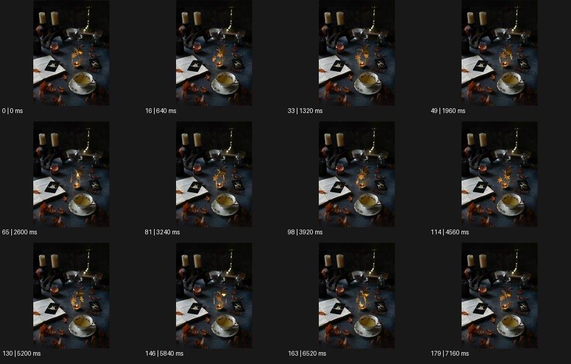

# Cinemagraph 시네마그래프


출처: Eyecandy · 원본 등록 카드명: **Cinemagraph 시네마그래프** · slug: cinemagraph

분류: J · People, POV & Mood / 인물·시점·무드

[원본 기법 페이지](https://eyecannndy.com/technique/cinemagraph) · [원본 미디어](https://asset.eyecannndy.com/media/clip/2024/01/01/261704071329.webp)

## 확인 근거

원본 180프레임, 메타데이터 길이 7200ms. 고유 12개 시점 프레임을 추출하여 이미지로 직접 관찰했다. 재생 감상·음향 청취·생성 재현 테스트를 했다는 뜻이 아니다.

표본 프레임(0부터): 0, 16, 33, 49, 65, 81, 98, 114, 130, 146, 163, 179



## 실제 시간순 관찰

0–1960ms: 찻잔·촛대·카드·마른 잎이 놓인 어두운 정물 구도가 유지되고 중앙의 작은 금빛 장식 형태가 달라진다. 2600–4560ms: 장식의 날개·막대처럼 보이는 부분이 방향을 바꾸는 동안 주변 사물은 같은 위치에 있다. 5200–7160ms: 같은 제한된 부분의 변화가 이어진다.

## 주체·카메라·합성·편집 구분

카메라와 대부분의 정물은 고정된다. 작은 금빛 장식 영역의 움직임만 두드러진다. 국부 영상과 정지 이미지 합성 여부는 화면상 추정이다.

## 장면에 재사용할 원리

정지된 전체와 제한된 움직임의 차이로 주의를 집중시키고 긴 시간의 정적 분위기를 유지한다.

## 확인 한계

찻잔·음료까지 움직인다고 덧붙이지 않는다. 정밀 루프의 프레임 일치 여부는 검사하지 않았다. 표본 사이의 모든 프레임과 반복 경계의 연속성을 검사하지 않았다. 음향은 확인하지 않았다.

## 뮤직비디오 각색 · 완성형 프롬프트

아래는 장면 목적에 맞게 새로 설계한 창작 적용안이며 원본 길이를 상속하지 않는다.

```text
8초 시네마그래프 뮤직비디오, 어두운 작업실 책상에 성인 보컬이 턱을 괴고 앉아 있는 정지 초상을 만든다. 카메라는 고정된 삼사분면이며 얼굴·손·책·옷은 첫 프레임의 자세로 유지한다. 움직이는 것은 보컬 앞 작은 메트로놈의 추 하나뿐이다. 추가로 눈 깜빡임이나 커튼 흔들림을 만들지 않는다. 추는 좌우로 일정하게 움직이고 방향이 바뀔 때 작은 멈춤을 남겨 정적 속 시간의 압박을 보여준다. 마지막까지 같은 구도를 유지하고 시작과 끝의 추 위치를 맞춰 반복 가능한 여운을 만든다. 생성 문자와 대사 없이 메트로놈 소리만 둔다.
```

## 브랜드필름 각색 · 완성형 프롬프트

```text
8초 차 브랜드필름, 짙은 목재 테이블 위에 흰 찻잔·차 포장·접힌 리넨을 정물처럼 배치한다. 카메라는 사선 위쪽에서 완전히 고정하고 모든 사물과 그림자는 같은 위치를 유지한다. 찻잔 위의 아주 얇은 증기 한 줄만 천천히 올라가 휘었다가 다시 가늘어지는 움직임을 반복한다. 찻잔의 액체 표면이나 포장 글자가 흔들리지 않게 한다. 증기는 제품 라벨을 가리지 않고 창빛을 지나갈 때만 부드럽게 읽힌다. 마지막까지 카메라를 움직이지 않으며 처음과 비슷한 증기 상태로 돌아와 고요한 반복을 만든다. 새 로고·문구·음악 없이 작은 공간 환경음만 둔다.
```

생성 테스트: 미실시. 단일 모델의 정확한 재현을 보장하지 않으며 필요한 촬영·합성·편집 층을 구분해 구현한다.
