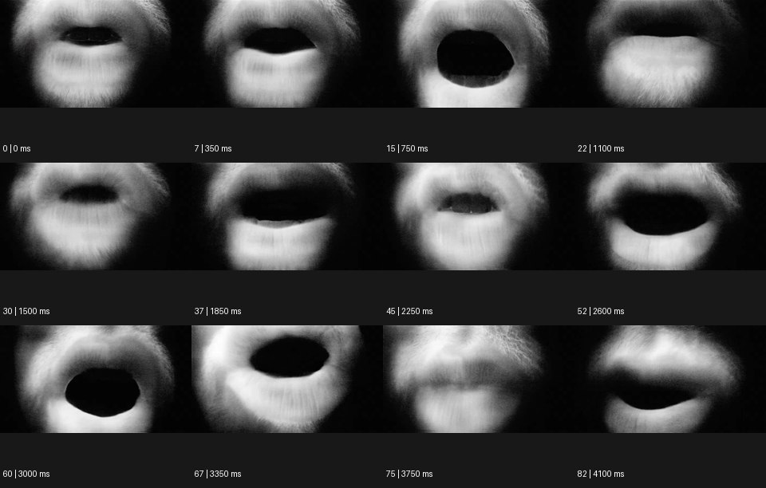

# Close-Up 클로즈업


출처: Eyecandy · 원본 등록 카드명: **Close-Up 클로즈업** · slug: close-up

분류: J · People, POV & Mood / 인물·시점·무드

[원본 기법 페이지](https://eyecannndy.com/technique/close-up) · [원본 미디어](https://asset.eyecannndy.com/media/clip/2024/07/07/261720343410.webp)

## 확인 근거

원본 83프레임, 메타데이터 길이 4150ms. 고유 12개 시점 프레임을 추출하여 이미지로 직접 관찰했다. 재생 감상·음향 청취·생성 재현 테스트를 했다는 뜻이 아니다.

표본 프레임(0부터): 0, 7, 15, 22, 30, 37, 45, 52, 60, 67, 75, 82



## 실제 시간순 관찰

0–1100ms: 흑백 입술과 입 주변만 프레임을 채우며 입이 크게 열렸다 좁아진다. 1500–2600ms: 여러 입 모양이 이어지고 입 안 암부·치아 일부가 보인다. 3000–4100ms: 다시 크게 열린 입에서 비스듬한 입술 형태로 바뀐다. 얼굴 전체는 나오지 않는다.

## 주체·카메라·합성·편집 구분

주체의 입 움직임이 주요 동작이다. 화면 구도는 극단적으로 가까워 작은 움직임도 크게 보인다. 필름 같은 질감·흐림이 있으나 특정 필름 재료는 미확인이다.

## 장면에 재사용할 원리

주요 디테일이 화면을 차지하도록 주변 맥락을 줄여 감각·긴장·재질에 집중시킨다.

## 확인 한계

입 모양만으로 가사나 발화를 추정하지 않는다. 확대 자체를 다음 장면 전환으로 만들 필요는 없다. 표본 사이의 모든 프레임과 반복 경계의 연속성을 검사하지 않았다. 음향은 확인하지 않았다.

## 뮤직비디오 각색 · 완성형 프롬프트

아래는 장면 목적에 맞게 새로 설계한 창작 적용안이며 원본 길이를 상속하지 않는다.

```text
6초 클로즈업 뮤직비디오, 성인 보컬의 입술과 턱 일부만 흑백으로 프레임을 채운다. 카메라는 정면 고정이며 피부의 실제 질감과 입술 가장자리 초점을 유지한다. 첫 1초는 입술이 가볍게 닫힌 호흡, 다음 3초는 한 음절을 길게 내는 듯 자연스럽게 벌어졌다가 좁아지는 동작을 보여준다. 가사를 화면에 쓰거나 정확한 발화를 강요하지 않는다. 마지막 2초에는 입이 닫히고 턱의 작은 긴장이 풀리는 순간을 충분히 읽힌다. 다른 얼굴 부위로 이동하거나 입 안으로 들어가지 않는다. 음악과 대사 없이 작은 호흡만 두어 디테일 자체가 장면이 되게 한다.
```

## 브랜드필름 각색 · 완성형 프롬프트

```text
7초 가죽 제품 브랜드필름, 짙은 갈색 가방 손잡이의 스티치와 가죽 단면을 매크로 클로즈업으로 담는다. 카메라는 손잡이 곡선을 따라 10cm만 천천히 이동하고 얕은 초점은 스티치 한 줄을 따라간다. 2초에 성인 장인의 엄지가 화면 가장자리에서 들어와 가죽을 한 번 누르면 표면이 아주 조금 눌렸다가 원래 두께로 돌아온다. 손은 제품을 가리지 않고 질감의 탄성만 설명한다. 5초에 손이 빠지면 카메라는 접합부에서 멈춰 정확한 실 간격과 가죽 결을 읽힌다. 마지막 2초는 고정된 디테일, 전체 제품으로 전환하지 않는다. 새 문자 없이 가죽 마찰음만 둔다.
```

생성 테스트: 미실시. 단일 모델의 정확한 재현을 보장하지 않으며 필요한 촬영·합성·편집 층을 구분해 구현한다.
