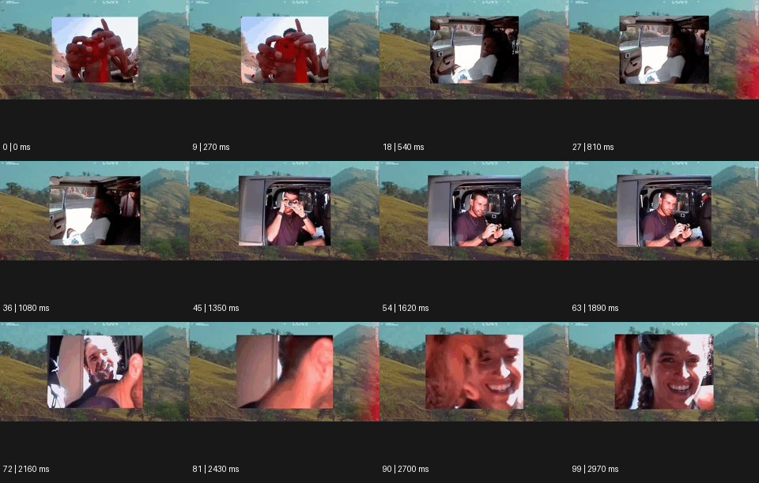

# Collage 콜라주


출처: Eyecandy · 원본 등록 카드명: **Collage 콜라주** · slug: collage

분류: I · VFX & Style / VFX & 스타일

[원본 기법 페이지](https://eyecannndy.com/technique/collage) · [원본 미디어](https://asset.eyecannndy.com/media/clip/2023/12/19/261703028230.webp)

## 확인 근거

원본 100프레임, 메타데이터 길이 3000ms. 고유 12개 시점 프레임을 추출하여 이미지로 직접 관찰했다. 재생 감상·음향 청취·생성 재현 테스트를 했다는 뜻이 아니다.

표본 프레임(0부터): 0, 9, 18, 27, 36, 45, 54, 63, 72, 81, 90, 99



## 실제 시간순 관찰

0–810ms: 산 풍경을 배경으로 중앙의 작은 사각 영상이 손 클로즈업에서 차량 내부 인물로 교체된다. 1080–1890ms: 중앙 창 크기와 위치가 달라지고 다른 인물의 손동작이 보인다. 2160–2970ms: 가까운 얼굴과 손이 연속 교체되는 동안 바깥 산 풍경은 유지된다.

## 주체·카메라·합성·편집 구분

중앙 삽입 영상 속 인물은 각각 움직인다. 배경과 영상 창을 별도 층으로 합성하고 창의 내용·크기를 편집한다. 화면 전체를 한 대의 카메라 경로로 읽지 않는다.

## 장면에 재사용할 원리

서로 다른 출처의 이미지 조각을 한 공간에 병치하고 바깥 맥락과 안쪽 행동의 관계를 만든다.

## 확인 한계

콜라주는 정지 사진에만 한정되지 않으며 이 사례에는 움직이는 영상 창이 있다. 표본 사이의 모든 프레임과 반복 경계의 연속성을 검사하지 않았다. 음향은 확인하지 않았다.

## 뮤직비디오 각색 · 완성형 프롬프트

아래는 장면 목적에 맞게 새로 설계한 창작 적용안이며 원본 길이를 상속하지 않는다.

```text
7초 콜라주 뮤직비디오, 흐린 바닷가의 고정 와이드숏 위에 성인 보컬의 작은 정면 영상 조각을 종이처럼 올린다. 바깥 풍경은 잔잔하게 유지하고 조각 속 보컬은 한 손으로 뺨을 쓸어내린다. 2초에 조각이 오른쪽으로 밀리면 그 아래서 같은 손의 클로즈업 조각이 나타난다. 이어 신발과 바람에 흔들리는 재킷 조각을 서로 겹치지 않는 비대칭 배치로 추가한다. 모든 조각은 같은 의상 색을 공유한다. 마지막 2초에는 얼굴 조각만 중앙에 남고 바깥 바다의 수평선과 눈높이가 맞아 감정을 묶는다. 거친 종이 경계는 유지하되 임의 문구·대사는 없다.
```

## 브랜드필름 각색 · 완성형 프롬프트

```text
8초 여행 가방 브랜드필름, 잔잔한 사막 능선을 배경으로 크림색 종이 위에 제품 디테일 영상 세 조각을 놓는다. 중앙에는 가방 전체, 왼쪽에는 가죽 손잡이를 잡는 손, 오른쪽에는 바퀴가 도는 클로즈업이다. 2초부터 손잡이 조각이 위로 조금 움직이고 바퀴 조각은 아래로 이동해 실제 가방의 부위 위치에 가까워진다. 중앙 제품은 형태가 바뀌지 않은 채 천천히 회전한다. 5초에 세 조각이 정렬되면 바깥 풍경이 아주 약하게 흐려지고 가방 전체가 시선 중심이 된다. 마지막 2초는 봉제·바퀴·손잡이의 정확한 형태를 읽힌다. 로고를 새로 만들지 않고 환경음만 둔다.
```

생성 테스트: 미실시. 단일 모델의 정확한 재현을 보장하지 않으며 필요한 촬영·합성·편집 층을 구분해 구현한다.
