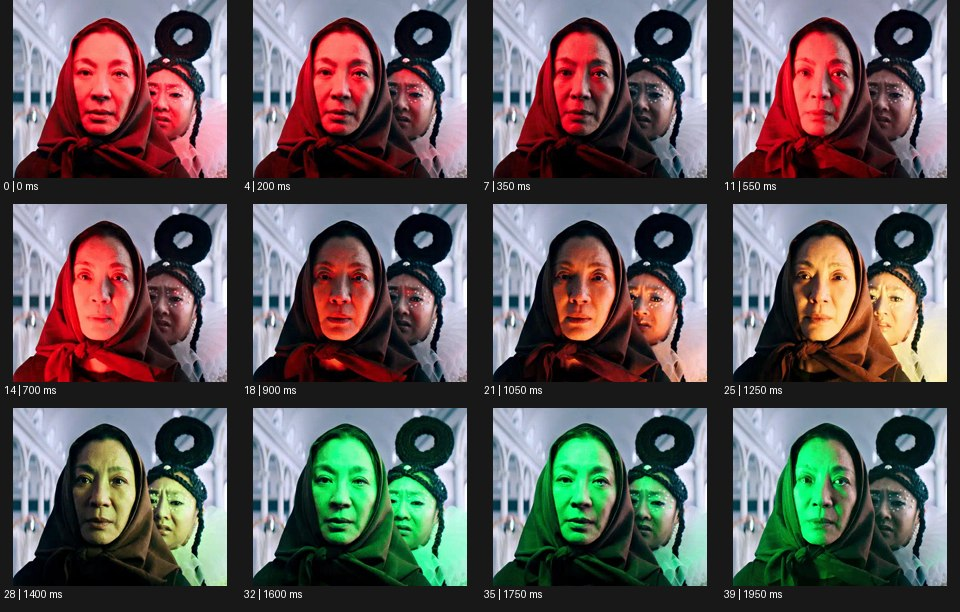

# Color Shift 컬러 시프트


출처: Eyecandy · 원본 등록 카드명: **Color Shift 컬러 시프트** · slug: color-shift

분류: J · People, POV & Mood / 인물·시점·무드

[원본 기법 페이지](https://eyecannndy.com/technique/color-shift) · [원본 미디어](https://asset.eyecannndy.com/media/clip/2024/02/04/261707023894.webp)

## 확인 근거

원본 40프레임, 메타데이터 길이 2000ms. 고유 12개 시점 프레임을 추출하여 이미지로 직접 관찰했다. 재생 감상·음향 청취·생성 재현 테스트를 했다는 뜻이 아니다.

표본 프레임(0부터): 0, 4, 7, 11, 14, 18, 21, 25, 28, 32, 35, 39



## 실제 시간순 관찰

0–550ms: 가까운 두 인물 얼굴에 강한 붉은 빛이 닿는다. 700–1250ms: 붉은빛이 주황·노랑 쪽으로 옮겨가며 얼굴의 밝은 영역이 바뀐다. 1400–1950ms: 녹색 빛이 얼굴과 옷에 우세해진다. 배경 건축은 비슷한 형태를 유지한다.

## 주체·카메라·합성·편집 구분

주체의 작은 표정 변화 위로 색 있는 빛 또는 보정 변화가 겹친다. 카메라는 가까운 정면 구도를 유지한다. 단순 전체 색보정인지 현장 조명인지 단정할 수 없다.

## 장면에 재사용할 원리

한 장면 안에서 색의 상태를 이동시켜 감정·시간·제품 감각의 변화를 만든다. 피부·제품 기준색이 필요한 구간은 확보한다.

## 확인 한계

원본을 무조건 LUT 전환이라고 설명하지 않는다. 얼굴에 국부적으로 다른 명암 변화가 함께 보인다. 표본 사이의 모든 프레임과 반복 경계의 연속성을 검사하지 않았다. 음향은 확인하지 않았다.

## 뮤직비디오 각색 · 완성형 프롬프트

아래는 장면 목적에 맞게 새로 설계한 창작 적용안이며 원본 길이를 상속하지 않는다.

```text
7초 컬러 시프트 뮤직비디오, 검은 방의 성인 보컬 얼굴을 정면 클로즈업으로 담는다. 카메라는 고정하고 처음 2초는 차가운 청록색 빛이 오른쪽 얼굴을 비추며 보컬은 아래를 본다. 보컬이 천천히 시선을 들면 빛이 중앙으로 이동하는 동시에 청록에서 중성 백색으로 바뀐다. 4초에 렌즈와 눈이 맞는 순간 반대쪽에 부드러운 호박색이 들어와 얼굴을 따뜻하게 마무리한다. 피부의 정상적인 형태와 눈 색을 보존하고 배경은 계속 검게 둔다. 마지막 2초는 따뜻한 색에서 표정을 충분히 읽힌다. 번쩍임·컷·자막 없이 호흡과 작은 실내 잔향만 둔다.
```

## 브랜드필름 각색 · 완성형 프롬프트

```text
8초 색조 화장품 브랜드필름, 성인 모델이 중성 회색 스튜디오에서 립 제품을 손에 들고 있다. 눈높이 미디엄 클로즈업의 카메라는 고정한다. 첫 2초는 정확한 제품 색을 백색 조명으로 보여준다. 이어 배경만 부드러운 복숭아색에서 자주색으로 천천히 변하고 모델의 피부와 입술·제품은 중성 조명 아래 기준색을 유지한다. 모델이 제품을 가슴 높이에서 얼굴 옆으로 들어 올리면 카메라가 15cm 접근한다. 5초에 배경색이 옅은 로즈로 멈추고 마지막 3초는 입술의 질감과 제품 형태가 함께 읽힌다. 새 로고·색상명·문자를 생성하지 않는다.
```

생성 테스트: 미실시. 단일 모델의 정확한 재현을 보장하지 않으며 필요한 촬영·합성·편집 층을 구분해 구현한다.
