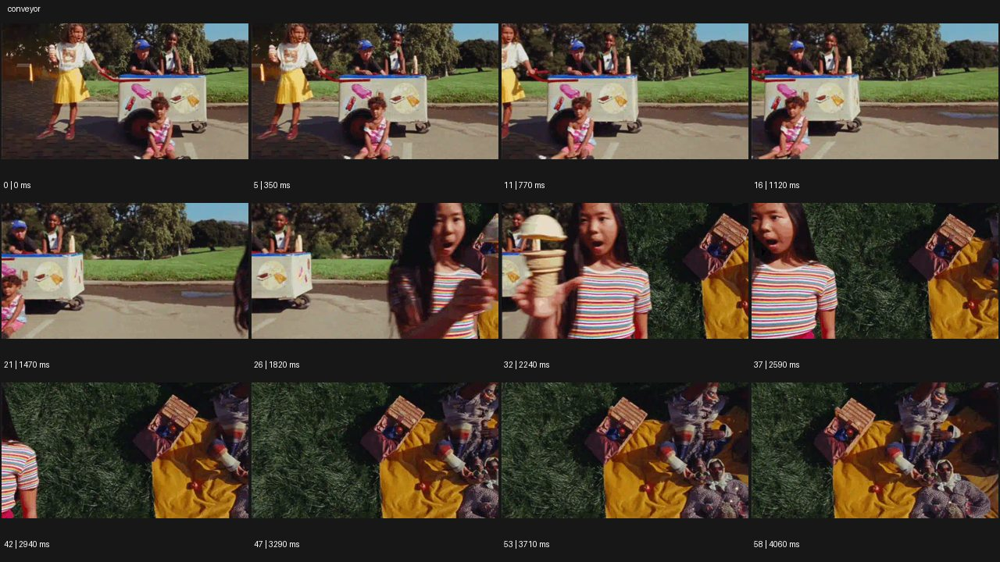

# Conveyor


- 원본 등록명: **Conveyor**
- 분류: A · 카메라 무브 / Camera Moves
- 공식 기법 페이지: [Conveyor](https://eyecannndy.com/technique/conveyor)
- 지정 원본 미디어: [애니메이션 WebP](https://asset.eyecannndy.com/media/clip/2023/12/18/261702865755.webp)
- 확인 방식: 59프레임 중 12시점의 시간순 이미지 배열을 직접 시각 확인. 메타데이터 길이 4.13초. 전체 프레임 재생·청음 확인 또는 생성 재현 테스트로 보고하지 않는다.



## 실제 관찰

0–1.12초 공원의 아이스크림 카트와 사람들이 왼쪽으로 밀려난다. 1.47–2.59초 오른쪽에서 아이스크림을 든 인물이 들어오며 앞 장면의 일부가 왼쪽에 남는다. 2.94초 이후 풀 위 피크닉의 높은 시점으로 넘어가 노란 천과 손에 든 간식이 화면을 차지한다.

## 작동 원리와 역할

연속된 수평 진행이 서로 다른 거리·시점의 장면을 넘겨준다. 주체 손동작과 화면의 슬라이드 연결을 분리하고 진행 방향을 유지한다.

## 해석의 한계

단순 2D 슬라이드인지 현장 이동과 합성의 결합인지는 확인할 수 없다. 같은 실제 공간의 연속 무편집으로 단정하지 않는다. 샘플 사이의 모든 움직임과 반복 경계의 무봉합 여부는 별도 검증하지 않았다. 아래 프롬프트는 새로운 장면 각색이며 생성 테스트는 하지 않았다.

## 뮤직비디오 적용 · 완성형 프롬프트

아래 설정과 길이는 독립 창작 예시다. 실제 요청의 길이·참조·음향 조건을 우선한다.

```text
8초 뮤직비디오. 성인 가수가 긴 야간 세탁소 왼쪽에서 젖은 재킷을 털며 노래하는 허리 위 구도로 시작한다. 가수가 재킷을 오른쪽으로 던지는 순간 화면 전체가 왼쪽으로 일정하게 미끄러지고, 오른쪽에서 같은 색 재킷을 입은 가수의 옥상 퍼포먼스가 들어온다. 두 장면은 잠깐 경계를 공유하며 가수의 어깨 높이와 시선 방향을 이어준다. 옥상 장면이 채워진 뒤 슬라이드를 멈추고 바람 속 가수가 두 팔을 펼친다. 마지막 2초 카메라는 천천히 뒤로 이동해 도시의 낮은 불빛을 드러낸다. 전환은 한 번만 사용하며 재킷이 포털로 변하지 않는다.
```

## 브랜드필름 적용 · 완성형 프롬프트

제품의 재질과 기능이 읽히는 순간에 효과를 배치하고 안정된 제품 상태로 끝낸다. 실제 브랜드 톤과 구조에 맞춰 각색한다.

```text
8초 고급 차 브랜드 필름. 밝은 작업실에서 성인 장인이 흰 도자기 잔에 차를 따르는 근접 장면으로 시작한다. 잔을 오른쪽으로 미는 동작에 맞춰 작업실 화면이 왼쪽으로 미끄러지고 오른쪽에서 저녁 테라스의 같은 잔이 들어온다. 경계가 지나갈 때 잔의 높이, 손의 진행 방향, 호박빛 차 색을 일치시킨다. 테라스 장면이 완전히 채워지면 화면 이동은 멈추고 손이 빠져나간다. 카메라가 아주 짧게 접근해 잔 위 수증기와 옆의 차 패키지를 함께 담는다. 끝 2초는 제품명과 도자기 질감을 선명하게 유지한다.
```

음향은 원본에서 확인하지 않았다. 실제 음원과 무음·NO BGM 등 사용자 조건을 유지한다. 특정 모델의 자동 재현을 보장하는 프리셋이 아니다.
