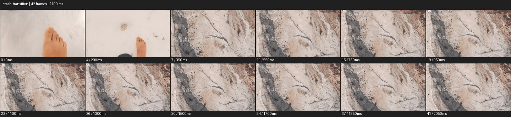
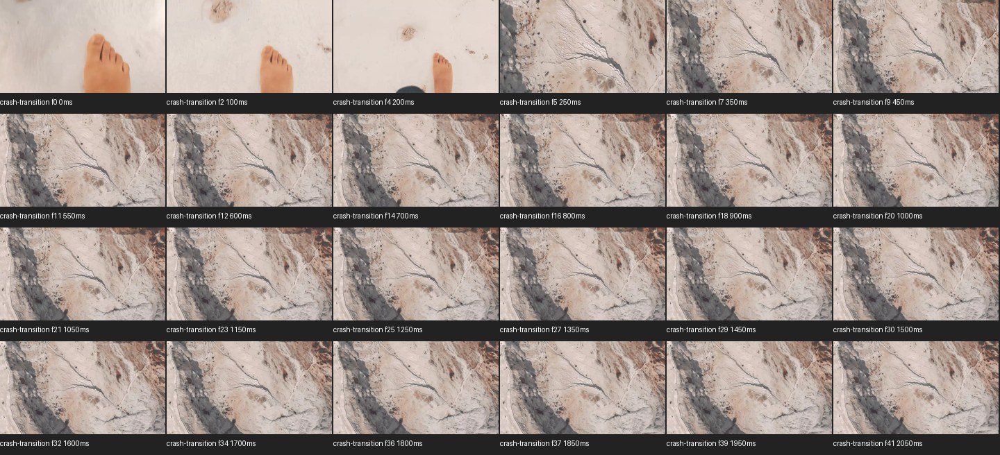

# Crash Cut


- 출처: Eyecandy · [Crash Cut](https://eyecannndy.com/technique/crash-transition)
- 카탈로그 등록 표기: **Crash Cut 크래시 컷**
- 카테고리: H · More Editing & Transition · 편집 & 전환 확장
- 원본 미디어: [애니메이션 WebP](https://asset.eyecannndy.com/media/clip/2024/02/28/261709102810.webp)
- 확인 방식: 원본 애니메이션을 디코딩해 시간순 프레임을 추출한 뒤 컨택트 시트를 직접 시각 확인했다. 전체 42프레임 / 2100ms, 기본 12시점, 추가 24시점 고밀도 확인. 재생·음향 청취·전 프레임 시각 검수·생성 테스트를 했다고 주장하지 않는다.
- 기본 확인 프레임: 0, 4, 7, 11, 15, 19, 22, 26, 30, 34, 37, 41. 해당 타임스탬프(ms): 0, 200, 350, 550, 750, 950, 1100, 1300, 1500, 1700, 1850, 2050.
- 원본 길이는 관찰 정보다. 아래 새 장면의 길이를 원본에 자동 맞추지 않는다.

## 움직임 증거





## 원본에서 확인한 시작 → 변화 → 끝

처음 밝은 땅을 내려다본 맨발이 보인다. 약 0.20–0.25초 사이 바위 절벽의 멀리 있는 인물 구도로 갑자기 바뀐다. 이후 절벽 표면과 인물의 작은 위치 변화가 유지된다.

- 카메라·시점: 맨발 근접에서 절벽 와이드로 규모가 급변한다.
- 주체: 첫 장면 발과 뒤 장면 작은 인물이 보인다.
- 조명·합성·편집: 약 0.20–0.25초 컷이 확실하며 중간 줌 경로는 미확인.

## 작동 원리와 확인 한계

짧은 시간에 가까운 신체 디테일에서 큰 지형 규모로 강하게 넘긴다. 샘플에서는 실제 크래시 줌의 중간 프레임보다 급격한 컷이 확실하므로 긴 줌 경로를 원본 사실로 단정하지 않는다.

샘플 사이의 빠른 변화는 일부 빠질 수 있다. GIF의 반복 경계가 작품의 의도된 완전 루프라는 보장은 없다. 원본 음악·대사·촬영 장비·제작 소프트웨어는 확인하지 않았다. 아래 프롬프트는 관찰한 원리를 다른 장면에 각색한 창작안이며 원본 장면이나 검증된 생성 결과가 아니다.

## 뮤직비디오 각색 · 완전한 장면 프롬프트

```text
성인 보컬의 고립을 크게 드러내는 뮤직비디오. 붉은 흙을 밟는 부츠를 내려다본 가까운 구도로 시작하고 발이 땅에 단단히 닿는 순간 아주 짧게 발 쪽으로 크래시 줌한다. 블러가 강해지는 지점에서 같은 붉은 흙 언덕의 극단적 와이드로 강하게 컷해 작은 보컬 한 명을 중앙에 남긴다. 다음 컷의 카메라는 고정하고 보컬이 고개를 들어 빈 풍경을 바라보게 한다. 마지막에는 풍경을 충분히 유지해 규모 대비를 읽힌다. 부츠와 의상, 지형 색을 두 컷에서 일치시킨다.
```

## 브랜드필름 각색 · 완전한 장면 프롬프트

```text
아웃도어 부츠의 사용 환경을 연결하는 브랜드필름. 바위에 닿는 밑창의 가까운 측면 구도에서 시작해 접지 순간 밑창 패턴 쪽으로 짧고 빠르게 확대한다. 확대의 절정에서 같은 회색 암반 능선 위 성인 하이커의 넓은 전신 장면으로 크래시 컷한다. 두 번째 카메라는 고정하고 하이커가 한 걸음 전진한 뒤 멈춰 풍경을 바라보게 한다. 마지막에는 온전한 부츠와 하이커, 실제 사용 공간이 함께 읽힌다. 제품 패턴과 색을 유지하고 절벽의 위치나 신체 비율을 임의로 바꾸지 않는다.
```

적용 시 사용자가 지정한 길이·참조·컷·음향·제품 보존 조건을 우선한다. 효과의 시작 계기와 도착 구도를 유지하며 필요한 부분을 해당 장면에 맞춰 다시 연출한다.
