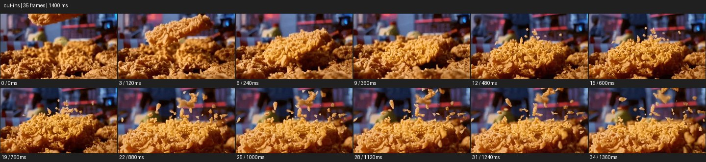

# Cut-ins


- 출처: Eyecandy · [Cut-ins](https://eyecannndy.com/technique/cut-ins)
- 카탈로그 등록 표기: **Cut-ins 컷인**
- 카테고리: H · More Editing & Transition · 편집 & 전환 확장
- 원본 미디어: [애니메이션 WebP](https://asset.eyecannndy.com/media/clip/2024/01/01/261704115165.webp)
- 확인 방식: 원본 애니메이션을 디코딩해 시간순 프레임을 추출한 뒤 컨택트 시트를 직접 시각 확인했다. 전체 35프레임 / 1400ms, 기본 12시점. 재생·음향 청취·전 프레임 시각 검수·생성 테스트를 했다고 주장하지 않는다.
- 기본 확인 프레임: 0, 3, 6, 9, 12, 15, 19, 22, 25, 28, 31, 34. 해당 타임스탬프(ms): 0, 120, 240, 360, 480, 600, 760, 880, 1000, 1120, 1240, 1360.
- 원본 길이는 관찰 정보다. 아래 새 장면의 길이를 원본에 자동 맞추지 않는다.

## 움직임 증거



## 원본에서 확인한 시작 → 변화 → 끝

튀긴 음식 조각이 위에서 떨어져 다른 조각 위에 닿는다. 충돌 후 바삭한 부스러기가 위로 튀며 점점 더 가까운 디테일 구도로 보인다. 배경은 같은 식당 분위기로 유지된다.

- 카메라·시점: 음식의 가까운 디테일 구도를 읽힌다.
- 주체: 조각이 떨어져 부스러기를 튀긴다.
- 조명·합성·편집: 설정 와이드·정확한 컷 경계는 제한된 샘플 밖일 수 있다.

## 작동 원리와 확인 한계

이미 설정된 행동에서 중요한 작은 디테일로 가까운 컷을 넣어 감각 정보를 강조한다. 이 짧은 샘플만으로 앞선 설정 와이드와 모든 컷 경계는 확인되지 않는다.

샘플 사이의 빠른 변화는 일부 빠질 수 있다. GIF의 반복 경계가 작품의 의도된 완전 루프라는 보장은 없다. 원본 음악·대사·촬영 장비·제작 소프트웨어는 확인하지 않았다. 아래 프롬프트는 관찰한 원리를 다른 장면에 각색한 창작안이며 원본 장면이나 검증된 생성 결과가 아니다.

## 뮤직비디오 각색 · 완전한 장면 프롬프트

```text
성인 기타리스트가 곡의 마지막 코드를 잡는 뮤직비디오. 먼저 기타와 상체가 함께 보이는 미디엄에서 손이 지판으로 이동하는 동작을 보여준다. 손가락이 줄을 누르는 순간 같은 방향과 손 위치를 맞춘 지판 클로즈업으로 컷인해 줄의 진동과 손끝 압력을 읽힌다. 마지막에는 다시 상체 미디엄으로 돌아와 기타리스트가 손을 천천히 풀고 고개를 드는 모습을 남긴다. 두 컷에서 기타 구조와 손가락 위치를 일치시키며 공간을 바꾸는 전환은 넣지 않는다.
```

## 브랜드필름 각색 · 완전한 장면 프롬프트

```text
바삭한 빵의 식감을 보여주는 브랜드필름. 따뜻한 식탁의 빵과 성인 손을 미디엄으로 담고 손이 빵을 두 조각으로 가르기 시작한다. 껍질이 갈라지는 순간 같은 손 위치의 근접 디테일로 컷인해 떨어지는 작은 부스러기와 안쪽 결을 보여준다. 카메라는 디테일 컷에서 고정하고 손이 두 조각을 내려놓을 때 다시 식탁의 넓은 구도로 돌아온다. 마지막에는 잘린 면과 남은 부스러기를 읽힌다. 과도한 파편 폭발이나 빵 속 재료의 임의 변경은 없다.
```

적용 시 사용자가 지정한 길이·참조·컷·음향·제품 보존 조건을 우선한다. 효과의 시작 계기와 도착 구도를 유지하며 필요한 부분을 해당 장면에 맞춰 다시 연출한다.
