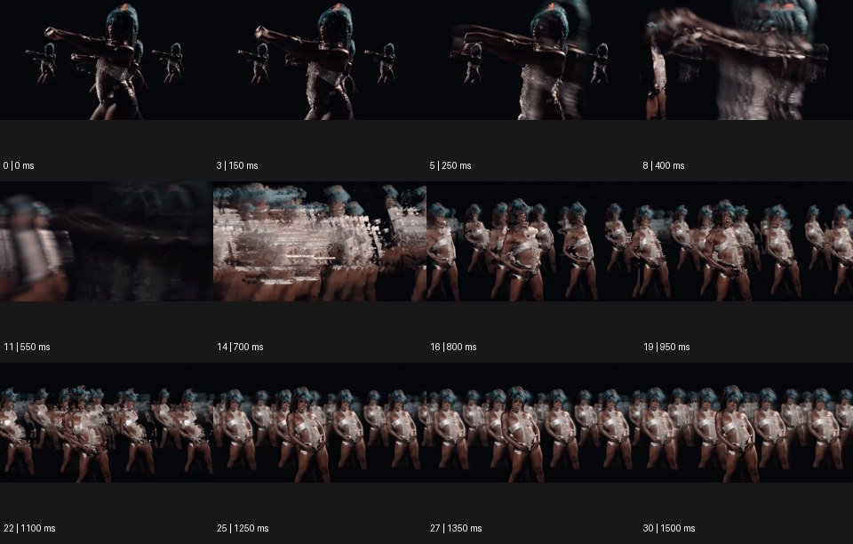

# Datamosh 데이터모싱


출처: Eyecandy · 원본 등록 카드명: **Datamosh 데이터모싱** · slug: datamosh

분류: I · VFX & Style / VFX & 스타일

[원본 기법 페이지](https://eyecannndy.com/technique/datamosh) · [원본 미디어](https://asset.eyecannndy.com/media/clip/2024/07/05/261720163864.webp)

## 확인 근거

원본 31프레임, 메타데이터 길이 1550ms. 고유 12개 시점 프레임을 추출하여 이미지로 직접 관찰했다. 재생 감상·음향 청취·생성 재현 테스트를 했다는 뜻이 아니다.

표본 프레임(0부터): 0, 3, 5, 8, 11, 14, 16, 19, 22, 25, 27, 30



## 실제 시간순 관찰

0–250ms: 검은 배경 앞 큰 퍼포머와 작은 인물상이 함께 보이고 팔을 뻗는다. 400–700ms: 팔과 몸의 윤곽이 가로로 번지고 잘게 끊긴 잔상 덩어리가 겹친다. 800–1500ms: 여러 인물상이 가로로 늘어서고 몸의 서로 다른 자세가 겹친 채 남는다.

## 주체·카메라·합성·편집 구분

주체는 팔과 몸으로 퍼포먼스한다. 화면상 크기와 배열도 변하지만 물리적 카메라 이동과 디지털 확대를 분리 확정할 수 없다. 합성·편집 층에서 이전 자세의 질감과 복제 윤곽이 다음 자세 위에 남는다.

## 장면에 재사용할 원리

움직임에 붙은 이전 프레임의 정보가 새 자세까지 끌려오는 잔류·블록 변형을 장면의 에너지로 쓴다. 실제 코덱 조작 여부는 샘플만으로 확인되지 않는다.

## 확인 한계

복제와 잔상이 함께 있으므로 모든 반복 인물을 데이터모싱 하나의 결과로 단정하지 않는다. 표본 사이의 모든 프레임과 반복 경계의 연속성을 검사하지 않았다. 음향은 확인하지 않았다.

## 뮤직비디오 각색 · 완성형 프롬프트

아래는 장면 목적에 맞게 새로 설계한 창작 적용안이며 원본 길이를 상속하지 않는다.

```text
6초 뮤직비디오, 검은 리허설실의 은색 재킷을 입은 성인 보컬을 허리 위 정면으로 담는다. 첫 1초는 얼굴과 재킷을 선명하게 읽힌다. 보컬이 오른팔을 수평으로 뻗는 순간 팔과 소매에만 이전 자세의 픽셀 블록이 붙어 이동 방향으로 끌린다. 카메라는 천천히 전진하고 얼굴 중심을 유지한다. 두 번째 팔 동작에는 잔류 영역이 어깨 뒤까지 퍼져 과거 동작 세 겹을 남기되 현재 얼굴은 한 개로 보존한다. 마지막 1초에 블록이 소매 끝으로 흩어지며 카메라가 멈추고 보컬의 정면 응시로 끝낸다. 대사와 생성 자막 없이 옷감 마찰만 둔다.
```

## 브랜드필름 각색 · 완성형 프롬프트

```text
7초 오디오 브랜드필름, 짙은 회색 스튜디오에 검은 무선 헤드폰 한 개를 세워 놓는다. 카메라는 이어컵의 미세한 메시에서 시작해 왼쪽으로 짧게 이동하며 제품 전체를 드러낸다. 2초에 옆으로 스치는 빛을 따라 배경의 이전 밝기가 네모난 잔류 조각으로 끌리며 음악의 밀도를 시각화한다. 왜곡은 제품 뒤의 반사와 그림자에만 적용하고 헤드밴드와 이어컵 접합부는 변하지 않는다. 잔상은 4초에 가장 풍부해졌다가 바깥으로 빠져나간다. 마지막 2초는 정지한 삼사분면 구도에서 소재와 기존 로고가 깨끗하게 읽히게 한다. 대사와 새 문자는 없다.
```

생성 테스트: 미실시. 단일 모델의 정확한 재현을 보장하지 않으며 필요한 촬영·합성·편집 층을 구분해 구현한다.
