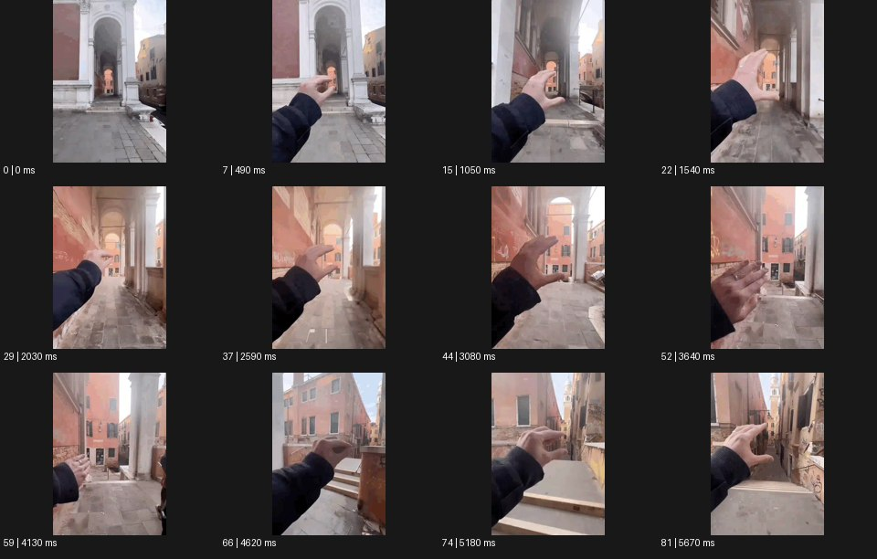

# Gesture 디지털 제스처


출처: Eyecandy · 원본 등록 카드명: **Gesture 디지털 제스처** · slug: digital-gesture

분류: J · People, POV & Mood / 인물·시점·무드

[원본 기법 페이지](https://eyecannndy.com/technique/digital-gesture) · [원본 미디어](https://asset.eyecannndy.com/media/clip/2024/01/01/261704109560.webp)

## 확인 근거

원본 82프레임, 메타데이터 길이 5740ms. 고유 12개 시점 프레임을 추출하여 이미지로 직접 관찰했다. 재생 감상·음향 청취·생성 재현 테스트를 했다는 뜻이 아니다.

표본 프레임(0부터): 0, 7, 15, 22, 29, 37, 44, 52, 59, 66, 74, 81



## 실제 시간순 관찰

0–1050ms: 건축 아치가 보이는 1인칭 화면에 손이 들어와 엄지와 손가락으로 대상을 집는 듯한 모양을 만든다. 1540–3080ms: 손짓 뒤에 시점이 골목 안쪽으로 크게 전진하고 다시 손을 벌리거나 집는다. 3640–5670ms: 계단과 다른 골목 방향으로 위치가 바뀌며 같은 손짓이 반복된다.

## 주체·카메라·합성·편집 구분

전경 손이 제스처를 하고 배경의 크기·위치 변화가 뒤따른다. 실제 이동, 속도 조정, 컷의 조합은 샘플로 분리되지 않는다. 허공의 문자 UI는 보이지 않는다.

## 장면에 재사용할 원리

손짓의 시작과 결과 사이에 명료한 인과를 만들어 공간·화면을 만지는 것처럼 연출한다.

## 확인 한계

디지털 제스처라고 해서 보이지 않은 홀로그램 인터페이스를 원본에 추가하지 않는다. 표본 사이의 모든 프레임과 반복 경계의 연속성을 검사하지 않았다. 음향은 확인하지 않았다.

## 뮤직비디오 각색 · 완성형 프롬프트

아래는 장면 목적에 맞게 새로 설계한 창작 적용안이며 원본 길이를 상속하지 않는다.

```text
7초 뮤직비디오, 성인 보컬이 넓은 회색 연습실에서 카메라와 마주 선다. 허리 위 정면 고정 카메라로 시작하고 보컬은 허공에 떠 있는 작은 사각 조명을 엄지와 검지로 집는 듯 손을 든다. 손가락 간격을 벌리면 실제 배경의 사각 빛 영역만 넓어져 보컬 뒤의 벽을 밝힌다. 손을 오른쪽으로 밀면 빛 영역이 같은 방향으로 일정 거리 이동한다. 얼굴과 몸의 비율은 변하지 않고 카메라는 움직이지 않는다. 마지막에 손바닥을 아래로 내리면 빛이 바닥의 얇은 선으로 정리되고 보컬이 그 선 위에 선다. 대사·UI·문자 없이 무음으로 끝낸다.
```

## 브랜드필름 각색 · 완성형 프롬프트

```text
8초 가구 브랜드필름, 성인 디자이너가 빈 베이지 스튜디오의 의자 옆에 선다. 카메라는 디자이너 손과 의자를 함께 담는 삼사분면 미디엄숏이다. 디자이너가 두 손가락으로 허공의 의자 폭을 재듯 벌리면 의자 뒤의 색상 견본 패널만 넓어지고 제품의 치수는 유지된다. 3초에 손을 가볍게 옆으로 쓸어 패널 색을 세이지에서 모래색으로 한 번 바꾼다. 카메라는 짧게 옆으로 이동해 의자와 새 배경의 관계를 보여준다. 손을 내리는 5초에 모든 변화가 멈추고 마지막 3초는 의자 마감과 정확한 구조를 읽힌다. 숫자·UI 문구·새 로고는 없다.
```

생성 테스트: 미실시. 단일 모델의 정확한 재현을 보장하지 않으며 필요한 촬영·합성·편집 층을 구분해 구현한다.
