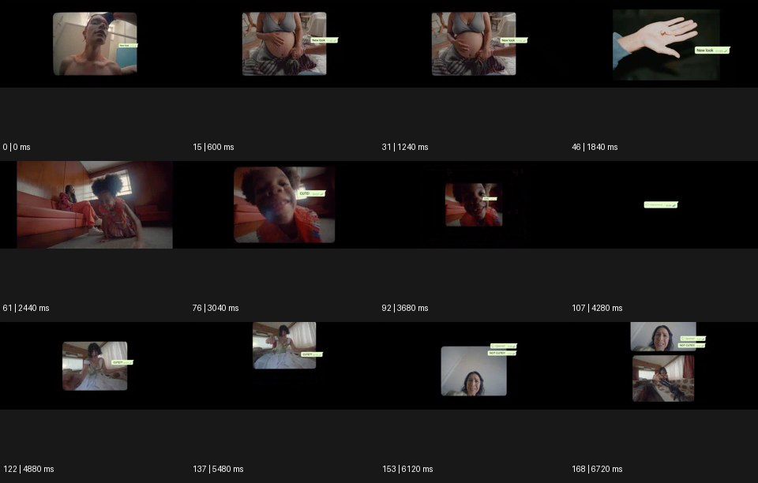

# Floating UI 플로팅 UI


출처: Eyecandy · 원본 등록 카드명: **Floating UI 플로팅 UI** · slug: digital-overlay

분류: J · People, POV & Mood / 인물·시점·무드

[원본 기법 페이지](https://eyecannndy.com/technique/digital-overlay) · [원본 미디어](https://asset.eyecannndy.com/media/clip/2024/02/19/261708342033.webp)

## 확인 근거

원본 169프레임, 메타데이터 길이 6760ms. 고유 12개 시점 프레임을 추출하여 이미지로 직접 관찰했다. 재생 감상·음향 청취·생성 재현 테스트를 했다는 뜻이 아니다.

표본 프레임(0부터): 0, 15, 31, 46, 61, 76, 92, 107, 122, 137, 153, 168



## 실제 시간순 관찰

0–1840ms: 검은 바탕의 작은 영상 창에 인물·몸·손이 바뀌고 옆에 연녹색 채팅 말풍선 같은 그래픽이 붙는다. 2440–4280ms: 인물 창이 커졌다 작아지며 사라지고 말풍선만 남는 구간도 있다. 4880–6720ms: 새로운 인물 창과 여러 말풍선이 나타나며 끝에는 영상 창 두 개가 함께 보인다.

## 주체·카메라·합성·편집 구분

실사 인물 동작과 별개로 화면 창·말풍선이 크기·위치를 바꾼다. 카메라 공간에 실제 떠 있는 물체보다 화면 그래픽 편집에 가깝다.

## 장면에 재사용할 원리

영상과 정보 층을 분리해 연결·반응·소통의 흐름을 보여준다. 정보가 피사체 얼굴이나 제품을 가리지 않게 계층을 설계한다.

## 확인 한계

샘플에 일부 문자가 보이지만 모든 문구를 정확히 전사하거나 소통 맥락을 확정하지 않는다. 표본 사이의 모든 프레임과 반복 경계의 연속성을 검사하지 않았다. 음향은 확인하지 않았다.

## 뮤직비디오 각색 · 완성형 프롬프트

아래는 장면 목적에 맞게 새로 설계한 창작 적용안이며 원본 길이를 상속하지 않는다.

```text
7초 디지털 오버레이 뮤직비디오, 성인 보컬이 어두운 침실에서 휴대전화를 내려다보는 정면 미디엄숏으로 시작한다. 실제 휴대전화 화면은 읽히지 않는다. 2초에 보컬 옆 빈 공간에 글자 없는 작은 메시지 말풍선 세 개가 차례로 나타나고 각각 다른 속도로 늘어났다 줄어든다. 얼굴과 손 위에는 UI를 겹치지 않는다. 카메라는 천천히 접근하고 보컬이 화면을 끄는 5초 지점에 말풍선도 하나씩 사라진다. 마지막 2초는 아무 그래픽 없이 얼굴과 창의 어두운 반사만 남겨 연결 이후의 고요를 보여준다. 실제 메시지·개인정보·자막·대사는 넣지 않는다.
```

## 브랜드필름 각색 · 완성형 프롬프트

```text
8초 스마트 오디오 브랜드필름, 밝은 서재의 테이블 위에 작은 스피커 한 개와 성인 사용자의 손을 담는다. 카메라는 낮은 삼사분면 구도에서 시작한다. 손이 제품 상단을 한 번 누르면 제품 오른쪽 여백에 얇은 원형 상태 표시가 나타나 천천히 한 바퀴 완성된다. 사용자가 손을 떼면 원 안의 세 점이 고르게 정렬되어 연결이 안정된 느낌을 준다. 실제 기능 수치나 검증되지 않은 성능 문구는 쓰지 않는다. 카메라는 20cm 접근하고 5초에 그래픽이 옅어져 사라진다. 마지막 3초는 스피커 메시·버튼·제품 외곽을 충분히 읽힌다. 새 로고·음성 안내는 없다.
```

생성 테스트: 미실시. 단일 모델의 정확한 재현을 보장하지 않으며 필요한 촬영·합성·편집 층을 구분해 구현한다.
