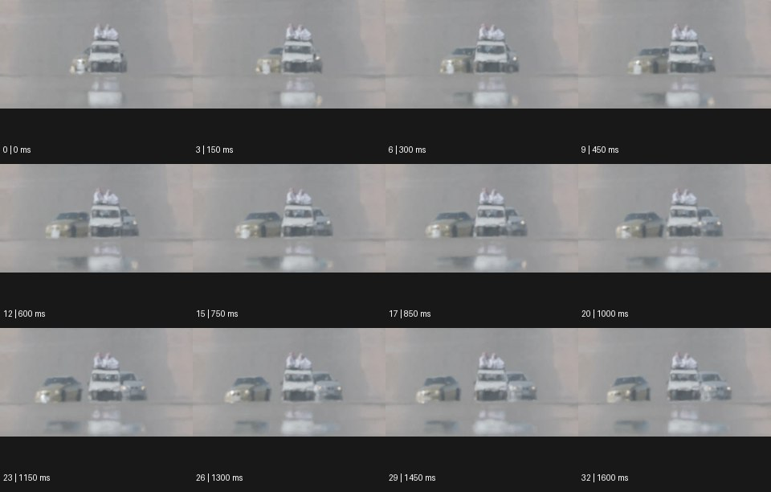

# Distortions 디스토션


출처: Eyecandy · 원본 등록 카드명: **Distortions 디스토션** · slug: distortions

분류: I · VFX & Style / VFX & 스타일

[원본 기법 페이지](https://eyecannndy.com/technique/distortions) · [원본 미디어](https://asset.eyecannndy.com/media/clip/2024/09/12/261726174531.webp)

## 확인 근거

원본 33프레임, 메타데이터 길이 1650ms. 고유 12개 시점 프레임을 추출하여 이미지로 직접 관찰했다. 재생 감상·음향 청취·생성 재현 테스트를 했다는 뜻이 아니다.

표본 프레임(0부터): 0, 3, 6, 9, 12, 15, 17, 20, 23, 26, 29, 32



## 실제 시간순 관찰

0–450ms: 멀리서 다가오는 여러 차량 아래에 거울 같은 흐린 형상이 보이고 윤곽이 흔들린다. 600–1000ms: 좌우 차량의 위치가 벌어지며 도로 가까운 부분이 물결처럼 찌그러진다. 1150–1600ms: 차량이 커지지만 하부 윤곽과 노면 반영은 계속 흐릿하게 일렁인다.

## 주체·카메라·합성·편집 구분

차량은 전진한다. 카메라는 먼 거리 정면 망원 구도를 유지한 것으로 보인다. 노면 부근의 광학적 굴절처럼 보이는 왜곡이 주된 화면 현상이며 디지털 VFX 여부는 미확인이다.

## 장면에 재사용할 원리

공기·열·유리 같은 매질의 굴절로 선과 반영이 휘는 원리를 장면에 맞게 적용한다. 왜곡의 위치와 강도를 대상 가독성과 함께 조절한다.

## 확인 한계

왜곡을 무조건 디지털 워프나 화면 전체 파동으로 규정하지 않는다. 표본 사이의 모든 프레임과 반복 경계의 연속성을 검사하지 않았다. 음향은 확인하지 않았다.

## 뮤직비디오 각색 · 완성형 프롬프트

아래는 장면 목적에 맞게 새로 설계한 창작 적용안이며 원본 길이를 상속하지 않는다.

```text
7초 뮤직비디오, 한낮의 텅 빈 콘크리트 운동장 끝에 성인 보컬이 서 있다. 먼 거리 망원 정면 구도에서 시작해 첫 2초는 보컬 아래의 뜨거운 지면이 일렁인다. 보컬이 카메라 쪽으로 걸어오면 다리 아래쪽의 윤곽이 열기 속에서 잠깐 찌그러지지만 얼굴과 상체는 분명하게 유지한다. 카메라는 움직이지 않고 보컬의 접근만으로 크기를 키운다. 5초에 보컬이 그늘 경계에 들어오면 굴절이 자연스럽게 줄어든다. 마지막 2초는 정지한 보컬과 뒤에 남은 열기의 대비로 거리감을 남긴다. 자막과 대사 없이 바람과 발소리만 둔다.
```

## 브랜드필름 각색 · 완성형 프롬프트

```text
8초 냉음료 브랜드필름, 뜨거운 햇빛을 받은 테라스의 짙은 돌 테이블 위에 차가운 유리병 한 개를 둔다. 카메라는 낮은 망원 구도에서 병의 윤곽을 선명하게 고정한다. 첫 3초는 병 뒤의 멀리 있는 난간과 도시만 열기로 일렁이고 유리 표면의 물방울은 실제 크기를 유지한다. 3초에 손이 병을 가볍게 돌려 차가운 반사를 보여주면 카메라는 20cm 접근한다. 배경 왜곡은 계속되지만 제품 라벨과 병목은 흔들리지 않는다. 마지막 2초는 손이 빠진 뒤 차가운 물방울이 천천히 내려오는 디테일에 안착한다. 새 문자·과장된 냉기 구름 없이 환경음만 둔다.
```

생성 테스트: 미실시. 단일 모델의 정확한 재현을 보장하지 않으며 필요한 촬영·합성·편집 층을 구분해 구현한다.
