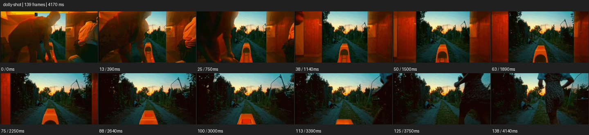

# Dolly


- 출처: Eyecandy · [Dolly](https://eyecannndy.com/technique/dolly-shot)
- 카탈로그 등록 표기: **Dolly 돌리 (푸시인)**
- 카테고리: E · More Camera Moves · 카메라 무브 확장
- 원본 미디어: [애니메이션 WebP](https://asset.eyecannndy.com/media/clip/2024/01/01/261704114041.webp)
- 확인 방식: 원본 애니메이션을 디코딩해 시간순 프레임을 추출한 뒤 컨택트 시트를 직접 시각 확인했다. 전체 139프레임 / 4170ms, 기본 12시점. 재생·음향 청취·전 프레임 시각 검수·생성 테스트를 했다고 주장하지 않는다.
- 기본 확인 프레임: 0, 13, 25, 38, 50, 63, 75, 88, 100, 113, 125, 138. 해당 타임스탬프(ms): 0, 390, 750, 1140, 1500, 1890, 2250, 2640, 3000, 3390, 3750, 4140.
- 원본 길이는 관찰 정보다. 아래 새 장면의 길이를 원본에 자동 맞추지 않는다.

## 움직임 증거



## 원본에서 확인한 시작 → 변화 → 끝

주황색 실내의 사람이 옆으로 물러나며 바깥 문이 드러난다. 카메라가 문 쪽으로 전진하며 문틀이 좌우 밖으로 밀리고, 중앙의 긴 주황 물체 너머 길과 마당이 커진다. 끝에 인물이 길 쪽으로 움직인다.

- 카메라·시점: 문을 향해 전진하며 문틀과 전경이 옆으로 벌어진다.
- 주체: 사람이 옆으로 비켜나고 마지막에 밖으로 이동한다.
- 조명·합성·편집: 주요 관찰 구간은 이어지는 공간 이동이며 숨은 컷 미확인.

## 작동 원리와 확인 한계

카메라의 위치 이동으로 전경이 빠르게 벌어지고 먼 배경이 드러나는 전진 원근. 단순 디지털 확대와 구별된다.

샘플 사이의 빠른 변화는 일부 빠질 수 있다. GIF의 반복 경계가 작품의 의도된 완전 루프라는 보장은 없다. 원본 음악·대사·촬영 장비·제작 소프트웨어는 확인하지 않았다. 아래 프롬프트는 관찰한 원리를 다른 장면에 각색한 창작안이며 원본 장면이나 검증된 생성 결과가 아니다.

## 뮤직비디오 각색 · 완전한 장면 프롬프트

```text
해 질 무렵 연습실 문 앞에 선 성인 보컬이 마지막 가사를 마무리하는 뮤직비디오. 카메라는 방 안의 오래된 피아노 너머에서 시작한다. 보컬이 문을 열고 옆으로 비키면 카메라가 문 중앙을 향해 천천히 전진해 피아노와 문틀이 양옆으로 빠지게 한다. 바깥의 비 젖은 골목이 넓게 드러날 때 보컬이 앞서 걸어 나가고 카메라는 그 뒤를 짧게 따른다. 문턱을 넘은 뒤 이동을 감속해 골목 안 작은 보컬의 뒷모습에 착지한다. 컷이나 초점거리 급변 없이 공간 이동을 이어간다.
```

## 브랜드필름 각색 · 완전한 장면 프롬프트

```text
목공 스튜디오의 완성된 의자를 소개하는 브랜드필름. 작업대 가장자리의 나뭇결을 전경에 두고 멀리 창빛 아래 놓인 의자를 보인다. 작업자가 손의 사포를 내려놓고 몸을 옆으로 비키는 순간 카메라가 의자를 향해 낮고 일정하게 전진한다. 전경의 공구가 양옆으로 지나가며 공방 깊이가 드러나고 의자의 곡면 등받이가 커진다. 마지막에는 좌판과 등받이를 함께 읽는 삼분의 사 구도에서 부드럽게 멈춘다. 나무 결, 다리 수, 접합부 형태를 유지하며 제품을 회전시키지 않는다.
```

적용 시 사용자가 지정한 길이·참조·컷·음향·제품 보존 조건을 우선한다. 효과의 시작 계기와 도착 구도를 유지하며 필요한 부분을 해당 장면에 맞춰 다시 연출한다.
