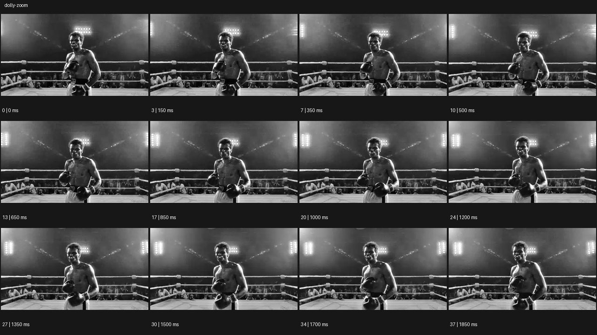

# Dolly Zoom


- 원본 등록명: **Dolly Zoom**
- 분류: A · 카메라 무브 / Camera Moves
- 공식 기법 페이지: [Dolly Zoom](https://eyecannndy.com/technique/dolly-zoom)
- 지정 원본 미디어: [애니메이션 WebP](https://asset.eyecannndy.com/media/clip/2024/01/06/261704528059.webp)
- 확인 방식: 38프레임 중 12시점의 시간순 이미지 배열을 직접 시각 확인. 메타데이터 길이 1.9초. 전체 프레임 재생·청음 확인 또는 생성 재현 테스트로 보고하지 않는다.



## 실제 관찰

흑백 복싱 링에서 글러브를 든 인물이 중앙에 있다. 0–0.85초 몸이 조금 움직이는 동안 뒤의 링 로프와 관중 공간의 상대 간격이 변한다. 1.0–1.85초에도 인물 상반신은 비슷한 크기를 유지하며 배경 조명과 로프가 다른 깊이 관계로 보인다.

## 작동 원리와 역할

주체는 제자리에서 자세와 글러브를 움직인다. 인물 크기에 비해 배경의 원근이 변하는 것이 핵심이다. 돌리 이동과 반대 방향 화각 보정을 결합하는 연출로 번역할 수 있다.

## 해석의 한계

정확한 초점거리·레일 방향·후반 보정은 표본으로 확인할 수 없다. 주체가 완전히 정지하거나 크기가 픽셀 단위로 고정된 예시는 아니다. 샘플 사이의 모든 움직임과 반복 경계의 무봉합 여부는 별도 검증하지 않았다. 아래 프롬프트는 새로운 장면 각색이며 생성 테스트는 하지 않았다.

## 뮤직비디오 적용 · 완성형 프롬프트

아래 설정과 길이는 독립 창작 예시다. 실제 요청의 길이·참조·음향 조건을 우선한다.

```text
6초 뮤직비디오. 심야 지하철 승강장 중앙에 검은 코트의 성인 보컬이 서서 손에 든 접힌 편지를 펼친다. 첫 1초는 가슴 위 구도로 편지에서 눈으로 시선을 옮긴다. 글을 읽고 숨이 멎는 순간 카메라를 천천히 뒤로 이동시키면서 렌즈를 동시에 당겨 얼굴의 크기를 거의 일정하게 유지한다. 뒤의 기둥과 형광등 간격만 압축되어 공간이 인물 쪽으로 밀려오는 듯 보인다. 보컬은 발을 움직이지 않고 편지를 조금 내린다. 마지막 1초 카메라와 줌이 함께 멈추며 눈에 초점을 고정한다. 얼굴을 늘리거나 배경을 액체처럼 휘게 하지 않는다.
```

## 브랜드필름 적용 · 완성형 프롬프트

제품의 재질과 기능이 읽히는 순간에 효과를 배치하고 안정된 제품 상태로 끝낸다. 실제 브랜드 톤과 구조에 맞춰 각색한다.

```text
7초 럭셔리 여행 가방 필름. 오래된 호텔의 긴 복도 중앙에 짙은 녹색 가죽 여행 가방이 놓여 있고 성인 투숙객의 손이 손잡이를 잡는다. 시작은 가방과 손이 선명한 낮은 정면 구도다. 손잡이가 세워지는 순간 카메라가 뒤로 이동하며 줌을 당겨 가방의 화면 크기를 유지한다. 복도의 문과 천장등은 서로 가까워 보이며 긴 여행의 거리가 압축되는 감각을 만든다. 가방 자체는 늘어나거나 회전하지 않는다. 끝에서는 투숙객이 손잡이를 놓고 카메라가 완전히 멈춘다. 2초간 가죽 결, 봉제선, 잠금장치가 읽히는 선명한 제품 상태를 유지한다.
```

음향은 원본에서 확인하지 않았다. 실제 음원과 무음·NO BGM 등 사용자 조건을 유지한다. 특정 모델의 자동 재현을 보장하는 프리셋이 아니다.
