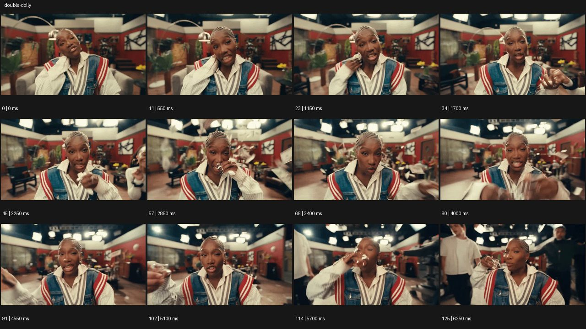

# Double Dolly


- 원본 등록명: **Double Dolly**
- 분류: A · 카메라 무브 / Camera Moves
- 공식 기법 페이지: [Double Dolly](https://eyecannndy.com/technique/double-dolly)
- 지정 원본 미디어: [애니메이션 WebP](https://asset.eyecannndy.com/media/clip/2025/02/10/261739172109.webp)
- 확인 방식: 126프레임 중 12시점의 시간순 이미지 배열을 직접 시각 확인. 메타데이터 길이 6.3초. 전체 프레임 재생·청음 확인 또는 생성 재현 테스트로 보고하지 않는다.



## 실제 관찰

0초부터 실내의 성인 퍼포머가 거의 일정한 상반신 크기로 중앙에 있다. 0.55–3.4초 손수건을 얼굴 가까이 들고 손짓하는 동안 가구·벽·뒤의 인물이 이동한다. 4.0–6.25초에도 중심 인물은 프레임 가까이 유지되고 주변 인물과 실내 배경이 옆으로 흘러간다.

## 작동 원리와 역할

주체와 카메라의 상대 거리를 유지하며 공간을 함께 이동해 미끄러지거나 떠가는 느낌을 만든다. 주체의 상반신 퍼포먼스와 배경의 병진 이동을 분리한다.

## 해석의 한계

기존 카탈로그의 돌리줌 결합 설명을 이 예시의 관찰로 채택하지 않는다. 실제 발판·리그는 보이지 않으며 광학 줌은 확인되지 않는다. 샘플 사이의 모든 움직임과 반복 경계의 무봉합 여부는 별도 검증하지 않았다. 아래 프롬프트는 새로운 장면 각색이며 생성 테스트는 하지 않았다.

## 뮤직비디오 적용 · 완성형 프롬프트

아래 설정과 길이는 독립 창작 예시다. 실제 요청의 길이·참조·음향 조건을 우선한다.

```text
8초 뮤직비디오, 새벽의 폐쇄된 볼링장. 붉은 니트의 성인 가수가 볼링공을 품에 안은 가슴 위 정면 구도로 시작한다. 카메라와 가수는 같은 속도로 레인 옆 통로를 부드럽게 이동하며 서로의 거리를 유지한다. 가수는 걷는 상하 반동 없이 떠가듯 이동하고, 뒤의 의자와 점수판만 일정하게 흐른다. 중간에 공을 내려다봤다가 렌즈로 눈을 올리며 입모양 퍼포먼스를 한다. 카메라는 줌하지 않고 얼굴 크기를 유지한다. 마지막에는 통로 끝에서 함께 감속해 멈추고, 어둠 속 가수가 공을 놓지 못하는 표정에 1초 머문다.
```

## 브랜드필름 적용 · 완성형 프롬프트

제품의 재질과 기능이 읽히는 순간에 효과를 배치하고 안정된 제품 상태로 끝낸다. 실제 브랜드 톤과 구조에 맞춰 각색한다.

```text
8초 프리미엄 의류 필름. 부드러운 회색 수트를 입은 성인 모델이 긴 석재 갤러리 안에 서 있다. 카메라와 모델을 같은 이동 플랫폼에 실은 듯 허리 위 정면 거리와 높이를 유지하면서 회랑을 통과한다. 모델은 걸음을 재현하지 않고 소매 끝을 차분히 정리한다. 뒤의 반복 기둥은 옆으로 흘러가지만 얼굴과 재킷의 봉제선은 선명하게 고정된다. 창에서 들어오는 자연광이 옷의 질감을 구간마다 바꾼다. 마지막 기둥 사이에서 둘이 함께 감속하여 멈추고 모델은 손을 내린다. 제품 형태가 읽히는 안정된 중간 구도를 2초 유지한다.
```

음향은 원본에서 확인하지 않았다. 실제 음원과 무음·NO BGM 등 사용자 조건을 유지한다. 특정 모델의 자동 재현을 보장하는 프리셋이 아니다.
