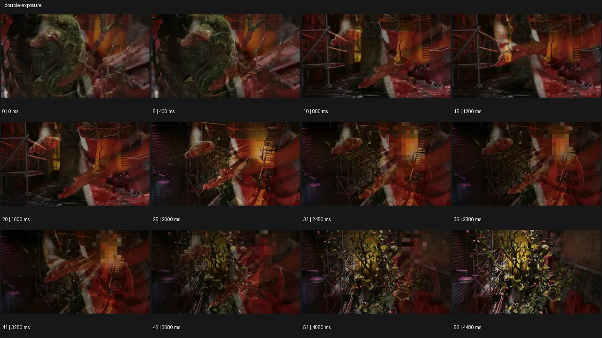

# Double Exposure


- 원본 등록명: **Double Exposure**
- 분류: D · 편집 & 전환 / Editing & Transition
- 공식 기법 페이지: [Double Exposure](https://eyecannndy.com/technique/double-exposure)
- 지정 원본 미디어: [애니메이션 WebP](https://asset.eyecannndy.com/media/clip/2024/01/04/261704334160.webp)
- 확인 방식: 57프레임 중 12시점의 시간순 이미지 배열을 직접 시각 확인. 메타데이터 길이 4.56초. 전체 프레임 재생·청음 확인 또는 생성 재현 테스트로 보고하지 않는다.



## 실제 관찰

초반 이끼 같은 얼굴 형태와 가지 이미지가 붉은 구조물 장면 위에 겹친다. 0.8–2.0초 골목·가지·반투명 붉은 형상이 서로 다른 밀도로 교차하며 공간의 깊이가 보인다. 2.48–4.48초 나뭇가지와 잎이 더 우세해지고 일부 색 블록 흔적이 지나가며 여러 층이 계속 중첩된다.

## 작동 원리와 역할

둘 이상의 이미지층을 반투명하게 겹쳐 각 층의 시간 변화가 동시에 보인다. 특정 인물 실루엣 내부만 채우는 방식으로 제한되지 않는다.

## 해석의 한계

원본의 압축·모자이크처럼 보이는 블록을 의도된 미학으로 확정하지 않는다. 실제 노출 촬영과 후반 합성 중 제작 방식은 확인되지 않는다. 샘플 사이의 모든 움직임과 반복 경계의 무봉합 여부는 별도 검증하지 않았다. 아래 프롬프트는 새로운 장면 각색이며 생성 테스트는 하지 않았다.

## 뮤직비디오 적용 · 완성형 프롬프트

아래 설정과 길이는 독립 창작 예시다. 실제 요청의 길이·참조·음향 조건을 우선한다.

```text
8초 뮤직비디오. 검은 배경에서 성인 보컬의 차분한 얼굴을 가까이 담고 눈에 초점을 맞춘다. 보컬이 천천히 고개를 돌리기 시작하면 흐린 겨울 숲의 가지와 햇빛을 반투명한 두 번째 영상층으로 얼굴과 배경에 겹친다. 숲 영상은 옆으로 느리게 흐르고 보컬 카메라는 고정되어 두 시간의 차이가 읽힌다. 눈과 입의 윤곽은 계속 선명하게 남기고 가지가 실제 피부를 뚫지 않게 한다. 후반 보컬이 다시 정면을 바라보면 숲의 불투명도를 천천히 줄인다. 마지막 2초 원래 얼굴만 남아 숨을 고르는 표정에 머문다.
```

## 브랜드필름 적용 · 완성형 프롬프트

제품의 재질과 기능이 읽히는 순간에 효과를 배치하고 안정된 제품 상태로 끝낸다. 실제 브랜드 톤과 구조에 맞춰 각색한다.

```text
8초 고급 향수 필름. 짙은 회색 배경 위 투명한 향수병을 정면 사선으로 선명하게 담는다. 병의 유리 모서리에 얇은 빛이 들어오면 새벽의 안개 낀 숲 영상을 낮은 불투명도로 병 주변과 유리 내부에 겹친다. 카메라는 제품을 향해 아주 천천히 접근하고 숲은 별도로 느리게 움직여 향의 이미지를 만든다. 라벨과 캡은 항상 선명한 전경층으로 보존하며 나무가 병을 뚫거나 제품을 대체하지 않는다. 마지막에는 숲 영상을 차분히 사라지게 하고 실제 유리와 호박색 액체만 남긴다. 끝 2초 제품명과 형태를 또렷하게 유지한다.
```

음향은 원본에서 확인하지 않았다. 실제 음원과 무음·NO BGM 등 사용자 조건을 유지한다. 특정 모델의 자동 재현을 보장하는 프리셋이 아니다.
