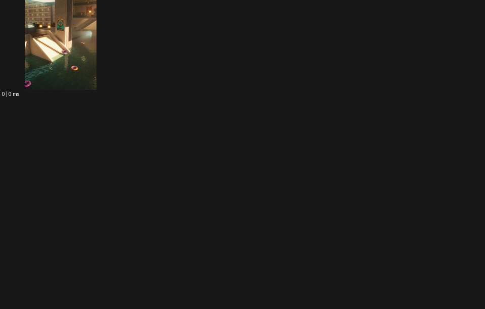

# Dreamcore 드림코어


출처: Eyecandy · 원본 등록 카드명: **Dreamcore 드림코어** · slug: dreamcore

분류: I · VFX & Style / VFX & 스타일

[원본 기법 페이지](https://eyecannndy.com/technique/dreamcore) · [원본 미디어](https://asset.eyecannndy.com/media/clip/2024/02/04/261707006676.webp)

## 확인 근거

정지 이미지 1개 확인. 시간 변화는 미확인. 재생 감상·음향 청취·생성 재현 테스트를 했다는 뜻이 아니다.

표본 프레임(0부터): 0



## 실제 시간순 관찰

원본 WebP가 한 프레임이다. 관찰된 정지 이미지에는 햇빛이 드는 큰 실내 건축, 계단, 물로 채워진 하부 공간과 색색의 튜브가 있다. 인물은 뚜렷하게 보이지 않는다. 시작→변화→종료의 움직임은 이 파일에서 확인할 수 없다.

## 주체·카메라·합성·편집 구분

정지 구도의 건축·물·비어 있는 공간 관계만 관찰했다. 카메라 이동·물결 움직임·편집은 미확인이다.

## 장면에 재사용할 원리

익숙한 생활 공간에 어긋난 용도와 비현실적인 고요를 결합하는 무드로 각색한다. 아래 시간 연출은 정지 이미지에서 새로 설계한 창작이다.

## 확인 한계

정지 이미지 확인 상태다. 애니메이션 분석 완료로 집계하지 않는다. 원본의 물이 움직였다고 주장하지 않는다. 표본 사이의 모든 프레임과 반복 경계의 연속성을 검사하지 않았다. 음향은 확인하지 않았다.

## 뮤직비디오 각색 · 완성형 프롬프트

아래는 장면 목적에 맞게 새로 설계한 창작 적용안이며 원본 길이를 상속하지 않는다.

```text
8초 몽환적인 뮤직비디오, 아무도 없는 학교 도서관의 바닥을 발목 높이의 맑은 물로 채우고 성인 보컬 한 명을 서가 끝에 세운다. 새벽빛이 창으로 길게 들어오며 첫 2초는 고정 와이드숏처럼 고요하다. 보컬이 책을 닫으면 물 위로 작은 파문이 한 번 퍼지고 카메라는 수면 바로 위에서 통로를 천천히 전진한다. 책장과 천장 형태는 정상으로 유지해 익숙한 공간의 어긋남을 강조한다. 6초에 카메라가 보컬 앞에서 멈추고 그는 파문이 잦아든 물을 내려다본다. 다음 장소로 전환하지 않고 고요한 여운으로 끝낸다. 대사·자막 없이 물결 소리만 둔다.
```

## 브랜드필름 각색 · 완성형 프롬프트

```text
8초 향수 브랜드필름, 파스텔빛 실내 수영장의 빈 타일 가장자리에 투명 향수병 한 개를 둔다. 공간에는 사람도 광고판도 없고 천창의 낮은 햇빛만 들어온다. 카메라는 먼 풀의 수면에서 시작해 병을 향해 느리게 낮아지며 접근한다. 물 위의 빛 무늬가 벽을 따라 올라가지만 타일과 병은 휘어지지 않는다. 4초에 병 뒤로 작은 원형 파문이 지나가면서 유리 가장자리를 잠깐 밝힌다. 마지막 3초는 병의 정면과 수면의 큰 여백에 안착하고 액체 색과 기존 라벨을 읽힌다. 초현실성은 공간의 고요로 만들며 임의의 문자와 음악은 없다.
```

생성 테스트: 미실시. 단일 모델의 정확한 재현을 보장하지 않으며 필요한 촬영·합성·편집 층을 구분해 구현한다.
