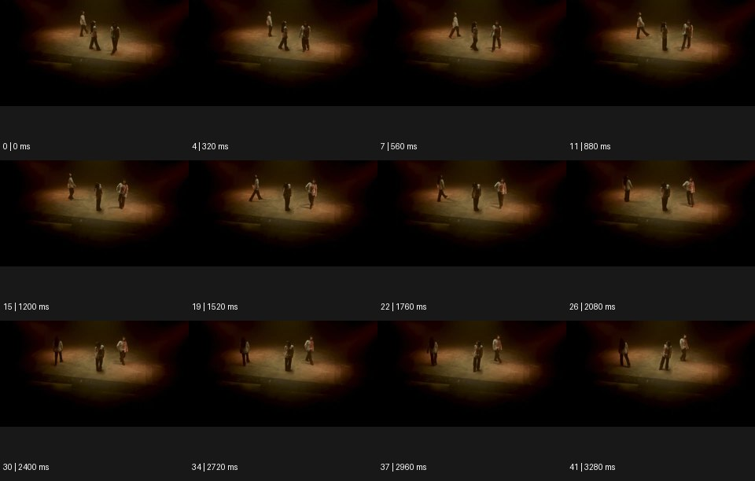

# Duplication 듀플리케이션


출처: Eyecandy · 원본 등록 카드명: **Duplication 듀플리케이션** · slug: duplication

분류: I · VFX & Style / VFX & 스타일

[원본 기법 페이지](https://eyecannndy.com/technique/duplication) · [원본 미디어](https://asset.eyecannndy.com/media/clip/2024/01/15/261705289666.webp)

## 확인 근거

원본 42프레임, 메타데이터 길이 3360ms. 고유 12개 시점 프레임을 추출하여 이미지로 직접 관찰했다. 재생 감상·음향 청취·생성 재현 테스트를 했다는 뜻이 아니다.

표본 프레임(0부터): 0, 4, 7, 11, 15, 19, 22, 26, 30, 34, 37, 41



## 실제 시간순 관찰

0–880ms: 어두운 가장자리로 둘러싸인 따뜻한 무대에 세 인물상이 떨어져 서서 걷는다. 1200–2080ms: 가운데와 양옆의 몸 방향·보폭이 다르게 바뀐다. 2400–3280ms: 세 인물상이 가로 간격을 유지하며 서로 다른 자세로 멈추거나 이동한다.

## 주체·카메라·합성·편집 구분

주체별 움직임이 서로 다르다. 카메라는 멀리서 높은 각도로 무대를 지켜보는 구도를 유지한다. 복제·다중 촬영 여부와 각 인물의 동일 정체성은 이 크기의 샘플에서 확정되지 않는다.

## 장면에 재사용할 원리

하나의 공간 안에서 여러 인물상의 위치와 동작 시간을 독립시켜 대화·갈등·동시성을 만든다. 창작 적용에서는 복제 수와 각각의 역할을 명시한다.

## 확인 한계

등록명을 근거로 실제 배우가 모두 같은 사람이라고 단정하지 않는다. 겹침·그림자의 제작 방식은 미확인이다. 표본 사이의 모든 프레임과 반복 경계의 연속성을 검사하지 않았다. 음향은 확인하지 않았다.

## 뮤직비디오 각색 · 완성형 프롬프트

아래는 장면 목적에 맞게 새로 설계한 창작 적용안이며 원본 길이를 상속하지 않는다.

```text
7초 뮤직비디오, 텅 빈 원형 무대에 같은 성인 보컬의 세 분신을 좌우와 중앙에 정확히 한 명씩 둔다. 카메라는 관객석 위 고정 와이드숏이다. 처음 2초에는 중앙 보컬만 앞으로 한 걸음 걷고 양옆 분신은 서로 등을 돌린다. 중앙이 고개를 들면 왼쪽 분신이 반 박자 늦게 같은 고개 동작을 하고 오른쪽 분신은 끝까지 아래를 본다. 세 인물은 서로 겹치지 않는 바닥 구역에서 움직이며 같은 얼굴과 의상을 유지한다. 마지막 2초에 모두 중앙을 바라보되 중앙 보컬만 관객을 응시한다. 분신을 없애는 전환 없이 그 긴장으로 끝낸다. 자막과 대사는 없다.
```

## 브랜드필름 각색 · 완성형 프롬프트

```text
8초 시계 브랜드필름, 밝은 콘크리트 갤러리의 긴 테이블에 같은 시계를 착용한 성인 모델 세 분신을 나란히 배치한다. 한 명은 스케치를 접고, 한 명은 손목을 돌리고, 한 명은 재킷 소매를 당긴다. 카메라는 왼쪽에서 오른쪽으로 일정하게 이동하며 서로 다른 생활 동작을 하나의 동선으로 읽힌다. 각 분신의 얼굴과 의상은 같고 손목 시계는 동일한 한 모델이다. 5초에 중앙 분신의 손목에서 이동을 멈추고 양옆은 동작을 끝내 정지한다. 마지막 3초는 시계 문자판과 손목의 자연스러운 비율에 초점을 둔다. 합성 경계와 겹친 손이 없고 대사·새 문자는 없다.
```

생성 테스트: 미실시. 단일 모델의 정확한 재현을 보장하지 않으며 필요한 촬영·합성·편집 층을 구분해 구현한다.
