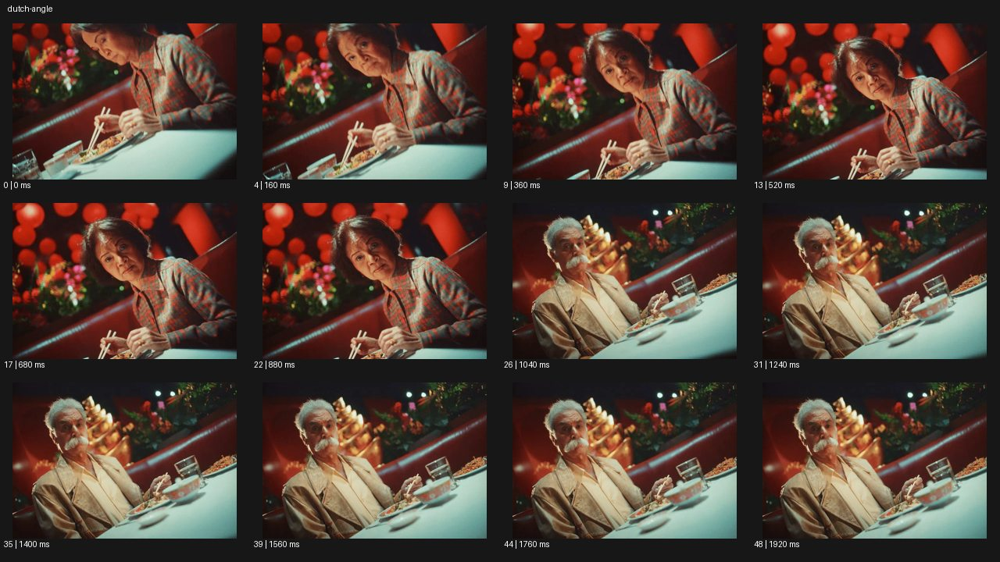

# Dutch Angle


- 원본 등록명: **Dutch Angle**
- 분류: B · 앵글 & 구도 / Angle & Framing
- 공식 기법 페이지: [Dutch Angle](https://eyecannndy.com/technique/dutch-angle)
- 지정 원본 미디어: [애니메이션 WebP](https://asset.eyecannndy.com/media/clip/2024/03/19/261710824876.webp)
- 확인 방식: 49프레임 중 12시점의 시간순 이미지 배열을 직접 시각 확인. 메타데이터 길이 1.96초. 전체 프레임 재생·청음 확인 또는 생성 재현 테스트로 보고하지 않는다.



## 실제 관찰

붉은 식당에서 여성과 탁자가 대각선으로 기울어진 구도다. 0–0.88초 여성이 고개를 들고 화면 쪽을 바라본다. 1.04초 반대편 노년 남성의 기울어진 구도로 컷이 바뀌고 그는 숟가락을 든 채 반응한다. 끝까지 탁자 선은 비스듬하다.

## 작동 원리와 역할

각 숏의 카메라 광축 롤을 기울어진 상태로 고정한다. 인물의 고개 움직임과 역숏 편집은 별개이며 지속 회전은 보이지 않는다.

## 해석의 한계

실제 기울기 각도를 수치로 확인하지 않았다. 표본은 롤 애니메이션보다 기울어진 숏끼리의 편집을 보여준다. 샘플 사이의 모든 움직임과 반복 경계의 무봉합 여부는 별도 검증하지 않았다. 아래 프롬프트는 새로운 장면 각색이며 생성 테스트는 하지 않았다.

## 뮤직비디오 적용 · 완성형 프롬프트

아래 설정과 길이는 독립 창작 예시다. 실제 요청의 길이·참조·음향 조건을 우선한다.

```text
6초 뮤직비디오. 녹색 형광등 아래 빈 당구장에서 성인 보컬이 큐대를 쥐고 있다. 카메라는 눈높이에서 시계 방향으로 약 20도 기울인 가슴 위 구도로 고정한다. 보컬이 테이블 위 굴러오는 흰 공을 바라보다가 렌즈로 고개를 돌린다. 테이블과 천장 선은 계속 대각선으로 남겨 마음의 불균형을 만든다. 중간에 한 번 공의 낮은 근접 구도로 컷하되 동일한 기울기 방향을 유지하고, 공이 멈추면 다시 보컬에게 돌아온다. 마지막 보컬의 굳은 표정에 머물며 화면을 돌려 세우지 않는다. 방이나 얼굴 자체를 비틀지 않는다.
```

## 브랜드필름 적용 · 완성형 프롬프트

제품의 재질과 기능이 읽히는 순간에 효과를 배치하고 안정된 제품 상태로 끝낸다. 실제 브랜드 톤과 구조에 맞춰 각색한다.

```text
6초 실험적인 고급 아이웨어 필름. 검은 안경을 쓴 성인 모델이 붉은 벽과 흰 대리석 탁자 사이에 앉아 있다. 기울어진 눈높이 카메라로 탁자 선을 대각선으로 놓고 모델의 얼굴은 화면 중앙에 선명하게 잡는다. 모델이 안경 다리를 한 번 정리하면 부드러운 측광이 프레임의 금속 경첩을 스친다. 카메라는 기울기를 유지한 채 아주 짧게 접근해 안경의 윤곽을 키운다. 마지막에는 모델이 시선을 옆으로 옮기고 움직임을 멈춘다. 2초간 안경의 정상적 대칭과 렌즈 투명도를 읽히며 추가 회전이나 렌즈 왜곡은 넣지 않는다.
```

음향은 원본에서 확인하지 않았다. 실제 음원과 무음·NO BGM 등 사용자 조건을 유지한다. 특정 모델의 자동 재현을 보장하는 프리셋이 아니다.
