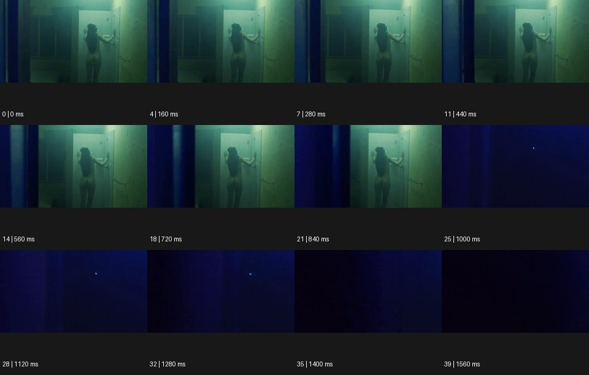

# Dystopian 디스토피안


출처: Eyecandy · 원본 등록 카드명: **Dystopian 디스토피안** · slug: dystopian

분류: I · VFX & Style / VFX & 스타일

[원본 기법 페이지](https://eyecannndy.com/technique/dystopian) · [원본 미디어](https://asset.eyecannndy.com/media/clip/2024/03/16/261710611880.webp)

## 확인 근거

원본 40프레임, 메타데이터 길이 1600ms. 고유 12개 시점 프레임을 추출하여 이미지로 직접 관찰했다. 재생 감상·음향 청취·생성 재현 테스트를 했다는 뜻이 아니다.

표본 프레임(0부터): 0, 4, 7, 11, 14, 18, 21, 25, 28, 32, 35, 39



## 실제 시간순 관찰

0–840ms: 청록색으로 어둡게 물든 좁은 공간에서 긴 머리 인물이 문 옆에 서서 한 팔을 뻗고 있다. 1000–1560ms: 화면이 짙은 푸른 암부로 바뀌고 작은 밝은 점만 남는다.

## 주체·카메라·합성·편집 구분

초반 인물의 자세 변화는 작다. 공간을 가리는 어두운 경계 또는 편집 변화가 후반에 시야를 거의 없앤다. 실제 위협 사건과 서사는 샘플만으로 알 수 없다.

## 장면에 재사용할 원리

좁은 시야, 비인간적인 색온도, 읽기 어려운 암부로 통제·고립의 분위기를 만든다. 장르 무드이며 단일 VFX 프리셋이 아니다.

## 확인 한계

원본 인물의 감정이나 강제 수용 같은 구체적 상황을 사실로 덧붙이지 않는다. 표본 사이의 모든 프레임과 반복 경계의 연속성을 검사하지 않았다. 음향은 확인하지 않았다.

## 뮤직비디오 각색 · 완성형 프롬프트

아래는 장면 목적에 맞게 새로 설계한 창작 적용안이며 원본 길이를 상속하지 않는다.

```text
7초 디스토피아 무드의 뮤직비디오, 성인 보컬이 긴 회색 검사실 복도 끝에 혼자 서 있다. 천장의 차가운 형광등이 켜진 구간과 꺼진 구간을 번갈아 만든다. 카메라는 문틈 너비의 좁은 전경 뒤에서 천천히 옆으로 이동해 보컬의 얼굴을 조금씩 드러낸다. 보컬이 손을 벽에 대는 3초 지점에 뒤쪽 등부터 하나씩 꺼지지만 얼굴 앞 작은 빛은 유지된다. 카메라는 얼굴이 전경 사이에 정확히 놓인 순간 멈춘다. 마지막에는 어두운 복도 속 눈빛을 2초 남겨 고립에 저항하는 태도를 보여준다. 폭력 장면·문자 없이 전기와 공간 환경음만 둔다.
```

## 브랜드필름 각색 · 완성형 프롬프트

```text
8초 기능성 조명 브랜드필름, 창 없는 차가운 회색 아파트 방에 검은 테이블 조명 한 개를 놓는다. 카메라는 방문 밖에서 좁은 틈을 통해 정지된 제품을 본다. 2초에 한 손이 들어와 스위치를 누르면 따뜻한 빛이 먼저 테이블 표면을 밝히고 이어 의자와 벽의 재질을 드러낸다. 카메라는 문틀을 벗어나 50cm 천천히 전진해 시야를 넓힌다. 차가운 방은 유지하되 제품 주변에 사람이 머물 수 있는 작은 영역을 만든다. 마지막 3초는 조명 헤드와 빛이 닿은 목재 결을 함께 읽힌다. 사회적 재난을 암시하는 문구나 임의 로고 없이 스위치 소리만 둔다.
```

생성 테스트: 미실시. 단일 모델의 정확한 재현을 보장하지 않으며 필요한 촬영·합성·편집 층을 구분해 구현한다.
