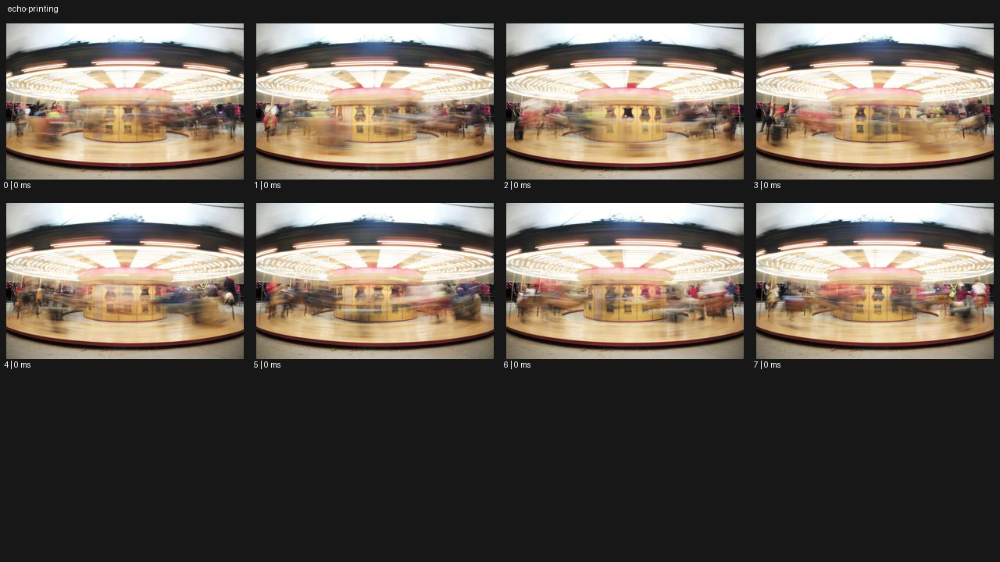

# Echo Print


- 원본 등록명: **Echo Print**
- 분류: C · 줌 & 임팩트 / Zoom & Impact
- 공식 기법 페이지: [Echo Print](https://eyecannndy.com/technique/echo-printing)
- 지정 원본 미디어: [애니메이션 WebP](https://asset.eyecannndy.com/media/clip/2024/03/13/261710313059.webp)
- 확인 방식: 8프레임 중 8시점의 시간순 이미지 배열을 직접 시각 확인. 메타데이터 길이 미확인 (메타데이터 0). 전체 프레임 재생·청음 확인 또는 생성 재현 테스트로 보고하지 않는다.



## 실제 관찰

8개 표본 모두 회전 놀이기구의 중앙 기둥과 밝은 원형 지붕이 보인다. 앞뒤 순서가 진행되며 바깥쪽 사람과 말 모양 형체가 가로로 번지고 겹친 윤곽을 남긴다. 중심 구조는 상대적으로 읽히고 마지막 표본에서도 바깥 움직임이 지속된다.

## 작동 원리와 역할

주체의 이전 위치를 투명하게 남기는 시간 중첩으로 회전 궤적을 시각화한다. 고정된 공간 앵커와 이동 대상의 잔상을 분리한다.

## 해석의 한계

원본 메타데이터의 프레임 지속시간이 모두 0으로 반환되어 실제 길이와 속도를 확인하지 못했다. 8프레임을 순서로 직접 확인했지만 시간값 0은 정지영상이라는 의미가 아니다. 실제 제작 공정도 미확인이다. 샘플 사이의 모든 움직임과 반복 경계의 무봉합 여부는 별도 검증하지 않았다. 아래 프롬프트는 새로운 장면 각색이며 생성 테스트는 하지 않았다.

## 뮤직비디오 적용 · 완성형 프롬프트

아래 설정과 길이는 독립 창작 예시다. 실제 요청의 길이·참조·음향 조건을 우선한다.

```text
7초 뮤직비디오. 검은 무대 중앙에서 흰 셔츠의 성인 댄서가 한 팔을 천천히 펼친다. 고정 카메라는 허리 위 구도로 얼굴과 몸통을 선명하게 유지한다. 팔이 크게 원을 그리는 중간 구간에만 직전 위치의 반투명 팔 윤곽을 세 겹 남겨 시간차가 부채처럼 퍼지게 한다. 잔상은 현재 팔보다 옅고 조금 늦게 따라오며 독립적으로 움직이지 않는다. 팔이 가슴 앞으로 돌아와 멈추면 잔상이 차례로 본체에 합쳐진다. 마지막 2초 한 사람의 정상적인 신체만 남겨 호흡과 시선을 읽힌다. 배경이나 얼굴은 중첩하지 않는다.
```

## 브랜드필름 적용 · 완성형 프롬프트

제품의 재질과 기능이 읽히는 순간에 효과를 배치하고 안정된 제품 상태로 끝낸다. 실제 브랜드 톤과 구조에 맞춰 각색한다.

```text
7초 고급 스카프 필름. 회색 스튜디오에서 성인 모델이 얇은 남색 실크 스카프를 한 번 크게 돌린다. 카메라는 전신보다 가까운 중간 구도에 고정하고 모델의 얼굴과 몸은 선명하게 유지한다. 스카프가 오른쪽에서 왼쪽으로 휘어질 때 직전 위치의 얇은 반투명 천 흔적을 두 겹 남겨 곡선의 여운을 보여준다. 실제 천이 목 앞에 내려앉으면 흔적은 순서대로 사라진다. 마지막에는 스카프의 정상적인 한 겹만 남고 카메라가 짧게 접근해 가장자리 봉제와 실크 광택을 읽힌다. 끝 2초 제품 색과 패턴을 선명히 유지한다.
```

음향은 원본에서 확인하지 않았다. 실제 음원과 무음·NO BGM 등 사용자 조건을 유지한다. 특정 모델의 자동 재현을 보장하는 프리셋이 아니다.
