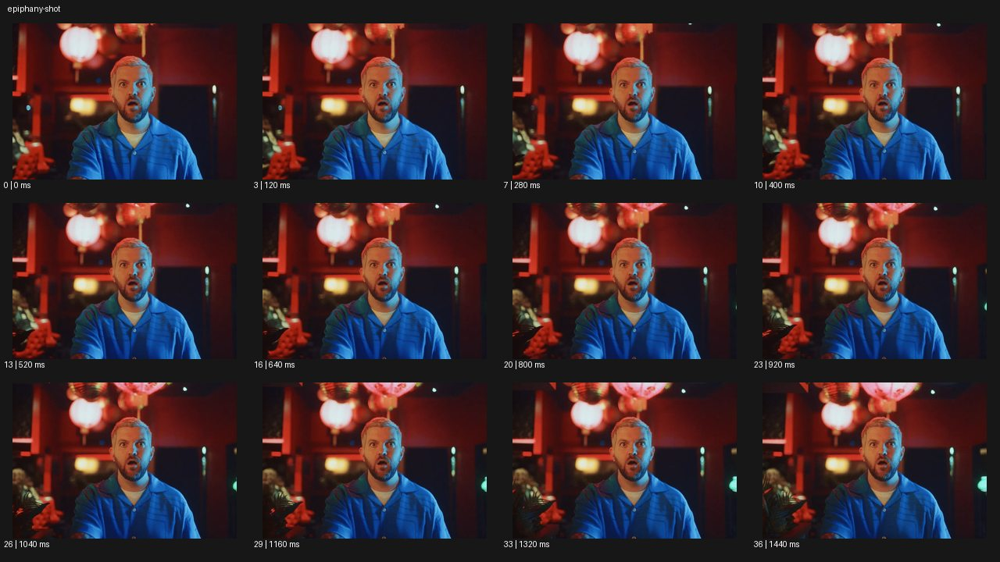

# Epiphany Shot 에피퍼니 샷


- 원본 등록명: **Epiphany Shot 에피퍼니 샷**
- 분류: B · 앵글 & 구도 / Angle & Framing
- 공식 기법 페이지: [Epiphany Shot 에피퍼니 샷](https://eyecannndy.com/technique/epiphany-shot)
- 지정 원본 미디어: [애니메이션 WebP](https://asset.eyecannndy.com/media/clip/2024/03/19/261710824754.webp)
- 확인 방식: 37프레임 중 12시점의 시간순 이미지 배열을 직접 시각 확인. 메타데이터 길이 1.48초. 전체 프레임 재생·청음 확인 또는 생성 재현 테스트로 보고하지 않는다.



## 실제 관찰

붉은 조명이 있는 실내에서 푸른 셔츠의 인물이 중앙에 입을 벌리고 눈을 크게 뜬다. 0–0.64초 놀란 표정이 유지되고 0.8–1.44초 주변 배경이 조금 더 읽히는 구도로 이어지지만 얼굴이 여전히 중심이다.

## 작동 원리와 역할

인물의 인식이 바뀌는 반응을 얼굴과 중심 프레이밍으로 강조한다. 큰 신체 행동보다 눈·입의 순간 상태를 읽히며 카메라의 과도한 효과가 필수는 아니다.

## 해석의 한계

무엇을 깨달았는지나 정확한 카메라 장비는 알 수 없다. 표본만으로 특정 돌리줌이나 줌 속도를 확정하지 않는다. 샘플 사이의 모든 움직임과 반복 경계의 무봉합 여부는 별도 검증하지 않았다. 아래 프롬프트는 새로운 장면 각색이며 생성 테스트는 하지 않았다.

## 뮤직비디오 적용 · 완성형 프롬프트

아래 설정과 길이는 독립 창작 예시다. 실제 요청의 길이·참조·음향 조건을 우선한다.

```text
6초 뮤직비디오. 어두운 녹음실에서 성인 보컬이 오래된 데모 카세트를 손에 들고 있다. 카메라는 눈높이 가슴 위 구도로 시작해 카세트 라벨에서 얼굴로 천천히 초점을 옮긴다. 보컬이 라벨을 읽다가 손을 멈추고 눈을 조금 크게 뜨며 입을 열기 직전의 표정이 된다. 그 순간 카메라가 아주 짧게 전진해 반응을 강조하되 배경을 뒤틀지 않는다. 보컬은 카세트를 가슴 가까이 당기고 표정을 차분히 정리한다. 마지막 2초 눈에 초점이 고정된 얼굴을 남긴다. 눈부신 플래시나 새로운 기억 장면 없이 인식의 변화만 보여준다.
```

## 브랜드필름 적용 · 완성형 프롬프트

제품의 재질과 기능이 읽히는 순간에 효과를 배치하고 안정된 제품 상태로 끝낸다. 실제 브랜드 톤과 구조에 맞춰 각색한다.

```text
6초 고급 향수 필름. 부드러운 아침빛의 거실에서 성인 모델이 손목의 향을 조용히 맡는다. 카메라는 얼굴과 손목이 같이 보이는 가까운 3/4 구도다. 모델이 눈을 감았다가 천천히 뜨면서 익숙한 기억을 떠올린 듯 입가에 작은 미소가 생긴다. 그 변화에 맞춰 카메라는 짧게 전진하고 초점은 눈에 붙인다. 손목이 아래로 내려가면 옆 테이블의 향수병이 하단에 드러난다. 마지막에는 초점을 병으로 부드럽게 옮겨 얼굴의 잔잔한 미소와 제품을 함께 남긴다. 로고와 병의 형태를 유지하고 향을 과장된 입자나 꽃 폭발로 바꾸지 않는다.
```

음향은 원본에서 확인하지 않았다. 실제 음원과 무음·NO BGM 등 사용자 조건을 유지한다. 특정 모델의 자동 재현을 보장하는 프리셋이 아니다.
