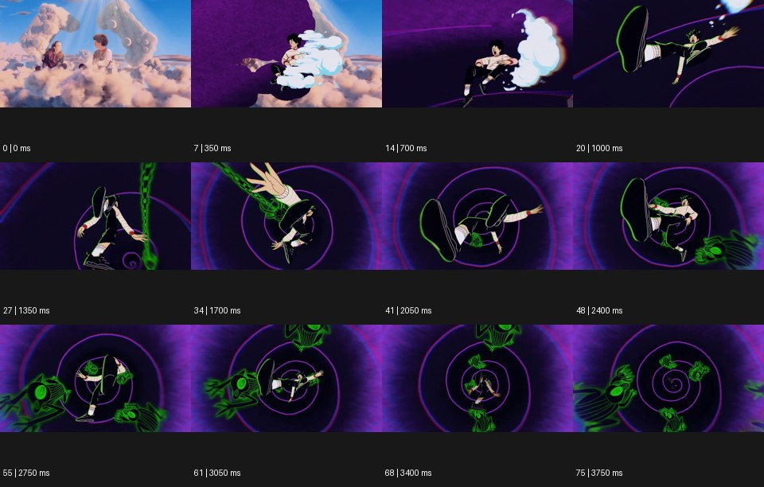

# Falling 낙하


출처: Eyecandy · 원본 등록 카드명: **Falling 낙하** · slug: falling

분류: J · People, POV & Mood / 인물·시점·무드

[원본 기법 페이지](https://eyecannndy.com/technique/falling) · [원본 미디어](https://asset.eyecannndy.com/media/clip/2024/03/09/261709976657.webp)

## 확인 근거

원본 76프레임, 메타데이터 길이 3800ms. 고유 12개 시점 프레임을 추출하여 이미지로 직접 관찰했다. 재생 감상·음향 청취·생성 재현 테스트를 했다는 뜻이 아니다.

표본 프레임(0부터): 0, 7, 14, 20, 27, 34, 41, 48, 55, 61, 68, 75



## 실제 시간순 관찰

0–700ms: 실사 같은 구름 장면에서 애니메이션 인물이 어두운 보라색 공간으로 바뀐다. 1000–2050ms: 인물의 신발이 크게 보이고 몸이 회전하며 보라색 나선과 녹색 형상이 주위를 지난다. 2400–3750ms: 인물이 나선 중심 쪽으로 작아지며 멀어지고 주변 형상이 앞을 가로지른다.

## 주체·카메라·합성·편집 구분

인물은 낙하·회전하는 자세다. 가상 시점과 스케일 변화가 깊이를 만들며 스타일 전환이 초반에 있다. 실제 지면 충돌은 샘플에 없다.

## 장면에 재사용할 원리

중력 방향·몸의 회전·주변 물체의 상대 흐름·크기 변화를 결합해 낙하를 읽힌다. 모든 낙하에 카메라가 같이 떨어질 필요는 없다.

## 확인 한계

원본의 정확한 도착 장소나 충격·상해를 추가하지 않는다. 표본 사이의 모든 프레임과 반복 경계의 연속성을 검사하지 않았다. 음향은 확인하지 않았다.

## 뮤직비디오 각색 · 완성형 프롬프트

아래는 장면 목적에 맞게 새로 설계한 창작 적용안이며 원본 길이를 상속하지 않는다.

```text
7초 낙하 뮤직비디오, 성인 보컬을 닮은 손그림 인물이 푸른 하늘에 떠 있는 얇은 종이 무대 끝에 앉아 있다. 가상 카메라는 발 앞에서 시작한다. 인물이 뒤로 몸을 기울이면 무대가 화면 위로 빠지고 인물이 깊은 남색 공간으로 천천히 떨어진다. 카메라는 위쪽에 남아 인물이 점점 작아지는 모습을 보며, 얇은 악보 없는 종이 조각들이 서로 다른 속도로 지나가 깊이를 만든다. 5초에 아래의 넓은 흰 천이 드러나고 인물은 부드럽게 내려앉는다. 마지막 2초는 천 위에 누워 위를 바라보는 작은 인물의 고요로 끝낸다. 충돌·문자·대사는 없다.
```

## 브랜드필름 각색 · 완성형 프롬프트

```text
8초 침구 브랜드필름, 어두운 회색 공간 위에서 흰 리넨 베개 한 개가 수평으로 천천히 내려온다. 카메라는 침대 높이의 측면에서 베개 아래의 간격을 보여준다. 첫 2초는 베개의 무게와 직물 주름을 읽히고, 낙하가 이어지는 동안 카메라가 조금 낮아져 매트리스 표면을 드러낸다. 4초에 베개가 매트리스에 닿으면 충격으로 가장자리가 부드럽게 퍼지고 작은 주름이 바깥으로 전달된다. 과장된 탄성이나 액체 변형은 넣지 않는다. 마지막 3초는 완전히 멈춘 베개의 스티치와 리넨 결에 가까이 안착한다. 인물·새 로고·문자 없이 낮은 직물 접촉음만 둔다.
```

생성 테스트: 미실시. 단일 모델의 정확한 재현을 보장하지 않으며 필요한 촬영·합성·편집 층을 구분해 구현한다.
