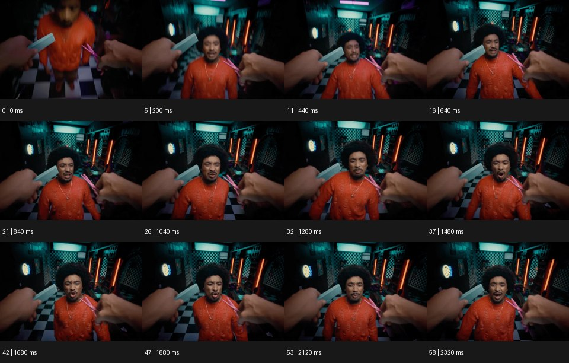

# First-Person 1인칭 시점


출처: Eyecandy · 원본 등록 카드명: **First-Person 1인칭 시점** · slug: first-person-pov

분류: J · People, POV & Mood / 인물·시점·무드

[원본 기법 페이지](https://eyecannndy.com/technique/first-person-pov) · [원본 미디어](https://asset.eyecannndy.com/media/clip/2024/06/07/261717741982.webp)

## 확인 근거

원본 59프레임, 메타데이터 길이 2360ms. 고유 12개 시점 프레임을 추출하여 이미지로 직접 관찰했다. 재생 감상·음향 청취·생성 재현 테스트를 했다는 뜻이 아니다.

표본 프레임(0부터): 0, 5, 11, 16, 21, 26, 32, 37, 42, 47, 53, 58



## 실제 시간순 관찰

0–200ms: 앞쪽 두 손과 작은 도구 너머로 주황색 옷의 인물이 가까워진다. 440–1280ms: 손이 화면 좌우에 남은 채 인물이 렌즈 쪽을 보며 입과 몸을 움직인다. 1480–2320ms: 같은 인물이 앞으로 기울었다가 표정을 바꾸고 전경 손의 위치도 조금 달라진다.

## 주체·카메라·합성·편집 구분

전경 손은 카메라를 가진 시점 인물의 신체처럼 배치된다. 상대 인물은 카메라를 향해 반응한다. 약한 시점 흔들림과 광각 원근이 있으며 별도의 전환 효과는 필요하지 않다.

## 장면에 재사용할 원리

시점 인물의 눈높이와 손의 공간 관계를 고정해 관객이 행동의 주체로 느끼게 한다.

## 확인 한계

전경 도구의 정확한 기능과 상대 인물의 말 내용은 확인하지 않았다. 표본 사이의 모든 프레임과 반복 경계의 연속성을 검사하지 않았다. 음향은 확인하지 않았다.

## 뮤직비디오 각색 · 완성형 프롬프트

아래는 장면 목적에 맞게 새로 설계한 창작 적용안이며 원본 길이를 상속하지 않는다.

```text
6초 1인칭 뮤직비디오, 관객이 작은 녹음실에서 성인 보컬에게 헤드폰을 건네는 시점이다. 카메라는 앉은 사람의 눈높이이며 자신의 두 손이 화면 아래에서 검은 헤드폰을 들고 있다. 첫 2초는 맞은편 보컬이 눈을 맞추고 상체를 조금 앞으로 기울인다. 손이 헤드폰을 앞으로 내밀면 카메라도 몸의 움직임에 따라 10cm만 전진한다. 보컬이 헤드폰을 받아 착용할 때 손은 자연스럽게 화면 아래로 내려간다. 마지막 2초에는 보컬이 눈을 감고 첫 호흡을 준비하는 표정을 고정된 시점으로 담는다. 손가락 수와 헤드폰 형태를 유지하며 대사·자막 없이 실내 소리만 둔다.
```

## 브랜드필름 각색 · 완성형 프롬프트

```text
7초 커피 도구 브랜드필름, 관객이 아침 주방의 바리스타가 된 1인칭 시점으로 시작한다. 카메라는 서 있는 눈높이에서 아래를 약하게 내려다보고 자신의 한 손은 드리퍼를, 다른 손은 가는 주둥이 주전자를 잡는다. 2초에 주전자를 기울여 원을 한 번 그리며 물을 붓고 카메라는 손동작보다 적게 움직여 도구의 형태를 읽힌다. 드리퍼와 컵은 같은 위치에 유지하고 물은 실제 중력 방향으로 흐른다. 5초에 주전자를 내려놓은 뒤 카메라가 조금 들려 창빛과 완성 커피를 함께 보여준다. 마지막에는 컵 손잡이를 잡는 손으로 마무리한다. 새 문자·로고 없이 물소리만 둔다.
```

생성 테스트: 미실시. 단일 모델의 정확한 재현을 보장하지 않으며 필요한 촬영·합성·편집 층을 구분해 구현한다.
