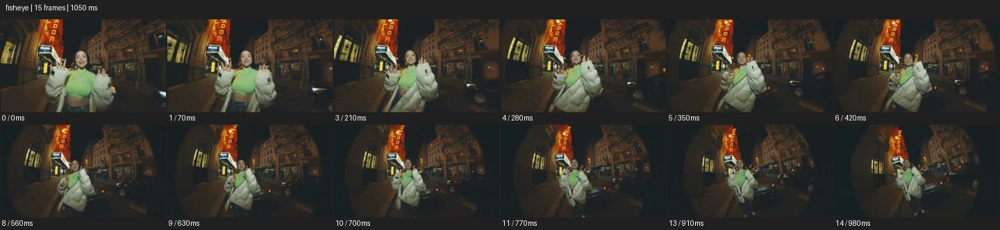

# Fisheye


- 출처: Eyecandy · [Fisheye](https://eyecannndy.com/technique/fisheye)
- 카탈로그 등록 표기: **Fisheye 피시아이**
- 카테고리: F · Lens & Optics · 렌즈 & 옵틱
- 원본 미디어: [애니메이션 WebP](https://asset.eyecannndy.com/media/clip/2024/01/09/261704836939.webp)
- 확인 방식: 원본 애니메이션을 디코딩해 시간순 프레임을 추출한 뒤 컨택트 시트를 직접 시각 확인했다. 전체 15프레임 / 1050ms, 기본 12시점. 재생·음향 청취·전 프레임 시각 검수·생성 테스트를 했다고 주장하지 않는다.
- 기본 확인 프레임: 0, 1, 3, 4, 5, 6, 8, 9, 10, 11, 13, 14. 해당 타임스탬프(ms): 0, 70, 210, 280, 350, 420, 560, 630, 700, 770, 910, 980.
- 원본 길이는 관찰 정보다. 아래 새 장면의 길이를 원본에 자동 맞추지 않는다.

## 움직임 증거



## 원본에서 확인한 시작 → 변화 → 끝

야간 거리에서 흰 패딩과 초록 상의를 입은 인물이 가까이 퍼포먼스한다. 주변 건물과 수직선이 휘어지고 프레임 가장자리가 어둡다. 카메라가 물러나며 인물이 작아지고 더 넓은 거리가 보인다.

- 카메라·시점: 강한 광각으로 물러나며 주변을 넓게 보여준다.
- 주체: 인물이 손과 몸을 가까이 움직인다.
- 조명·합성·편집: 왜곡이 렌즈인지 후반 처리인지는 미확인.

## 작동 원리와 확인 한계

강한 광각의 배럴 왜곡과 근거리 원근으로 중심 인물의 존재감을 키운다. 렌즈 모델과 실제 초점거리는 확인되지 않는다.

샘플 사이의 빠른 변화는 일부 빠질 수 있다. GIF의 반복 경계가 작품의 의도된 완전 루프라는 보장은 없다. 원본 음악·대사·촬영 장비·제작 소프트웨어는 확인하지 않았다. 아래 프롬프트는 관찰한 원리를 다른 장면에 각색한 창작안이며 원본 장면이나 검증된 생성 결과가 아니다.

## 뮤직비디오 각색 · 완전한 장면 프롬프트

```text
야간 레코드숍 앞 성인 래퍼를 담는 뮤직비디오. 어안의 넓은 화각으로 얼굴과 두 손을 가까이 담고 가게 외벽의 직선이 가장자리에서 둥글게 휘도록 한다. 래퍼가 손바닥을 렌즈 가까이 내밀 때 손만 크게 보이고 얼굴은 중앙에서 정상 정체성을 유지한다. 카메라는 두 걸음 부드럽게 후진해 전신과 간판을 드러낸다. 래퍼가 팔을 내리면 카메라도 멈춰 중심의 전신 구도로 착지한다. 가장자리 왜곡을 인물 얼굴의 찌그러짐으로 확장하지 않는다.
```

## 브랜드필름 각색 · 완전한 장면 프롬프트

```text
부드러운 볼륨의 패딩 컬렉션을 보여주는 유쾌한 패션필름. 밝은 곡면 스튜디오 중앙에 성인 모델을 두고 낮은 어안 카메라로 부츠와 패딩의 볼륨을 강조한다. 모델이 한 걸음 다가오며 양팔을 벌리면 가까운 소매가 크게 보이고 배경 격자만 둥글게 휜다. 카메라는 짧게 물러나 균형을 맞춘 뒤 전신 구도에서 멈춘다. 마지막에 모델이 옆으로 조금 돌아 패딩의 옆선과 지퍼를 읽힌다. 로고와 얼굴은 화면 중심 부근에 유지하고 제품 색을 일정하게 둔다.
```

적용 시 사용자가 지정한 길이·참조·컷·음향·제품 보존 조건을 우선한다. 효과의 시작 계기와 도착 구도를 유지하며 필요한 부분을 해당 장면에 맞춰 다시 연출한다.
