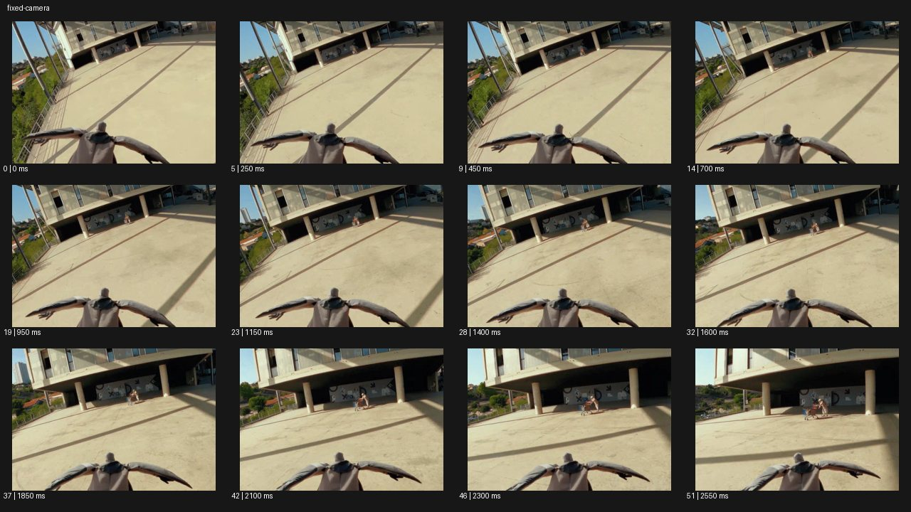

# Fixed Cam


- 원본 등록명: **Fixed Cam**
- 분류: B · 앵글 & 구도 / Angle & Framing
- 공식 기법 페이지: [Fixed Cam](https://eyecannndy.com/technique/fixed-camera)
- 지정 원본 미디어: [애니메이션 WebP](https://asset.eyecannndy.com/media/clip/2024/03/04/261709538350.webp)
- 확인 방식: 52프레임 중 12시점의 시간순 이미지 배열을 직접 시각 확인. 메타데이터 길이 2.6초. 전체 프레임 재생·청음 확인 또는 생성 재현 테스트로 보고하지 않는다.



## 실제 관찰

화면 아래 팔을 양옆으로 벌린 인물의 등과 머리가 거의 같은 위치에 남는다. 0–1.15초 비스듬한 광장 바닥과 건물이 앞으로 다가온다. 1.6–2.55초 건물 아래에 있는 사람들이 커지지만 하단의 인물은 상대 위치를 유지한다.

## 작동 원리와 역할

주체와 카메라가 연결된 듯한 상대 고정이 핵심이다. 카메라와 주체는 이동하고 배경의 원근만 변화한다. 세계 기준 삼각대 고정과 다르다.

## 해석의 한계

실제 카메라 부착 지점과 지지 장비는 보이지 않는다. 인물의 이동 수단도 단정하지 않는다. 샘플 사이의 모든 움직임과 반복 경계의 무봉합 여부는 별도 검증하지 않았다. 아래 프롬프트는 새로운 장면 각색이며 생성 테스트는 하지 않았다.

## 뮤직비디오 적용 · 완성형 프롬프트

아래 설정과 길이는 독립 창작 예시다. 실제 요청의 길이·참조·음향 조건을 우선한다.

```text
7초 뮤직비디오. 긴 옥상 통로를 달리는 성인 보컬의 어깨 앞에 카메라가 고정된 듯 얼굴을 항상 같은 크기로 담는다. 보컬은 처음에는 렌즈를 피하고 달리기 시작하면서 눈을 들어 정면을 본다. 카메라는 얼굴과 함께 이동하여 몸의 작은 반동은 남지만 뒤의 난간과 도시 불빛이 빠르게 흘러간다. 중간에 보컬이 고개를 조금 돌려도 얼굴 중심은 화면 중앙 근처에 유지한다. 통로 끝에서 보컬이 멈추면 배경의 흐름도 자연스럽게 잦아든다. 마지막 2초 숨을 고르는 표정에 머물고 배경을 합성 소용돌이로 만들지 않는다.
```

## 브랜드필름 적용 · 완성형 프롬프트

제품의 재질과 기능이 읽히는 순간에 효과를 배치하고 안정된 제품 상태로 끝낸다. 실제 브랜드 톤과 구조에 맞춰 각색한다.

```text
7초 프리미엄 자전거 액세서리 필름. 자전거 핸들에 장착된 작은 브러시드 알루미늄 벨을 프레임 오른쪽 아래에 고정한 카메라 구도로 시작한다. 성인 라이더가 공원의 완만한 길을 달리면 벨과 핸들의 상대 위치는 유지되고 나무와 길만 뒤로 흐른다. 엄지가 벨을 한 번 누르는 동작을 선명하게 보여준 뒤 카메라는 같은 부착 시점을 유지한다. 곡선 길에서 배경은 부드럽게 기울지만 제품은 프레임에서 이탈하지 않는다. 마지막 자전거가 정지하여 숲의 빛과 벨의 금속 결이 안정된다. 끝 2초 제품 형태와 장착 구조를 정확히 읽힌다.
```

음향은 원본에서 확인하지 않았다. 실제 음원과 무음·NO BGM 등 사용자 조건을 유지한다. 특정 모델의 자동 재현을 보장하는 프리셋이 아니다.
