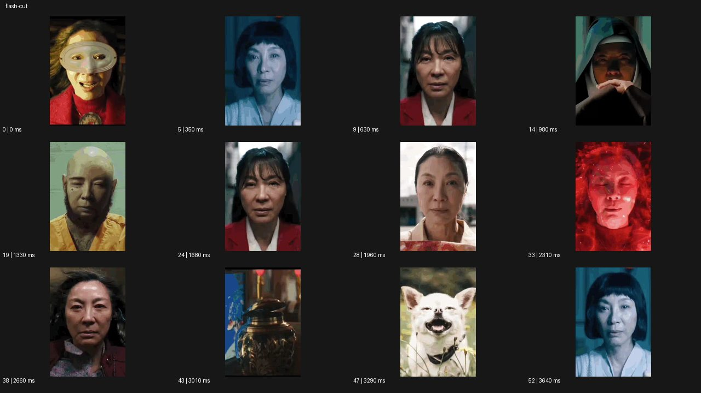
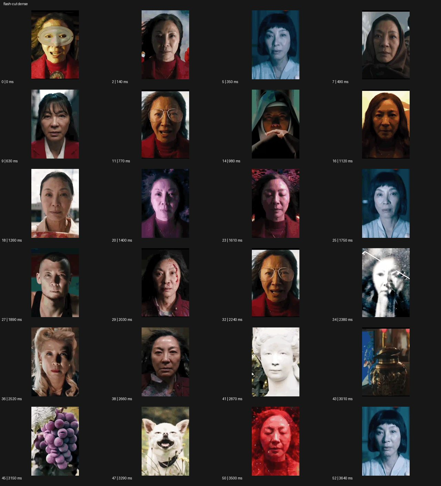

# Flash Cut


- 원본 등록명: **Flash Cut**
- 분류: D · 편집 & 전환 / Editing & Transition
- 공식 기법 페이지: [Flash Cut](https://eyecannndy.com/technique/flash-cut)
- 지정 원본 미디어: [애니메이션 WebP](https://asset.eyecannndy.com/media/clip/2024/01/12/261705037397.webp)
- 확인 방식: 53프레임 중 12시점의 시간순 이미지 배열을 직접 시각 확인. 메타데이터 길이 3.71초. 추가 24시점 배열도 직접 확인. 전체 프레임 재생·청음 확인 또는 생성 재현 테스트로 보고하지 않는다.





## 실제 관찰

짧은 간격마다 중앙을 향한 인물의 얼굴·의상·빛이 바뀐다. 초반에는 가면과 여러 인물 버전이 반복되고 중반에도 눈과 얼굴의 위치를 비슷하게 유지하며 다른 모습이 들어온다. 후반에는 조각상·항아리·포도·동물까지 삽입되며 마지막은 푸른빛 얼굴이다.

## 작동 원리와 역할

카메라 이동보다 짧은 이미지 지속시간과 중심 정렬 편집이 변화를 만든다. 단순 흰 플래시가 아니라 이미지 자체의 빠른 교체다.

## 해석의 한계

24개 밀도 표본도 모든 중간 컷을 포함하지 않는다. 정확한 컷 수·노출·음악 동기화는 확인하지 않았다. 샘플 사이의 모든 움직임과 반복 경계의 무봉합 여부는 별도 검증하지 않았다. 아래 프롬프트는 새로운 장면 각색이며 생성 테스트는 하지 않았다.

## 뮤직비디오 적용 · 완성형 프롬프트

아래 설정과 길이는 독립 창작 예시다. 실제 요청의 길이·참조·음향 조건을 우선한다.

```text
6초 뮤직비디오. 같은 성인 보컬의 눈 위치와 얼굴 크기를 맞춘 정면 초상 네 장면을 준비한다. 첫 장면은 흰 방의 차분한 얼굴로 1초 유지한다. 중간 2초 동안 붉은 무대, 젖은 골목, 어두운 탈의실, 다시 흰 방의 얼굴을 짧은 하드컷으로 교차한다. 각 장면에서 의상과 조명은 다르지만 얼굴 정체성과 눈의 중심은 이어지고 흰색 점멸 프레임은 넣지 않는다. 교체가 끝나면 마지막 흰 방에서 보컬이 천천히 눈을 감는다. 카메라는 모든 숏에서 고정하며 끝 2초 표정을 읽힐 충분한 시간을 둔다.
```

## 브랜드필름 적용 · 완성형 프롬프트

제품의 재질과 기능이 읽히는 순간에 효과를 배치하고 안정된 제품 상태로 끝낸다. 실제 브랜드 톤과 구조에 맞춰 각색한다.

```text
6초 고급 시계 캠페인. 같은 시계의 다이얼을 중앙에 정렬한 세 근접 장면으로 시작한다. 첫 1초 검은 스튜디오에서 제품 전체를 선명하게 읽힌 뒤, 중간 구간에 손목 위 자연광, 책상 위 따뜻한 측광, 차가운 석재 위 반사광의 다이얼을 짧게 교차 편집한다. 모든 컷의 다이얼 크기와 12시 방향을 일치시키고 시계 디자인을 바꾸지 않는다. 빠른 교체 뒤에는 검은 스튜디오의 정면 제품 구도로 돌아와 2초 정지한다. 로고와 눈금은 마지막에 또렷하고 별도의 백색 점멸이나 프레임 흔들림은 없다.
```

음향은 원본에서 확인하지 않았다. 실제 음원과 무음·NO BGM 등 사용자 조건을 유지한다. 특정 모델의 자동 재현을 보장하는 프리셋이 아니다.
