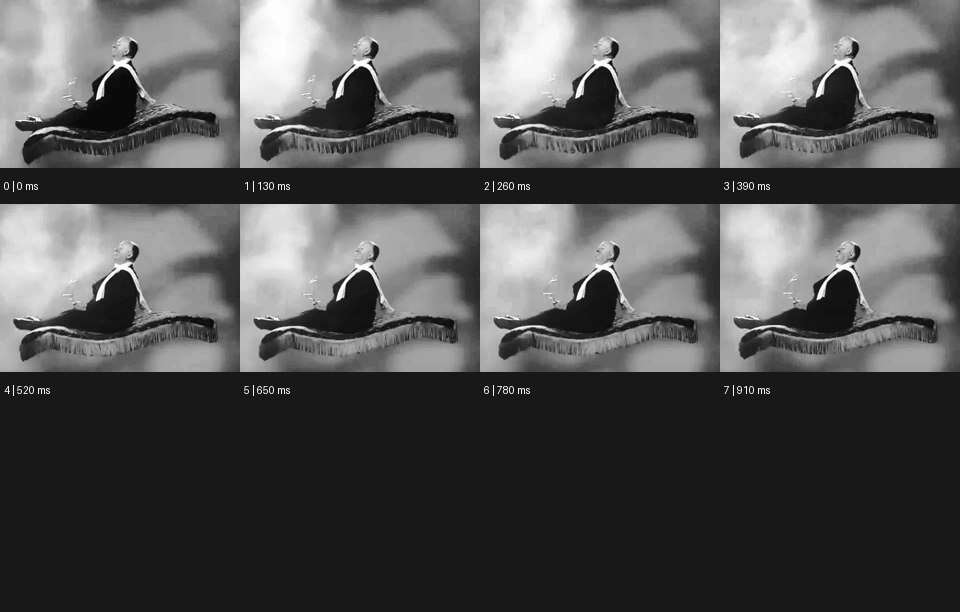

# Levitation 부유


출처: Eyecandy · 원본 등록 카드명: **Levitation 부유** · slug: floating

분류: J · People, POV & Mood / 인물·시점·무드

[원본 기법 페이지](https://eyecannndy.com/technique/floating) · [원본 미디어](https://asset.eyecannndy.com/media/clip/2024/03/09/261709962011.webp)

## 확인 근거

원본 8프레임, 메타데이터 길이 1040ms. 고유 8개 시점 프레임을 추출하여 이미지로 직접 관찰했다. 재생 감상·음향 청취·생성 재현 테스트를 했다는 뜻이 아니다.

표본 프레임(0부터): 0, 1, 2, 3, 4, 5, 6, 7



## 실제 시간순 관찰

0–390ms: 흑백 인물이 장식 가장자리의 카펫 위에 앉아 다리를 앞으로 뻗고, 카펫은 구름 같은 배경 앞에 떠 있다. 520–910ms: 앉은 자세를 거의 유지하며 카펫 가장자리와 배경의 상대 위치가 조금 바뀐다. 파일은 8프레임이다.

## 주체·카메라·합성·편집 구분

주체는 앉은 자세로 미세하게 움직인다. 카펫의 눈에 보이는 지지대는 없고 배경과 분리된 부유 인상을 만든다. 실제 와이어·미니어처·합성 여부는 미확인이다.

## 장면에 재사용할 원리

지지·중력의 기대를 제거하되 대상의 무게·관성을 미세하게 남겨 떠 있는 상태를 설득력 있게 만든다.

## 확인 한계

8개 고유 프레임 이미지 확인이며 실제 재생의 속도감과 이음새 평가는 하지 않았다. 표본 사이의 모든 프레임과 반복 경계의 연속성을 검사하지 않았다. 음향은 확인하지 않았다.

## 뮤직비디오 각색 · 완성형 프롬프트

아래는 장면 목적에 맞게 새로 설계한 창작 적용안이며 원본 길이를 상속하지 않는다.

```text
7초 부유 뮤직비디오, 성인 보컬이 새벽의 텅 빈 방에서 낮은 나무 의자에 앉아 있다. 카메라는 바닥 가까운 측면 와이드숏이다. 보컬이 깊게 숨을 내쉬는 2초 지점에 의자의 네 다리가 바닥에서 천천히 15cm 떠오르고 바닥 그림자가 부드럽게 분리된다. 보컬은 발을 늘어뜨린 채 과장되게 놀라지 않는다. 카메라는 30cm만 옆으로 이동해 바닥과 의자 사이 빈 공간을 보여준다. 5초부터 상승을 멈추고 아주 작은 흔들림만 남긴다. 마지막에는 창빛 속 보컬의 옆얼굴과 떠 있는 의자를 함께 유지한다. 지지대·추가 사물·자막 없이 방의 환경음만 둔다.
```

## 브랜드필름 각색 · 완성형 프롬프트

```text
8초 경량 여행 가방 브랜드필름, 모래색 스튜디오 바닥에 닫힌 가방 한 개를 놓는다. 카메라는 낮은 삼사분면에서 바퀴와 바닥 접점을 먼저 읽힌다. 2초에 가방이 형태를 유지한 채 바닥에서 천천히 10cm 떠오르고 그림자는 바로 아래에 남아 넓어진다. 제품이 뒤집히거나 손잡이가 늘어나지 않게 하고 경량감은 낮은 상승과 부드러운 정지로만 표현한다. 카메라는 25도 오빗해 네 바퀴와 측면을 보여준다. 5초에 부유가 멈추고 마지막 3초는 고정된 가방과 분리된 그림자의 간격을 읽힌다. 실제 중량 수치·새 로고·문구는 쓰지 않는다.
```

생성 테스트: 미실시. 단일 모델의 정확한 재현을 보장하지 않으며 필요한 촬영·합성·편집 층을 구분해 구현한다.
