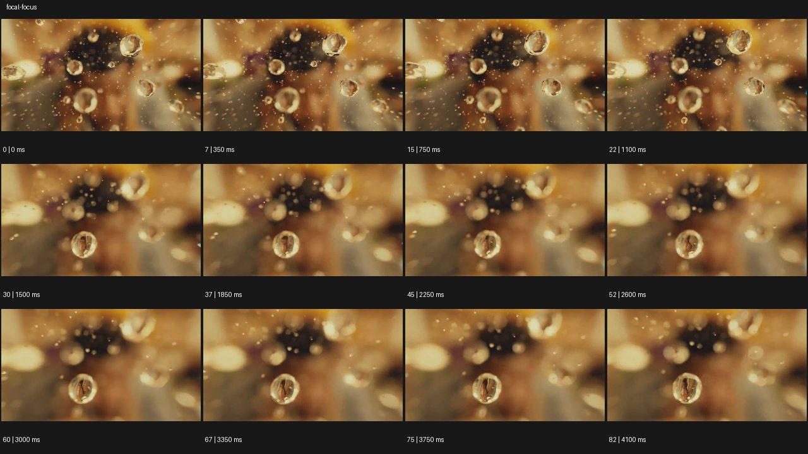

# Shallow Focus 얕은 심도


- 원본 등록명: **Shallow Focus 얕은 심도**
- 분류: B · 앵글 & 구도 / Angle & Framing
- 공식 기법 페이지: [Shallow Focus 얕은 심도](https://eyecannndy.com/technique/focal-focus)
- 지정 원본 미디어: [애니메이션 WebP](https://asset.eyecannndy.com/media/clip/2024/02/27/261709022589.webp)
- 확인 방식: 83프레임 중 12시점의 시간순 이미지 배열을 직접 시각 확인. 메타데이터 길이 4.15초. 전체 프레임 재생·청음 확인 또는 생성 재현 테스트로 보고하지 않는다.



## 실제 관찰

따뜻한 배경의 흐린 얼굴 앞에 물방울 같은 구체들이 떠 있다. 0–1.1초 화면 위쪽과 좌우의 구체가 선명하고 얼굴은 계속 흐리다. 1.5초 이후 아래쪽 앞 구체가 선명해지고 주변 구체는 보케처럼 풀리며 끝까지 얕은 초점층이 유지된다.

## 작동 원리와 역할

전경 구체의 깊이별 초점 차이가 시선을 선택한다. 구체 이동과 초점 변화가 함께 보이며 배경 얼굴은 맥락으로 남는다.

## 해석의 한계

실제 물방울·CG·유리 표면 여부는 확정할 수 없다. 프레임마다 어느 비율이 초점 이동이고 물체 이동인지 분리하기 어렵다. 샘플 사이의 모든 움직임과 반복 경계의 무봉합 여부는 별도 검증하지 않았다. 아래 프롬프트는 새로운 장면 각색이며 생성 테스트는 하지 않았다.

## 뮤직비디오 적용 · 완성형 프롬프트

아래 설정과 길이는 독립 창작 예시다. 실제 요청의 길이·참조·음향 조건을 우선한다.

```text
7초 뮤직비디오. 비 오는 밤 유리창 바로 뒤에 성인 보컬이 서 있다. 카메라는 창 밖의 물방울에 가까이 붙어 시작하며 물방울 가장자리만 선명하고 보컬의 얼굴은 흐린 색면으로 남는다. 보컬이 손바닥을 유리에 대면 앞의 작은 물방울 하나가 아래로 흘러내린다. 초점은 그 물방울을 잠깐 따라가다가 서서히 뒤의 눈으로 이동한다. 카메라 위치는 고정하고 얼굴이 선명해질 때 손은 천천히 내려간다. 마지막에는 흐린 물방울 너머 눈과 입을 또렷하게 읽힌다. 물방울이 눈이나 얼굴의 일부로 변하지 않게 한다.
```

## 브랜드필름 적용 · 완성형 프롬프트

제품의 재질과 기능이 읽히는 순간에 효과를 배치하고 안정된 제품 상태로 끝낸다. 실제 브랜드 톤과 구조에 맞춰 각색한다.

```text
7초 고급 스킨케어 필름. 크림색 배경에서 투명한 세럼 한 방울이 유리 피펫 끝에 맺혀 있고 뒤에는 제품병이 있다. 카메라는 피펫 끝의 방울을 선명하게 잡고 병의 라벨은 부드럽게 흐린 채 시작한다. 방울이 천천히 길어져 작은 유리 접시에 떨어지면 카메라는 움직이지 않고 초점만 뒤의 제품병으로 이동한다. 피펫은 위로 빠져나가고 병의 유리 두께와 라벨이 점차 또렷해진다. 마지막 2초 제품 전체에 초점을 유지하며 접시의 한 방울은 전경 보케로 남긴다. 액체의 양과 병 형태를 일관되게 유지한다.
```

음향은 원본에서 확인하지 않았다. 실제 음원과 무음·NO BGM 등 사용자 조건을 유지한다. 특정 모델의 자동 재현을 보장하는 프리셋이 아니다.
