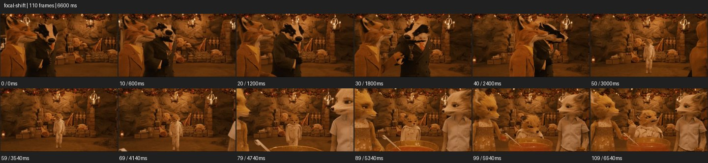

# Focal Shift


- 출처: Eyecandy · [Focal Shift](https://eyecannndy.com/technique/focal-shift)
- 카탈로그 등록 표기: **Focal Shift 포컬 시프트**
- 카테고리: F · Lens & Optics · 렌즈 & 옵틱
- 원본 미디어: [애니메이션 WebP](https://asset.eyecannndy.com/media/clip/2024/03/25/261711344614.webp)
- 확인 방식: 원본 애니메이션을 디코딩해 시간순 프레임을 추출한 뒤 컨택트 시트를 직접 시각 확인했다. 전체 110프레임 / 6600ms, 기본 12시점. 재생·음향 청취·전 프레임 시각 검수·생성 테스트를 했다고 주장하지 않는다.
- 기본 확인 프레임: 0, 10, 20, 30, 40, 50, 59, 69, 79, 89, 99, 109. 해당 타임스탬프(ms): 0, 600, 1200, 1800, 2400, 3000, 3540, 4140, 4740, 5340, 5940, 6540.
- 원본 길이는 관찰 정보다. 아래 새 장면의 길이를 원본에 자동 맞추지 않는다.

## 움직임 증거



## 원본에서 확인한 시작 → 변화 → 끝

갈색 조형 캐릭터들이 있는 실내에서 가까운 동물 얼굴과 뒤 중앙 인물이 보인다. 가까운 인물들이 옆으로 빠지고 뒤 인물이 읽히다가, 후반 가까운 두 캐릭터와 냄비가 다시 화면을 채운다.

- 카메라·시점: 앞뒤 대상을 포함한 구도가 변한다.
- 주체: 앞 캐릭터가 물러나고 뒤 인물이 다가온다.
- 조명·합성·편집: 초점·캐릭터 이동·편집을 한 원인으로 합치지 않는다.

## 작동 원리와 확인 한계

앞뒤 거리 사이 관객의 주의를 옮기는 초점 원리. 이 샘플에는 인물 이동과 구도 변화도 커서 모든 변화가 초점 이동만으로 생긴다고 주장하지 않는다.

샘플 사이의 빠른 변화는 일부 빠질 수 있다. GIF의 반복 경계가 작품의 의도된 완전 루프라는 보장은 없다. 원본 음악·대사·촬영 장비·제작 소프트웨어는 확인하지 않았다. 아래 프롬프트는 관찰한 원리를 다른 장면에 각색한 창작안이며 원본 장면이나 검증된 생성 결과가 아니다.

## 뮤직비디오 각색 · 완전한 장면 프롬프트

```text
밤 기차 객실의 성인 보컬을 담는 뮤직비디오. 카메라는 고정하고 전경 창문 유리에 맺힌 빗방울을 먼저 선명하게 둔다. 뒤에 앉은 보컬은 흐린 형태로만 보인다. 보컬이 손을 창에 대면 초점이 빗방울에서 뒤의 눈으로 천천히 이동하고 물방울은 부드럽게 흐려진다. 보컬이 손을 내린 뒤에도 눈의 초점을 유지하며 고요한 표정을 남긴다. 카메라의 이동이나 줌으로 전환을 대신하지 않고 얼굴 크기와 창문 구조를 일정하게 유지한다.
```

## 브랜드필름 각색 · 완전한 장면 프롬프트

```text
차 한 잔의 향과 마시는 사람을 연결하는 브랜드필름. 고정된 낮은 카메라로 가까운 찻잔 테두리와 얇은 증기를 선명하게 잡고 뒤의 성인 모델은 부드럽게 흐린다. 모델이 잔을 향해 손을 뻗기 시작하면 초점을 손의 도착 지점을 거쳐 얼굴로 서서히 이동한다. 잔을 들어 향을 맡는 순간 눈과 코를 선명하게 유지한다. 마지막에는 모델이 잔을 내려놓고 초점이 다시 찻잔으로 돌아와 유약 질감을 읽힌다. 컷 없이 진행하며 잔 모양과 손가락 형태를 보존한다.
```

적용 시 사용자가 지정한 길이·참조·컷·음향·제품 보존 조건을 우선한다. 효과의 시작 계기와 도착 구도를 유지하며 필요한 부분을 해당 장면에 맞춰 다시 연출한다.
