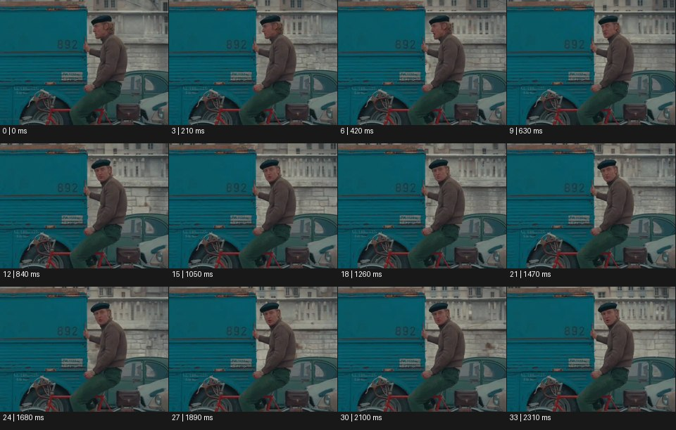

# Fourth Wall 4번째 벽


출처: Eyecandy · 원본 등록 카드명: **Fourth Wall 4번째 벽** · slug: fourth-wall

분류: J · People, POV & Mood / 인물·시점·무드

[원본 기법 페이지](https://eyecannndy.com/technique/fourth-wall) · [원본 미디어](https://asset.eyecannndy.com/media/clip/2024/01/10/261704859264.webp)

## 확인 근거

원본 34프레임, 메타데이터 길이 2380ms. 고유 12개 시점 프레임을 추출하여 이미지로 직접 관찰했다. 재생 감상·음향 청취·생성 재현 테스트를 했다는 뜻이 아니다.

표본 프레임(0부터): 0, 3, 6, 9, 12, 15, 18, 21, 24, 27, 30, 33



## 실제 시간순 관찰

0–420ms: 자전거 옆 또는 위의 모자 쓴 인물이 측면을 보고 있고 한 손은 파란 차량 쪽에 닿아 있다. 630–1260ms: 고개와 눈을 카메라 쪽으로 돌린다. 1470–2310ms: 카메라를 직접 바라보며 입과 표정을 움직인다.

## 주체·카메라·합성·편집 구분

인물의 시선과 고개 전환이 중심이다. 카메라는 비슷한 거리에서 인물을 따라가는 구도를 유지한다. 제4의 벽 효과는 합성보다 렌즈를 향한 연기 관계에서 생긴다.

## 장면에 재사용할 원리

장면 속 행동을 하던 인물이 관객 존재를 알아차리는 명확한 시선 변화를 배치한다.

## 확인 한계

음성을 듣지 않았으므로 관객에게 어떤 대사를 하는지는 확인하지 않았다. 표본 사이의 모든 프레임과 반복 경계의 연속성을 검사하지 않았다. 음향은 확인하지 않았다.

## 뮤직비디오 각색 · 완성형 프롬프트

아래는 장면 목적에 맞게 새로 설계한 창작 적용안이며 원본 길이를 상속하지 않는다.

```text
6초 뮤직비디오, 성인 보컬이 빈 세탁소에서 돌아가는 세탁기를 기다린다. 카메라는 맞은편 의자 높이의 고정 미디엄숏이며 첫 2초에는 보컬이 세탁기만 본다. 기다리다 지친 듯 손목을 만지던 보컬이 카메라를 발견하고 눈부터 돌린 뒤 고개를 따라 돌린다. 3초에 직접 눈을 맞추고 자신 옆 빈 의자를 손바닥으로 가볍게 두드린다. 카메라는 그 초대를 받은 듯 20cm만 앞으로 이동한다. 마지막 2초는 보컬이 작은 웃음을 참는 표정과 빈 의자가 함께 보이게 유지한다. 시선은 렌즈를 향하고 다른 인물을 만들지 않는다. 자막·대사 없이 세탁기 소리만 둔다.
```

## 브랜드필름 각색 · 완성형 프롬프트

```text
7초 맞춤 셔츠 브랜드필름, 성인 모델이 밝은 피팅룸 거울 앞에서 커프스를 잠근다. 카메라는 거울 옆에 서 있는 사람의 높이로 고정한다. 첫 3초는 모델이 자신의 손목과 거울만 보며 정확하게 단추를 채운다. 마무리한 모델이 카메라 쪽으로 눈을 돌려 짧게 응시한 뒤 커프스를 조금 들어 관객이 재질을 볼 수 있게 한다. 카메라는 그 손목을 향해 천천히 접근하되 얼굴 일부를 함께 남긴다. 마지막 2초는 소매의 스티치와 편안한 눈맞춤이 읽히는 구도다. 과장된 광고 제스처·새 로고·문구 없이 옷감 소리만 둔다.
```

생성 테스트: 미실시. 단일 모델의 정확한 재현을 보장하지 않으며 필요한 촬영·합성·편집 층을 구분해 구현한다.
