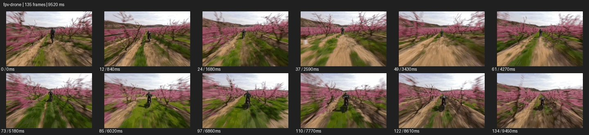

# FPV Drone FPV


- 출처: Eyecandy · [FPV Drone FPV](https://eyecannndy.com/technique/fpv-drone)
- 카탈로그 등록 표기: **FPV Drone FPV 드론**
- 카테고리: E · More Camera Moves · 카메라 무브 확장
- 원본 미디어: [애니메이션 WebP](https://asset.eyecannndy.com/media/clip/2024/01/09/261704821205.webp)
- 확인 방식: 원본 애니메이션을 디코딩해 시간순 프레임을 추출한 뒤 컨택트 시트를 직접 시각 확인했다. 전체 135프레임 / 9520ms, 기본 12시점. 재생·음향 청취·전 프레임 시각 검수·생성 테스트를 했다고 주장하지 않는다.
- 기본 확인 프레임: 0, 12, 24, 37, 49, 61, 73, 85, 97, 110, 122, 134. 해당 타임스탬프(ms): 0, 840, 1680, 2590, 3430, 4270, 5180, 6020, 6860, 7770, 8610, 9450.
- 원본 길이는 관찰 정보다. 아래 새 장면의 길이를 원본에 자동 맞추지 않는다.

## 움직임 증거



## 원본에서 확인한 시작 → 변화 → 끝

꽃이 핀 과수원 줄 사이로 앞선 자전거 인물을 낮게 따라간다. 나무와 땅이 양옆으로 빠르게 흐르고 카메라가 좌우로 기울며 거리를 조절한다. 끝까지 인물을 추적하는 경로가 이어진다.

- 카메라·시점: 낮게 전진하며 좌우 경로와 기울기를 조정한다.
- 주체: 앞선 라이더가 나무 사이를 달린다.
- 조명·합성·편집: 속도 보정·안정화 여부는 미확인.

## 작동 원리와 확인 한계

낮은 전진 이동과 방향 전환, 뱅크를 결합해 주행 경로의 속도를 체감시킨다. FPV 장비 자체는 이미지로 검증되지 않는다.

샘플 사이의 빠른 변화는 일부 빠질 수 있다. GIF의 반복 경계가 작품의 의도된 완전 루프라는 보장은 없다. 원본 음악·대사·촬영 장비·제작 소프트웨어는 확인하지 않았다. 아래 프롬프트는 관찰한 원리를 다른 장면에 각색한 창작안이며 원본 장면이나 검증된 생성 결과가 아니다.

## 뮤직비디오 각색 · 완전한 장면 프롬프트

```text
후렴의 해방감을 담는 뮤직비디오. 넓은 갈대밭의 구불구불한 흙길에서 성인 댄서가 달리며 팔을 펼친다. 카메라는 댄서 뒤 허리 높이에서 출발해 길의 곡선을 따라 빠르게 전진하고, 완만한 코너에서는 진행 방향으로 가볍게 기울어진다. 갈대는 가까운 양옆으로 빠르게 스치되 얼굴을 가리지 않는다. 댄서가 열린 공터로 들어가 회전하면 카메라는 바깥으로 넓게 돌아 앞모습을 포착한다. 마지막에는 속도를 줄이고 댄서 전신과 탁 트인 하늘을 함께 담아 끝낸다.
```

## 브랜드필름 각색 · 완전한 장면 프롬프트

```text
산악 자전거의 주행 안정성을 보여주는 브랜드필름. 숲의 넓은 트레일에서 헬멧을 쓴 성인 라이더가 완만한 연속 코너를 지난다. 카메라는 낮은 후방 시점에서 출발해 차체와 일정한 간격을 두고 따라가며 코너의 곡률에 맞춰 부드럽게 뱅크한다. 앞바퀴가 작은 요철을 넘는 순간 잠깐 측후면으로 이동해 서스펜션 작동을 읽힌다. 트레일이 열리면 추적 속도를 낮춰 라이더와 자전거의 온전한 측면을 남긴다. 바퀴 회전과 지면 접촉, 프레임 구조를 일관되게 유지한다.
```

적용 시 사용자가 지정한 길이·참조·컷·음향·제품 보존 조건을 우선한다. 효과의 시작 계기와 도착 구도를 유지하며 필요한 부분을 해당 장면에 맞춰 다시 연출한다.
