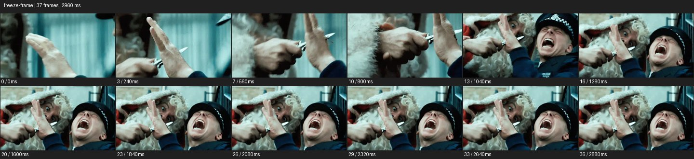

# Freeze Frame


- 출처: Eyecandy · [Freeze Frame](https://eyecannndy.com/technique/freeze-frame)
- 카탈로그 등록 표기: **Freeze Frame 프리즈 프레임**
- 카테고리: G · Speed & Time · 속도 & 시간
- 원본 미디어: [애니메이션 WebP](https://asset.eyecannndy.com/media/clip/2024/01/23/261705996589.webp)
- 확인 방식: 원본 애니메이션을 디코딩해 시간순 프레임을 추출한 뒤 컨택트 시트를 직접 시각 확인했다. 전체 37프레임 / 2960ms, 기본 12시점. 재생·음향 청취·전 프레임 시각 검수·생성 테스트를 했다고 주장하지 않는다.
- 기본 확인 프레임: 0, 3, 7, 10, 13, 16, 20, 23, 26, 29, 33, 36. 해당 타임스탬프(ms): 0, 240, 560, 800, 1040, 1280, 1600, 1840, 2080, 2320, 2640, 2880.
- 원본 길이는 관찰 정보다. 아래 새 장면의 길이를 원본에 자동 맞추지 않는다.

## 움직임 증거



## 원본에서 확인한 시작 → 변화 → 끝

손과 작은 날붙이의 가까운 구도에서 두 인물 얼굴로 화면이 넓어진다. 약 중반 이후 벌린 입과 손의 자세가 같은 모습으로 반복되어 마지막까지 고정된다.

- 카메라·시점: 초반 손 구도에서 두 얼굴이 보이는 구도로 바뀐다.
- 주체: 행동 중 표정·손 자세가 후반 고정된다.
- 조명·합성·편집: 같은 전체 프레임을 유지하는 정지 효과가 보인다.

## 작동 원리와 확인 한계

행동 중 한 순간을 정지 이미지로 유지해 표정이나 사건을 강조한다. 원본의 정확한 정지 시작 프레임은 전 프레임 검수 없이 단정하지 않는다.

샘플 사이의 빠른 변화는 일부 빠질 수 있다. GIF의 반복 경계가 작품의 의도된 완전 루프라는 보장은 없다. 원본 음악·대사·촬영 장비·제작 소프트웨어는 확인하지 않았다. 아래 프롬프트는 관찰한 원리를 다른 장면에 각색한 창작안이며 원본 장면이나 검증된 생성 결과가 아니다.

## 뮤직비디오 각색 · 완전한 장면 프롬프트

```text
성인 보컬과 밴드가 연습실에서 동시에 점프하는 뮤직비디오. 카메라는 정면 와이드로 고정하고 모두가 무릎을 굽혔다 뛰어오르는 준비와 도약을 정상 속도로 보여준다. 신발이 바닥에서 떨어지고 표정이 가장 잘 읽히는 한 순간에 전체 프레임을 멈춘다. 짧은 정지 동안 인물과 배경 모두 같은 프레임으로 유지하며 가상 카메라 회전을 넣지 않는다. 이후 그 지점에서 재생을 이어 착지와 웃음을 보여주고 끝낸다. 인물 수와 얼굴 정체성을 유지한다.
```

## 브랜드필름 각색 · 완전한 장면 프롬프트

```text
패션 컬렉션의 실루엣을 읽히는 브랜드필름. 밝은 벽 앞 성인 모델이 긴 코트 자락을 한 번 돌려 펼친다. 고정된 정면 카메라로 전신을 담고 자락의 형태가 가장 선명해지는 순간 전체 영상을 프리즈한다. 정지 구간에는 바닥 그림자와 머리카락도 움직이지 않는다. 짧게 형태를 읽힌 뒤 같은 프레임에서 동작을 재개해 코트가 자연스럽게 내려앉게 한다. 마지막에는 모델이 곧게 서고 온전한 코트 전신이 남는다. 옷의 재단과 단추 배열은 변하지 않는다.
```

적용 시 사용자가 지정한 길이·참조·컷·음향·제품 보존 조건을 우선한다. 효과의 시작 계기와 도착 구도를 유지하며 필요한 부분을 해당 장면에 맞춰 다시 연출한다.
