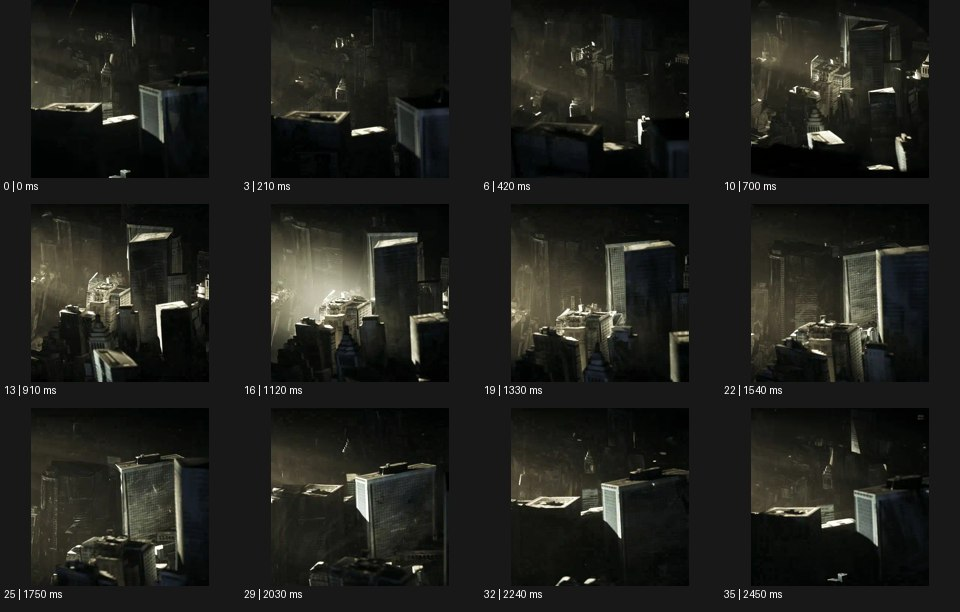

# Generative 제너레이티브


출처: Eyecandy · 원본 등록 카드명: **Generative 제너레이티브** · slug: generative

분류: I · VFX & Style / VFX & 스타일

[원본 기법 페이지](https://eyecannndy.com/technique/generative) · [원본 미디어](https://asset.eyecannndy.com/media/clip/2024/02/19/261708338199.webp)

## 확인 근거

원본 36프레임, 메타데이터 길이 2520ms. 고유 12개 시점 프레임을 추출하여 이미지로 직접 관찰했다. 재생 감상·음향 청취·생성 재현 테스트를 했다는 뜻이 아니다.

표본 프레임(0부터): 0, 3, 6, 10, 13, 16, 19, 22, 25, 29, 32, 35



## 실제 시간순 관찰

0–420ms: 어둡고 빽빽한 건물 같은 입체 구조에 일부 빛이 들어온다. 700–1540ms: 가까운 블록과 뒤쪽 구조의 가림 관계가 바뀌고 내부가 더 넓게 드러난다. 1750–2450ms: 높은 사각 매스와 작은 구조가 새 배열로 보이며 빛과 그림자 영역이 이동한다.

## 주체·카메라·합성·편집 구분

건축 형태의 시점·가림·조명이 함께 변한다. 물리적 카메라, 가상 카메라, 구조 생성의 기여를 샘플로 분리 확정하기 어렵다. 인물 퍼포먼스나 뚜렷한 장면 컷은 보이지 않는다.

## 장면에 재사용할 원리

반복 가능한 규칙으로 수많은 구조를 조직하고 변화시키는 장면으로 각색한다. 원본이 특정 생성형 AI나 알고리즘으로 제작됐다는 증거는 이 미디어에 없다.

## 확인 한계

Generative라는 이름만으로 텍스트 투 비디오 결과나 AI 공정이라고 단정하지 않는다. 표본 사이의 모든 프레임과 반복 경계의 연속성을 검사하지 않았다. 음향은 확인하지 않았다.

## 뮤직비디오 각색 · 완성형 프롬프트

아래는 장면 목적에 맞게 새로 설계한 창작 적용안이며 원본 길이를 상속하지 않는다.

```text
8초 뮤직비디오, 검은 공간 중앙에 성인 키보디스트와 흰 건반만 놓는다. 고정된 높은 삼사분면 카메라로 시작한다. 연주자가 세 번 건반을 누를 때마다 그 음의 위치 아래에서 같은 폭의 얇은 빛 기둥이 한 줄씩 자라난다. 각 줄은 높이만 달라져 작은 도시 같은 규칙적 지형을 만들고 연주자의 몸 주위에는 빈 원을 남긴다. 4초부터 카메라가 천천히 내려오며 기둥 사이의 깊이를 드러낸다. 마지막 건반을 놓으면 성장이 멈추고 가장 낮은 기둥부터 빛이 약해져 연주자와 몇 개의 높은 기둥만 남는다. 생성 문자와 음성은 넣지 않는다.
```

## 브랜드필름 각색 · 완성형 프롬프트

```text
8초 프리미엄 조명 브랜드필름, 모래색 공간의 한 스탠드 조명을 중심으로 얇은 세로 패널들을 반원으로 배치한다. 카메라는 조명 높이의 정면에서 시작한다. 조명이 켜지면 패널들이 중심에서의 거리라는 한 규칙에 따라 차례로 높아지고, 빛이 닿는 면은 따뜻하게 밝아진다. 카메라는 오른쪽으로 25도 이동해 반복 패널 사이의 부드러운 그림자를 읽힌다. 조명 제품의 형태는 전혀 바뀌지 않는다. 5초에 패널의 성장이 멈추고 마지막 3초는 완성된 공간과 조명 헤드의 재질을 함께 보여준다. 숫자·설계 UI·새 로고 없이 낮은 실내 환경음만 둔다.
```

생성 테스트: 미실시. 단일 모델의 정확한 재현을 보장하지 않으며 필요한 촬영·합성·편집 층을 구분해 구현한다.
