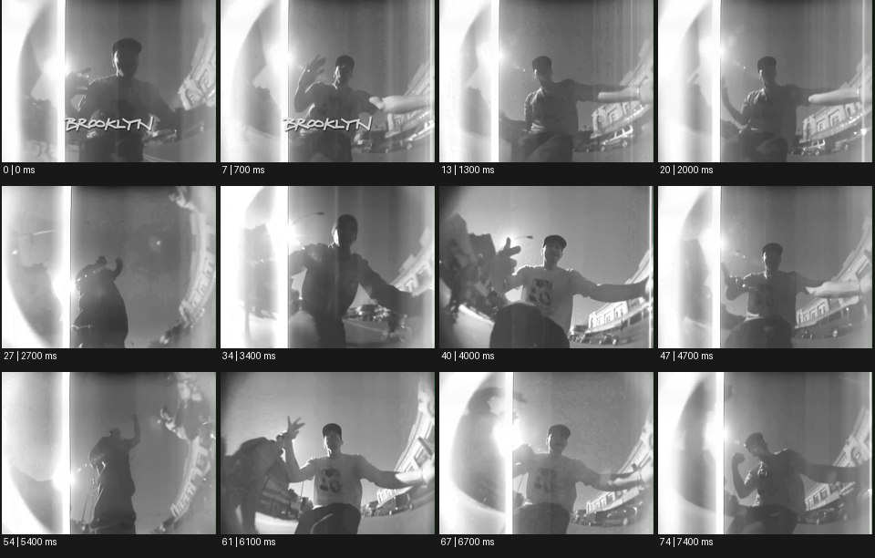

# Feedback / Glitch 글리치


출처: Eyecandy · 원본 등록 카드명: **Feedback / Glitch 글리치** · slug: glitch

분류: I · VFX & Style / VFX & 스타일

[원본 기법 페이지](https://eyecannndy.com/technique/glitch) · [원본 미디어](https://asset.eyecannndy.com/media/clip/2024/02/19/261708345235.webp)

## 확인 근거

원본 75프레임, 메타데이터 길이 7500ms. 고유 12개 시점 프레임을 추출하여 이미지로 직접 관찰했다. 재생 감상·음향 청취·생성 재현 테스트를 했다는 뜻이 아니다.

표본 프레임(0부터): 0, 7, 13, 20, 27, 34, 40, 47, 54, 61, 67, 74



## 실제 시간순 관찰

0–1300ms: 흑백 인물이 낮은 시점 앞에서 손을 들고 좌우에 밝고 휜 경계가 보인다. 2000–4000ms: 몸의 기울기와 팔 위치가 바뀌고 곡면처럼 뒤틀린 주변 영상에 인물의 겹친 형상이 나타난다. 4700–7400ms: 같은 범위의 팔 동작과 큰 몸 기울기가 이어진다.

## 주체·카메라·합성·편집 구분

주체의 팔·몸 동작이 주된 변화다. 주변의 곡률과 겹침은 광학 반사 또는 화면 처리 가능성이 있고 카메라의 정확한 이동은 불명확하다. 큰 장소 전환은 샘플에서 확인되지 않는다.

## 장면에 재사용할 원리

원본에서 확인된 것은 주변 영상의 왜곡과 피드백처럼 겹치는 인물 형상이다. 이를 현재 영상과 지연 복제층의 관계로 각색할 수 있다.

## 확인 한계

샘플에는 뚜렷한 RGB 채널 분리나 코덱 블록 파손이 보이지 않는다. Feedback / Glitch 등록명을 유지하되 그런 현상을 관찰 사실로 추가하지 않는다. 표본 사이의 모든 프레임과 반복 경계의 연속성을 검사하지 않았다. 음향은 확인하지 않았다.

## 뮤직비디오 각색 · 완성형 프롬프트

아래는 장면 목적에 맞게 새로 설계한 창작 적용안이며 원본 길이를 상속하지 않는다.

```text
6초 뮤직비디오, 어두운 지하 통로에서 성인 댄서가 정면으로 선다. 허리 높이의 광각 카메라는 제자리에 두고 첫 1초 동안 댄서가 한 손을 렌즈 쪽으로 들어 기대를 만든다. 손목을 튕길 때 화면 양옆에 0.2초 늦은 동일 동작의 복제 영상이 곡면 띠처럼 나타난다. 댄서가 몸을 왼쪽과 오른쪽으로 기울이면 지연된 윤곽이 중앙으로 돌아오려다 다시 가장자리로 밀린다. 얼굴이 있는 중앙 영역은 계속 선명하다. 마지막 동작에서 손을 내리면 주변 겹침도 한 번 수축해 사라지고 정면 전신을 1초 유지한다. 무음, 자막 없음.
```

## 브랜드필름 각색 · 완성형 프롬프트

```text
7초 실험적 패션 브랜드필름, 검은 유리 벽 앞에서 성인 모델이 구조적인 흰 코트를 입고 소매를 정리한다. 카메라는 가슴 높이에서 오른쪽으로 30cm 이동한다. 모델의 동작을 뒤늦게 따라오는 반사상 두 겹을 벽에만 합성하고, 3초에 코트 깃을 세우는 동작에서 반사 경계가 짧게 가로로 어긋난다. 실물 모델과 코트 봉제선은 왜곡되지 않는다. 카메라는 옆 이동을 멈추고 모델이 소매를 놓는 순간 반사 지연을 해소한다. 마지막에는 한 개의 반사와 정확한 코트 실루엣이 남는다. 얇은 옷감 소리만 두고 화면에 새 문자를 만들지 않는다.
```

생성 테스트: 미실시. 단일 모델의 정확한 재현을 보장하지 않으며 필요한 촬영·합성·편집 층을 구분해 구현한다.
