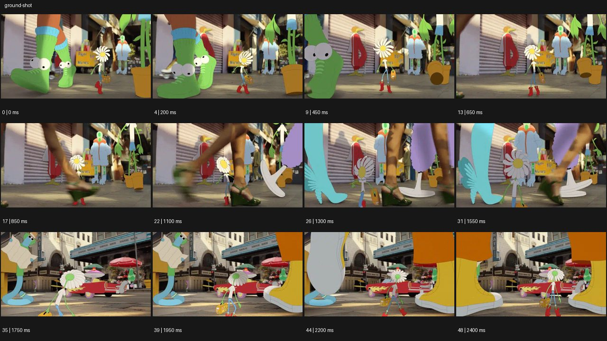

# Ground Level 그라운드 레벨


- 원본 등록명: **Ground Level 그라운드 레벨**
- 분류: B · 앵글 & 구도 / Angle & Framing
- 공식 기법 페이지: [Ground Level 그라운드 레벨](https://eyecannndy.com/technique/ground-shot)
- 지정 원본 미디어: [애니메이션 WebP](https://asset.eyecannndy.com/media/clip/2024/01/13/261705173516.webp)
- 확인 방식: 49프레임 중 12시점의 시간순 이미지 배열을 직접 시각 확인. 메타데이터 길이 2.45초. 전체 프레임 재생·청음 확인 또는 생성 재현 테스트로 보고하지 않는다.



## 실제 관찰

골목 바닥 가까이에서 거대한 신발과 다리가 앞을 지나가고 가운데 작은 꽃 모양 캐릭터가 걷는다. 0–0.65초 초록 부츠, 0.85–1.55초 초록 구두가 전경을 가린다. 1.75초 다른 거리 구도로 바뀌어 큰 그래픽 신발 사이로 작은 꽃 캐릭터가 계속 움직인다.

## 작동 원리와 역할

낮은 카메라가 신발과 작은 캐릭터의 스케일 차이를 강조한다. 실사 다리의 이동, 평면 애니메이션, 장면 컷이 함께 쓰인다.

## 해석의 한계

모든 피사체가 실사인 예시가 아니다. 지상 높이를 30–60cm라는 고정 수치로 원본에 적용하지 않는다. 샘플 사이의 모든 움직임과 반복 경계의 무봉합 여부는 별도 검증하지 않았다. 아래 프롬프트는 새로운 장면 각색이며 생성 테스트는 하지 않았다.

## 뮤직비디오 적용 · 완성형 프롬프트

아래 설정과 길이는 독립 창작 예시다. 실제 요청의 길이·참조·음향 조건을 우선한다.

```text
7초 뮤직비디오. 비 온 뒤 좁은 골목 바닥에서 작은 종이별 하나가 바람에 구른다. 카메라는 발목 높이로 종이별 옆을 천천히 따라가며 성인 댄서들의 운동화가 전경을 번갈아 스친다. 신발이 별을 밟지 않고 별 주위에 원을 만드는 스텝을 밟으면 바닥의 물빛과 발 그림자가 리듬을 만든다. 가운데 보컬의 손이 내려와 별을 집어 들 때 카메라는 높이를 올리지 않고 손끝만 따라 짧게 팬한다. 마지막에는 빈 젖은 바닥과 뒤의 멈춘 발들을 남긴다. 작은 종이와 큰 신발의 비례를 유지하고 인물 얼굴로 갑자기 점프하지 않는다.
```

## 브랜드필름 적용 · 완성형 프롬프트

제품의 재질과 기능이 읽히는 순간에 효과를 배치하고 안정된 제품 상태로 끝낸다. 실제 브랜드 톤과 구조에 맞춰 각색한다.

```text
7초 고급 여행 신발 필름. 오래된 기차역 석재 바닥에서 짙은 밤색 로퍼를 신은 성인 여행자의 발을 발목 높이로 담는다. 카메라는 옆으로 나란히 움직이며 한 걸음마다 가죽 주름과 밑창 접촉이 읽히도록 속도를 맞춘다. 흐릿한 여행 가방 바퀴가 전경을 지나간 뒤 로퍼가 다시 선명히 드러난다. 여행자가 벤치 앞에서 멈추면 카메라도 감속해 신발 측면과 돌바닥 질감을 담는 낮은 구도에 안착한다. 마지막 2초 두 발이 자연스럽게 놓여 제품의 형태를 비교할 수 있게 한다. 발이나 신발의 수를 늘리지 않는다.
```

음향은 원본에서 확인하지 않았다. 실제 음원과 무음·NO BGM 등 사용자 조건을 유지한다. 특정 모델의 자동 재현을 보장하는 프리셋이 아니다.
