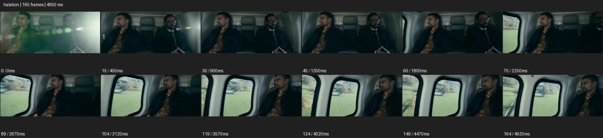

# Halation


- 출처: Eyecandy · [Halation](https://eyecannndy.com/technique/halation)
- 카탈로그 등록 표기: **Halation 헤일레이션**
- 카테고리: F · Lens & Optics · 렌즈 & 옵틱
- 원본 미디어: [애니메이션 WebP](https://asset.eyecannndy.com/media/clip/2024/03/09/261710023723.webp)
- 확인 방식: 원본 애니메이션을 디코딩해 시간순 프레임을 추출한 뒤 컨택트 시트를 직접 시각 확인했다. 전체 165프레임 / 4950ms, 기본 12시점. 재생·음향 청취·전 프레임 시각 검수·생성 테스트를 했다고 주장하지 않는다.
- 기본 확인 프레임: 0, 15, 30, 45, 60, 75, 89, 104, 119, 134, 149, 164. 해당 타임스탬프(ms): 0, 450, 900, 1350, 1800, 2250, 2670, 3120, 3570, 4020, 4470, 4920.
- 원본 길이는 관찰 정보다. 아래 새 장면의 길이를 원본에 자동 맞추지 않는다.

## 움직임 증거



## 원본에서 확인한 시작 → 변화 → 끝

차량 안 두 인물 앞에 밝은 광원이 비치며 초반 녹색 원형 플레어와 뿌연 빛 번짐이 보인다. 번짐이 줄어들고 카메라 구도가 창가의 한 인물 쪽으로 움직인다.

- 카메라·시점: 차 안에서 창가 인물 쪽으로 시선을 옮긴다.
- 주체: 앉은 인물이 고개와 시선을 작게 바꾼다.
- 조명·합성·편집: 초반 원형 플레어와 광원 번짐이 강하고 뒤에 줄어든다.

## 작동 원리와 확인 한계

밝은 광원 주변 번짐과 광학 플레어가 대비를 잠시 낮춘다. 원본에는 플레어도 명확하므로 모든 빛 흔적을 필름의 적색 헤일레이션으로 단정하지 않는다.

샘플 사이의 빠른 변화는 일부 빠질 수 있다. GIF의 반복 경계가 작품의 의도된 완전 루프라는 보장은 없다. 원본 음악·대사·촬영 장비·제작 소프트웨어는 확인하지 않았다. 아래 프롬프트는 관찰한 원리를 다른 장면에 각색한 창작안이며 원본 장면이나 검증된 생성 결과가 아니다.

## 뮤직비디오 각색 · 완전한 장면 프롬프트

```text
해 질 무렵 버스 창가에 앉은 성인 보컬의 뮤직비디오. 얼굴 미디엄으로 시작해 창밖 태양이 프레임 모서리에 잠깐 들어오게 카메라가 아주 느리게 옆으로 이동한다. 밝은 창 가장자리와 머리카락 윤곽에 따뜻한 빛 번짐이 생기고 얼굴의 어두운 부분은 읽을 수 있게 유지한다. 버스가 그늘에 들어가면 번짐이 자연스럽게 줄어들고 보컬의 조용한 눈빛이 다시 선명해진다. 마지막에는 창을 바라보는 옆얼굴에서 멈춘다. 화면 전체를 지속적으로 뿌옇게 덮지 않는다.
```

## 브랜드필름 각색 · 완전한 장면 프롬프트

```text
역광의 얇은 유리 향수병을 보여주는 브랜드필름. 창가의 석재 받침 위 병을 가까운 삼분의 사 구도로 담고 카메라가 아주 천천히 옆으로 이동한다. 창빛이 유리 가장자리와 만나는 순간 따뜻한 작은 헤일로가 생겨 투명한 두께를 강조한다. 이동이 이어져 광원이 병 뒤로 숨으면 번짐이 잦아들고 라벨과 액체 색이 다시 또렷해진다. 마지막에는 병 전체가 온전히 들어오는 안정된 구도에 머문다. 빛 번짐은 가장자리에 제한하며 제품 윤곽과 글자를 날리지 않는다.
```

적용 시 사용자가 지정한 길이·참조·컷·음향·제품 보존 조건을 우선한다. 효과의 시작 계기와 도착 구도를 유지하며 필요한 부분을 해당 장면에 맞춰 다시 연출한다.
