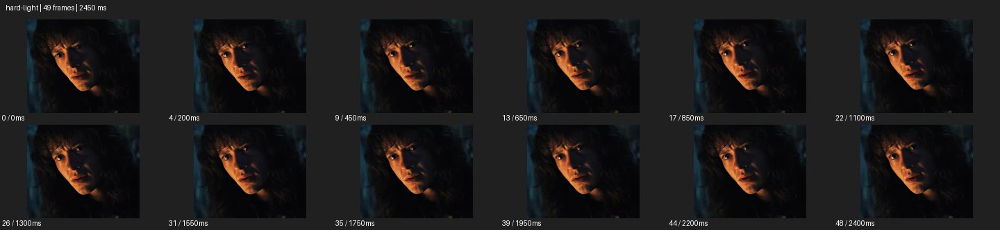

# Hard Light


- 출처: Eyecandy · [Hard Light](https://eyecannndy.com/technique/hard-light)
- 카탈로그 등록 표기: **Hard Light 하드 라이트**
- 카테고리: F · Lens & Optics · 렌즈 & 옵틱
- 원본 미디어: [애니메이션 WebP](https://asset.eyecannndy.com/media/clip/2023/12/20/261703048367.webp)
- 확인 방식: 원본 애니메이션을 디코딩해 시간순 프레임을 추출한 뒤 컨택트 시트를 직접 시각 확인했다. 전체 49프레임 / 2450ms, 기본 12시점. 재생·음향 청취·전 프레임 시각 검수·생성 테스트를 했다고 주장하지 않는다.
- 기본 확인 프레임: 0, 4, 9, 13, 17, 22, 26, 31, 35, 39, 44, 48. 해당 타임스탬프(ms): 0, 200, 450, 650, 850, 1100, 1300, 1550, 1750, 1950, 2200, 2400.
- 원본 길이는 관찰 정보다. 아래 새 장면의 길이를 원본에 자동 맞추지 않는다.

## 움직임 증거



## 원본에서 확인한 시작 → 변화 → 끝

어두운 배경의 인물 얼굴 한쪽에 따뜻한 빛이 강하게 닿고 반대쪽은 깊은 그림자다. 시선과 입이 작게 움직여도 뚜렷한 명암 구조는 유지된다.

- 카메라·시점: 얼굴 클로즈업 구도를 유지한다.
- 주체: 눈과 입의 작은 동작이 있다.
- 조명·합성·편집: 강한 방향성 조명이 명암을 유지한다.

## 작동 원리와 확인 한계

작고 방향성 있는 광원처럼 선명한 그림자 경계로 얼굴의 형태와 긴장을 드러낸다. 실제 광원 크기·위치는 이미지로 정확히 측정되지 않는다.

샘플 사이의 빠른 변화는 일부 빠질 수 있다. GIF의 반복 경계가 작품의 의도된 완전 루프라는 보장은 없다. 원본 음악·대사·촬영 장비·제작 소프트웨어는 확인하지 않았다. 아래 프롬프트는 관찰한 원리를 다른 장면에 각색한 창작안이며 원본 장면이나 검증된 생성 결과가 아니다.

## 뮤직비디오 각색 · 완전한 장면 프롬프트

```text
어두운 방에서 진실을 말하기 직전의 성인 보컬을 담는 뮤직비디오. 카메라는 얼굴 클로즈업으로 고정하고 왼쪽 낮은 방향의 따뜻한 직사광으로 한쪽 뺨과 코선을 선명하게 밝힌다. 보컬이 천천히 빛 쪽으로 고개를 조금 돌리면 코 그림자가 반대쪽으로 이동하며 두 눈 중 하나가 드러난다. 마지막에는 고개를 멈추고 정면 가까운 눈빛을 유지한다. 광원의 방향과 그림자 경계를 일관되게 두고 배경은 깊은 암부로 남긴다. 조명 변화 대신 피부를 발광시키지 않는다.
```

## 브랜드필름 각색 · 완전한 장면 프롬프트

```text
각진 금속 시계의 가공 품질을 보여주는 브랜드필름. 검은 배경에서 시계를 받침에 고정하고 작고 강한 측광으로 베젤 모서리에 선명한 하이라이트를 만든다. 카메라는 낮은 측면에서 아주 느리게 원호 이동하며 금속 면마다 밝고 어두운 영역이 바뀌는 순서를 보여준다. 이동 말미에는 문자판이 읽히는 정면 가까운 각도에서 멈춘다. 마지막 구간에는 강한 명암 안에서도 바늘과 인덱스를 분명히 유지한다. 금속 형태와 표면 마감을 보존하고 광원이 화면을 전부 날리지 않게 한다.
```

적용 시 사용자가 지정한 길이·참조·컷·음향·제품 보존 조건을 우선한다. 효과의 시작 계기와 도착 구도를 유지하며 필요한 부분을 해당 장면에 맞춰 다시 연출한다.
